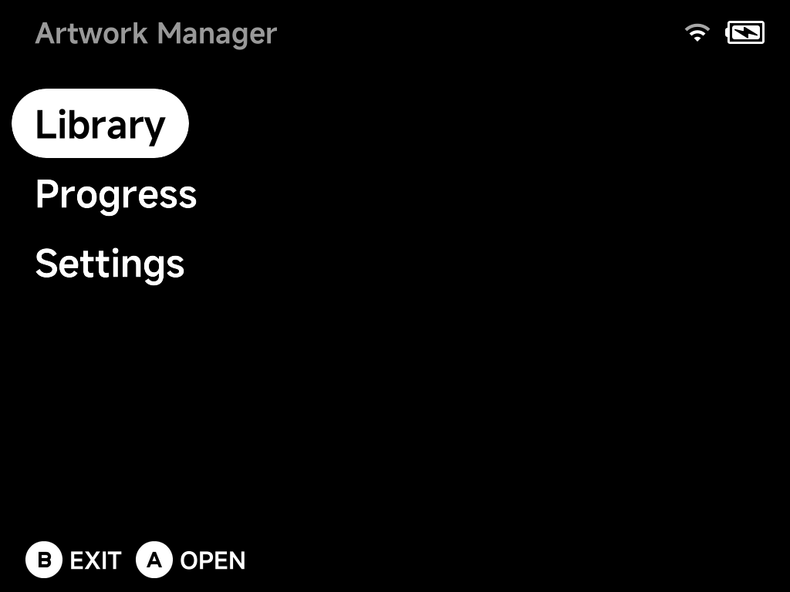
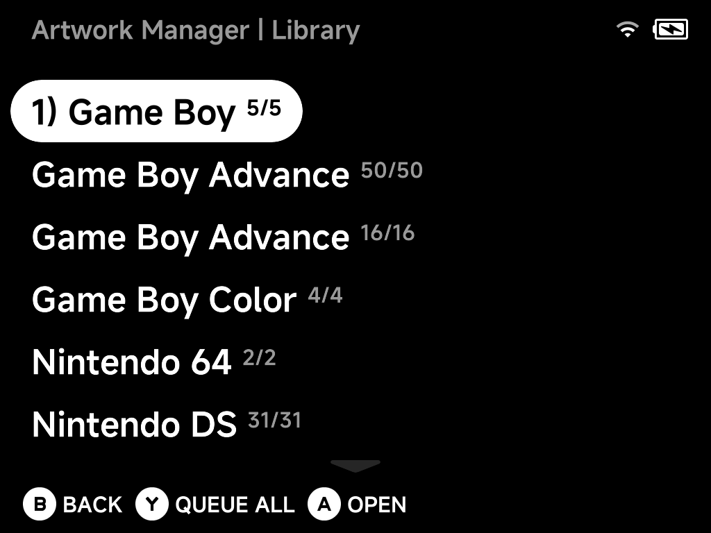
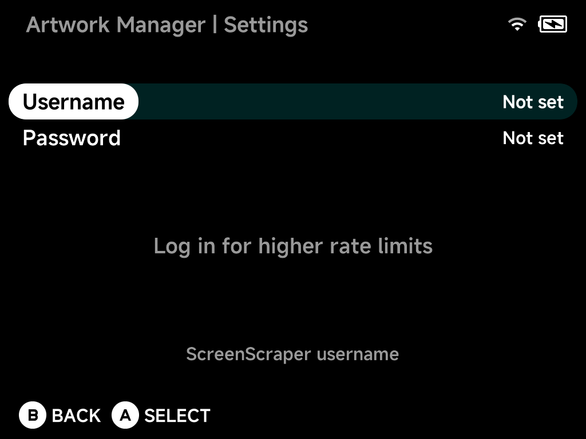

# Artwork Manager

**Tools → Artwork Manager** fetches custom mix box art for your ROMs in bulk.

## Library

The Library lists every system with its artwork coverage (games with art /
total games).

- `A` **Open** — drill into a system to queue individual games.
- `Y` **Queue All** — queue every missing artwork in the selected system.
- `B` **Back**.

## Progress

Queued downloads run in the background; the **Progress** page shows what's
being fetched. Downloaded art is placed alongside the ROMs, so it shows up in
the game lists immediately.

!!! tip "Single game instead?"
    For one game, use **Fetch Box Art** in the game's
    [context menu](../guide/context-menu.md) — no need to open the Artwork
    Manager at all.

## Settings — your ScreenScraper account

Artwork comes from [ScreenScraper](https://www.screenscraper.fr/). Fetching
works **without any account**, but anonymous access shares a limited request
budget — fine for a game here and there, slow going for a whole library.

Enter your own (free) ScreenScraper **username** and **password** here and
every fetch runs on your account's allowance instead:

- **Higher rate limits** — your account's own daily request quota, which for
  registered users is well above the shared anonymous budget.
- **Live quota display** — once logged in, the page shows **Requests Today**
  and **Max Requests** (your account's daily limit), fetched straight from
  your ScreenScraper account.
- **Logout** — a logged-in page also gains a Logout entry that clears the
  saved credentials from the device.

Both fields are typed with the on-screen keyboard; the password is stored on
the SD card and always displayed masked.
