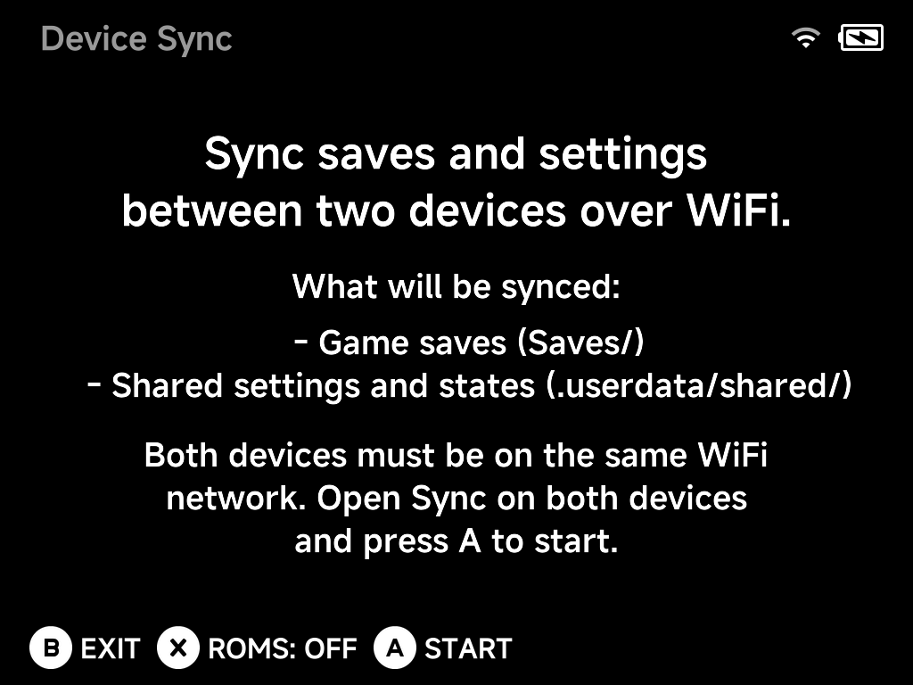

# Device Sync

**Tools → Device Sync** moves your data between two NX Redux devices over
Wi-Fi. Since SD cards are built per device model and must not be swapped
between them, this is the supported way to carry your progress from one
device to another.

## What gets synced

- **Game saves** (`Saves/`)
- **Shared settings and states** (`.userdata/shared/`)
- **ROMs** — optional: press `X` to toggle `ROMS: OFF/ON` before starting.

## How to sync

1. Connect both devices to the **same Wi-Fi network**.
2. Open **Tools → Device Sync** on both devices.
3. Press `A` **Start** on both — the devices find each other and sync.

!!! note
    Device Sync requires an active Wi-Fi connection; if Wi-Fi is off or not
    connected, the tool asks you to enable it first (quickest way: the Wi-Fi
    toggle in the [OSD](../guide/osd.md)).
