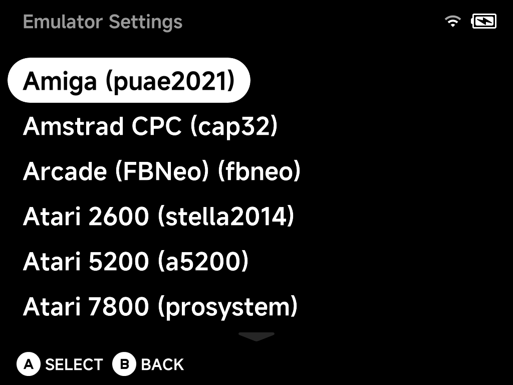

# Emulator Settings

**Tools → Emulator Settings** configures each system's emulator without
launching a game first. Every system is listed with the core it runs on
(e.g. `Arcade (FBNeo) (fbneo)`, `Atari 2600 (stella2014)`).

Select a system with `A` to edit its emulator options — the same options you
reach in-game via the [pause menu](../guide/playing-games.md#the-in-game-menu)'s
**Options** entry, edited here as the system-wide defaults.

For a **single game**, use **Emulator Options** in the game's
[context menu](../guide/context-menu.md) instead — per-game options override
the system-wide settings made here. See
[Emulator Options](../guide/emulator-options.md) for how the three
configuration places fit together.
