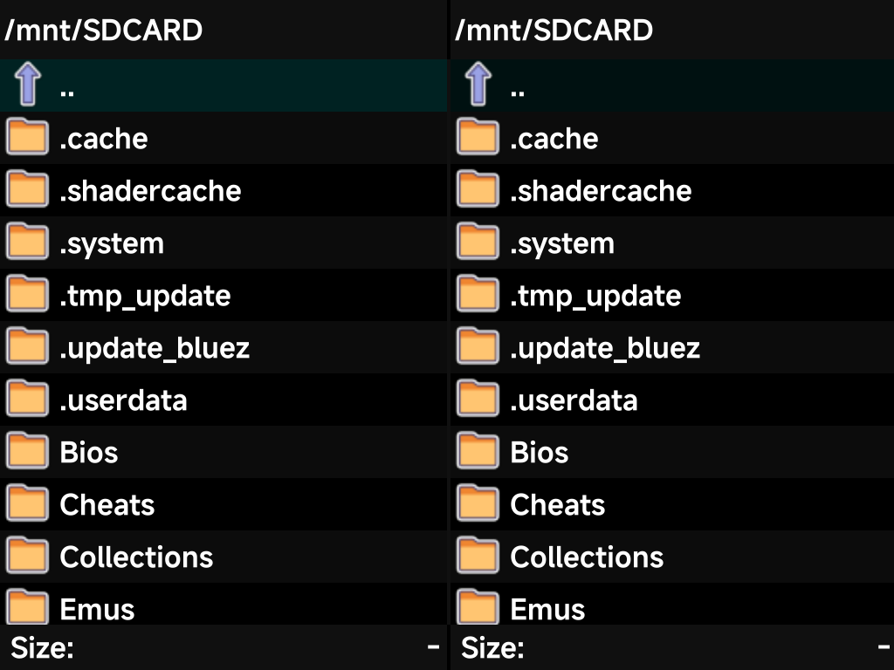
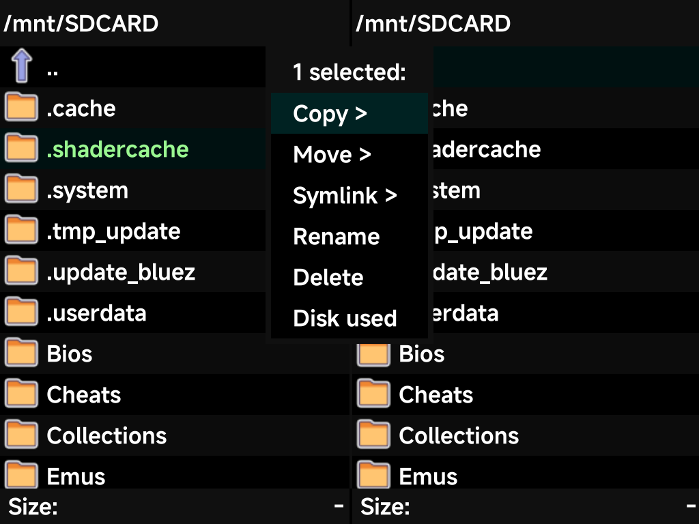

# Files

**Tools → Files** is a dual-pane file manager for the device — browse the SD
card and copy, move, rename or delete files without a computer.

- Two independent panes make copying between folders straightforward — set
  each pane to a location and transfer between them.
- `A` opens the selected folder or file, `B` goes up a directory.
- `X` opens the **file actions** menu for the current selection.
- `MENU` (or `Y`) opens the system menu: **Select all / Select none**, **New
  directory**, **Disk info**, and **Quit** to leave the app.

## File actions

Press `X` on a file or folder to act on it:

- **Copy / Move / Symlink** — into the folder open in the *other* pane.
- **Rename** and **Delete**.
- **Disk used** — size of the current selection.

The menu header shows how many items are selected — use **Select all** from
the system menu to operate on a whole folder at once.

The whole card is visible, including the hidden dot-folders (`.system`,
`.userdata`, and friends) — handy for the occasional maintenance task the
[FAQ](../reference/faq.md) mentions, like removing the Simple Mode PIN file.
