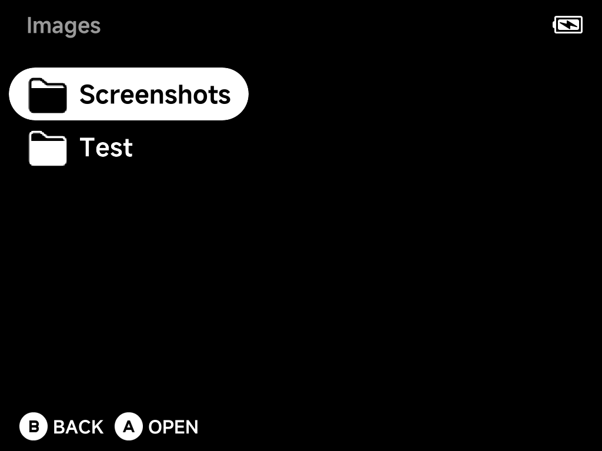
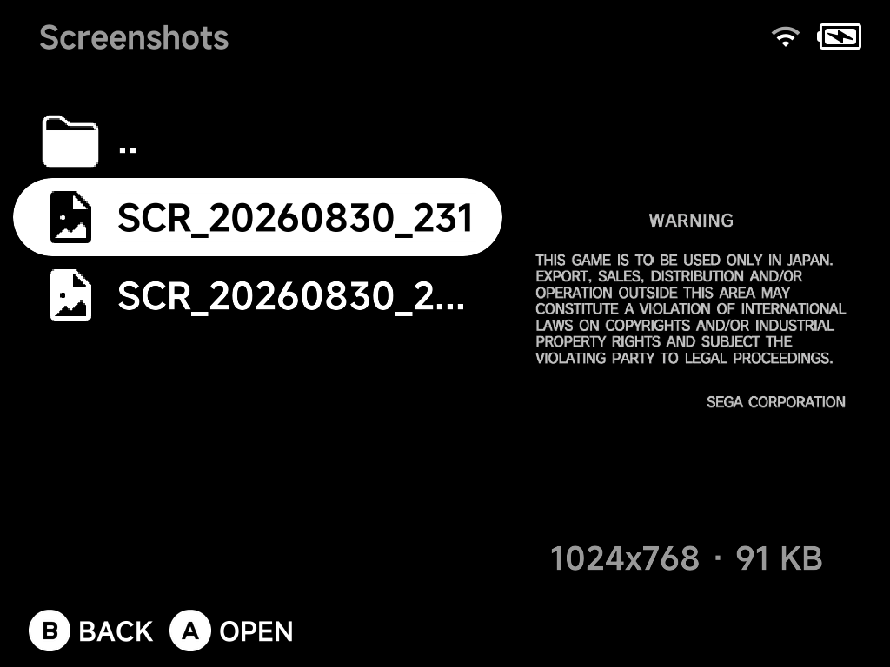
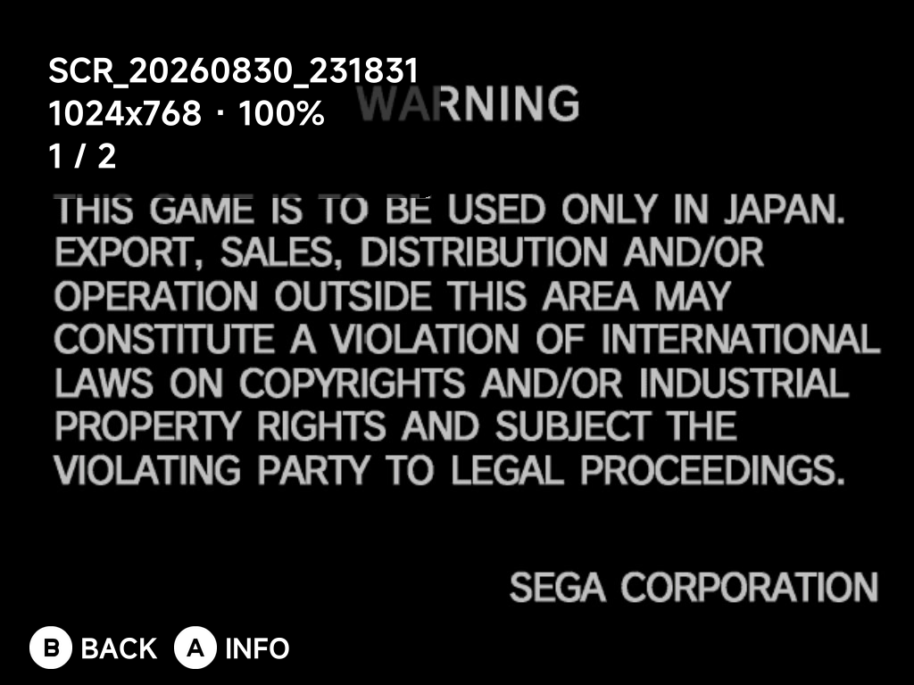
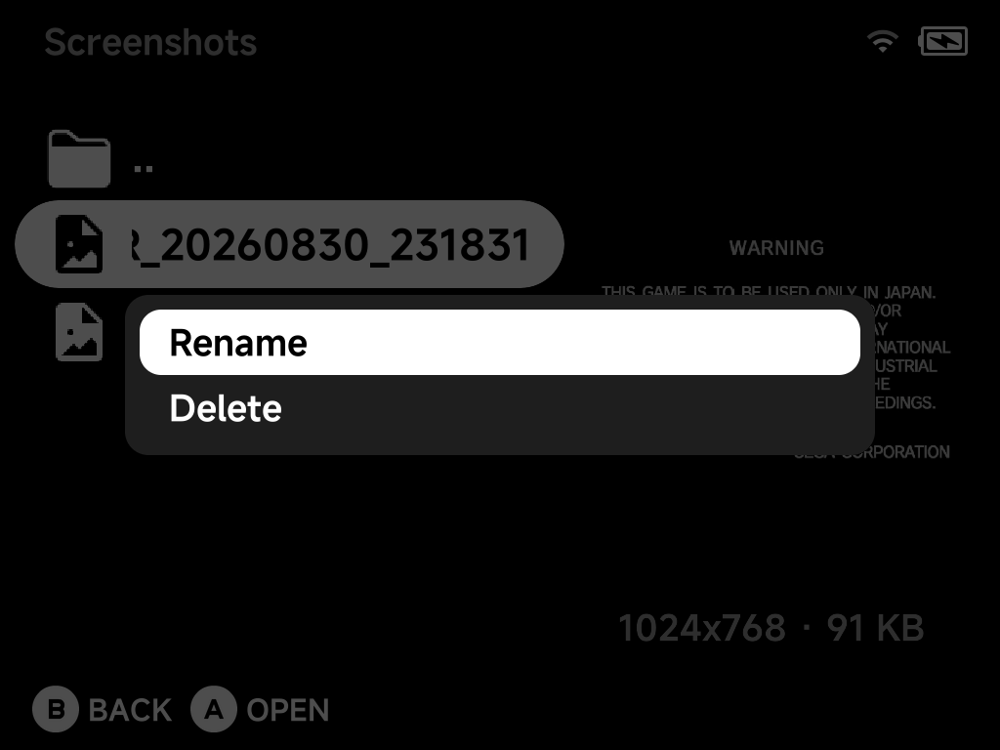

# Image Viewer

A built-in browser and fullscreen viewer for images on the SD card —
starting with your OSD screenshots. Open it from **Tools → Image Viewer**.

## Library

Image Viewer browses the `Images` folder on the SD card. Screenshots taken
with the [OSD](../guide/osd.md) land in `Images/Screenshots` automatically,
and any other pictures you drop into `Images` (subfolders included) show up
here too.

Folders show a folder icon, images a picture icon. Select an image to see a
live preview on the right, along with its resolution and file size (for
example `1024x768 · 91 KB`).

- `A` opens a folder, or opens an image fullscreen.
- `B` goes up one folder — at the `Images` root, it exits the app.

Supported formats: `png`, `jpg`, `jpeg`, `bmp`, `gif` (animated GIFs show
their first frame only).

## Viewing

Opening an image switches to a fullscreen viewer, fit to the screen by
default:

| Button | At fit size | While zoomed in |
| --- | --- | --- |
| `Left` / `Right` | Previous / next image in the folder (wraps around) | Pan |
| `Up` / `Down` | — | Pan |
| `R1` / `L1` | Zoom in / out | Zoom in / out |
| `A` | Toggle the info overlay | Toggle the info overlay |
| `B` | Back to the browser | Back to fit size, then back to the browser |

Zoom steps through **fit → 100% → 200% → 400%** (skipping 100% when the
image is already at or below screen size, since that step wouldn't
change anything). The info overlay shown above lists the file name,
resolution, zoom level and your position among the folder's images (e.g.
`1 / 2`).

## Rename & Delete

Press `MENU` on a folder or image in the browser for its context menu:

- **Rename** — opens the on-screen keyboard. The file's extension is kept
  automatically, so retyping it won't double it up, and a name already in
  use is refused.
- **Delete** — asks for confirmation first. Deleting a folder removes
  everything inside it, and the dialog warns you before it does.

## Limits

Very large images are refused politely — anything over 32 MB or 40
megapixels shows an "Image too large" message instead of opening. A file
that can't be decoded shows a "Couldn't load image" message.
