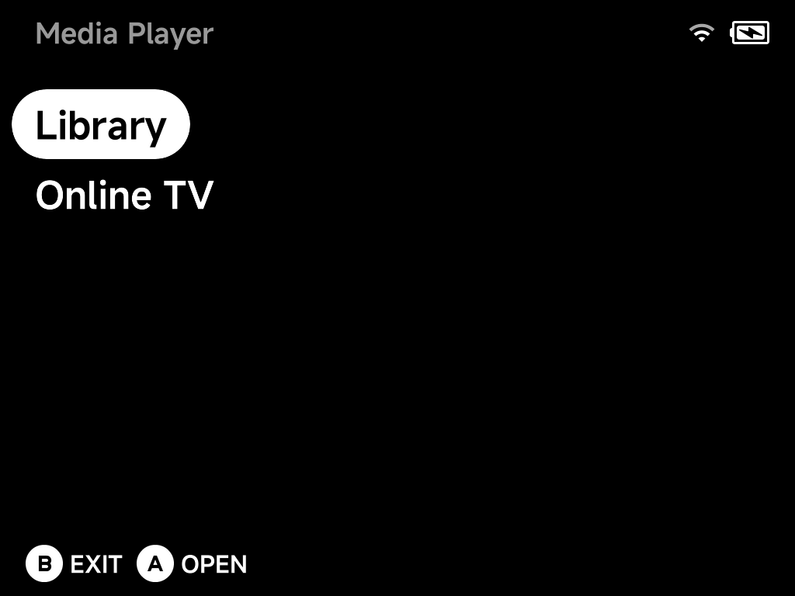
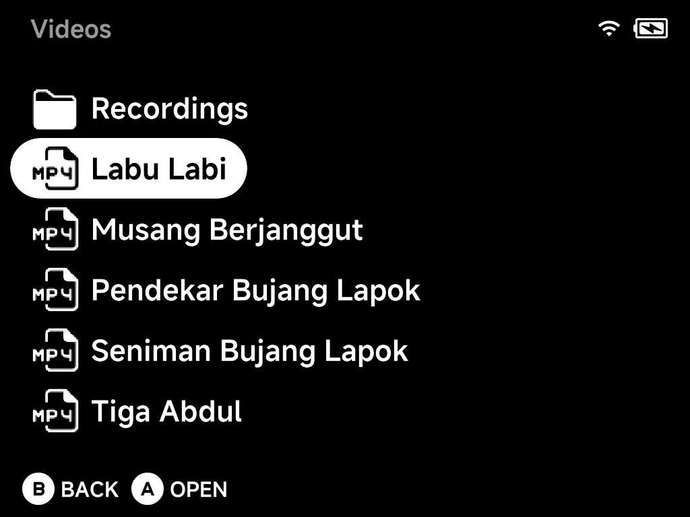
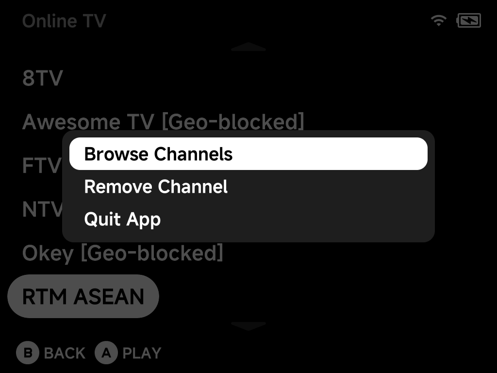

# Media Player

A built-in video player with audio and subtitle track switching, per-video
resume, and internet TV streaming. Open it from **Tools → Media Player**.



## Library

Put your videos in the `Videos` folder on the SD card — subfolders are fine,
and your [screen recordings](../guide/osd.md#screen-recording) in
`Videos/Recordings` show up here too.



Supported containers: `mp4`, `mkv`, `avi`, `webm`, `mov`, `ts`, `flv`,
`m4v`, `wmv`, `mpg`, `mpeg`, `3gp`.

Every video remembers its playback position:

- `A` plays the video — and **resumes from where you left off** if it has a
  saved position.
- Press `MENU` on a video with a saved position and choose **Play from
  Start** to ignore it once.

## Playback controls

| Button | Action |
| --- | --- |
| `A` | Pause / resume |
| `B` | Stop and return to the library |
| `X` | Toggle the on-screen info display |
| `Y` | Cycle aspect ratio |
| `Left` / `Right` | Seek −/+ 10 s (hold to keep seeking) |
| `L1` / `R1` | Seek −/+ 60 s |
| `Up` | **Cycle audio track** |
| `Down` | **Cycle subtitle track** (including *off*) |

## Subtitles

Embedded subtitle streams (e.g. in an `mkv`) work out of the box — cycle
through them with `Down` during playback.

To add **external subtitles**, drop `srt`, `ass`, `ssa` or `sub` files next
to the video, named after it:

```
Videos/
├── movie.mkv
├── movie.srt            ← exact match
├── movie.en.srt         ← language variants work too
├── movie(Malay).srt
└── movie_english.sub
```

Any subtitle file whose name starts with the video's name is picked up
automatically; `Down` cycles through all of them, plus a subtitles-off step.

## Online TV

**Online TV** streams live internet TV. The page lists *your* channels —
press `A` to play one. Before connecting, the player runs a quick
reachability check, so a dead or geo-blocked stream fails fast with an
`Unavailable — offline or geo-blocked` toast instead of a black screen.

Press `MENU` for the page's context menu:



- **Browse Channels** — open the channel catalog to add channels (below).
- **Remove Channel** — remove the highlighted channel from your list.
- **Quit App**.

### Adding channels from the catalog

**Browse Channels** opens a country list built from the community-run
[iptv-org](https://github.com/iptv-org/iptv) catalog (your device's country
is listed first). Pick a country to see its channels:

- `A` **adds** a channel to your Online TV list — added channels are marked,
  and pressing `A` again offers to remove them. Your list holds up to 64
  channels.
- Channel names carry iptv-org's status tags such as `[Geo-blocked]` and
  `[Not 24/7]`, so you know what to expect before adding; the tag is dropped
  from the name when the channel is saved to your list.
- `MENU` in the catalog offers **Refresh List** to re-fetch the catalog from
  iptv-org (it is cached on the SD card otherwise).

As the catalog toast says: streams come from iptv-org, so availability
varies — channels can go offline or be blocked in your region at any time.

### Adding your own channels

Your channel list is a plain JSON file on the SD card:

```
.userdata/shared/media-player/tv/channels.json
```

Each entry looks like:

```json
{
  "name": "My Channel",
  "url": "https://example.com/stream/master.m3u8",
  "group": "News",
  "logo": "https://example.com/logo.png",
  "decryption_key": ""
}
```

Add any direct stream URL (e.g. HLS `.m3u8`) as a new entry and it appears
in Online TV. `decryption_key` is optional and accepts a ClearKey hex string
for streams that need one; `group` and `logo` are optional metadata. Edit
the file with the device powered off or the Media Player closed, since the
app saves the same file when you add or remove channels.
