# Music Player

A full music player built into the firmware — local library with playlists,
internet radio, podcasts, synced lyrics and audiophile-grade output. Open it
from **Tools → Music Player**.

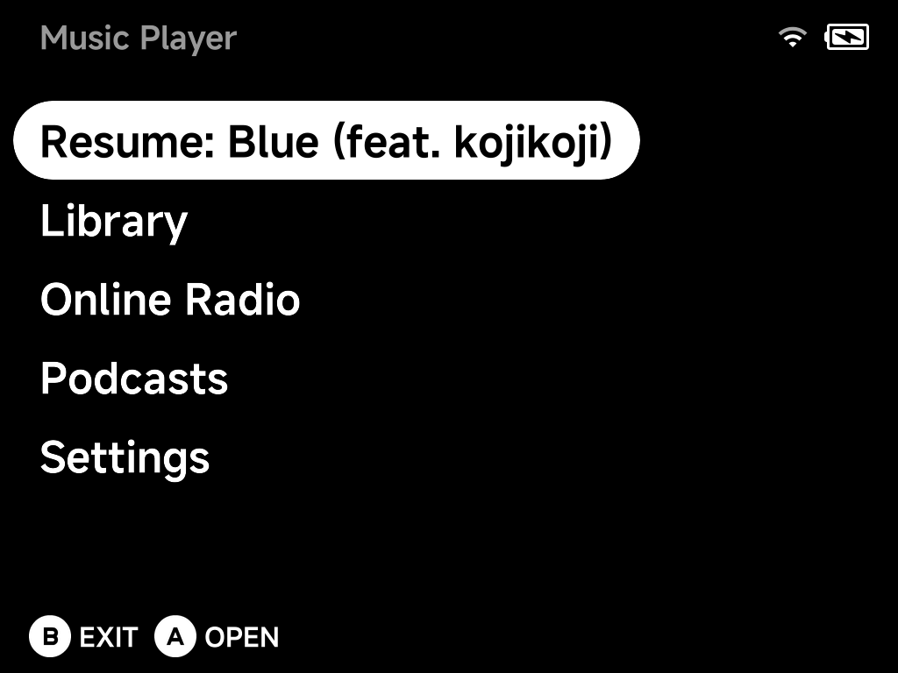

The home screen offers **Resume** (pick up the last track where you left
off), **Library**, **Online Radio**, **Podcasts** and **Settings**.

## Library

Put your music in the `Music` folder on the SD card. The Library has two
views: **Files** (browse your folders directly) and **Playlists**.

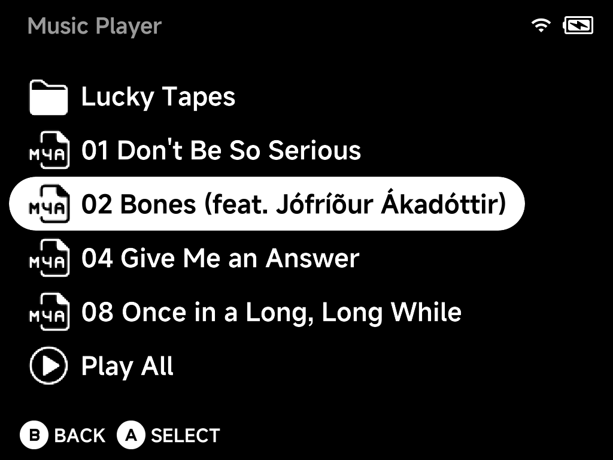

The Files view mirrors your folder structure, so **organizing with folders
works naturally**: drop loose tracks straight into `Music`, or group songs
in folders — in the screenshot above, a `Lucky Tapes` folder collects that
artist's songs while the other tracks sit at the top level. Each file shows
its format icon, and every folder gets a **Play All** entry that plays its
contents in one go. Folders are the quick way to organize; for hand-picked
track sequences across folders, use [Playlists](#playlists) instead — both
work side by side.

Supported formats: `mp3`, `flac`, `wav`, `ogg`, `opus`, `m4a`, `aac` and
`mod` tracker modules.

### Managing files

Press `MENU` on any track or folder in the Files view for its context menu:

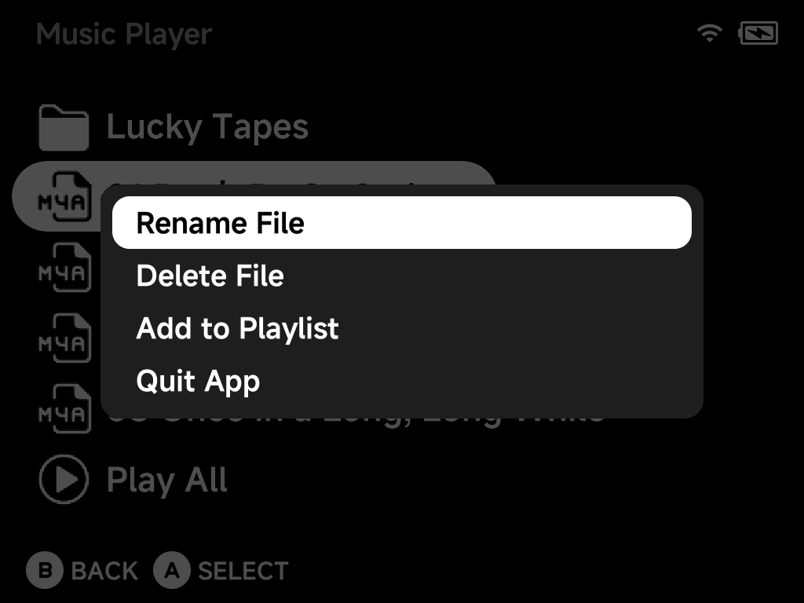

- **Rename File** / **Delete File** — manage your music right on the device;
  renames use the on-screen keyboard, deletes ask for confirmation.
- **Add to Playlist** — add the track to an existing playlist or create a
  new one on the spot.

On a folder the same menu adapts: **Rename Folder**, **Delete Folder**, and
**Add Folder to Playlist**, which adds all of the folder's tracks in one go.

### Playlists

The **Playlists** view lists your playlists with their track counts:

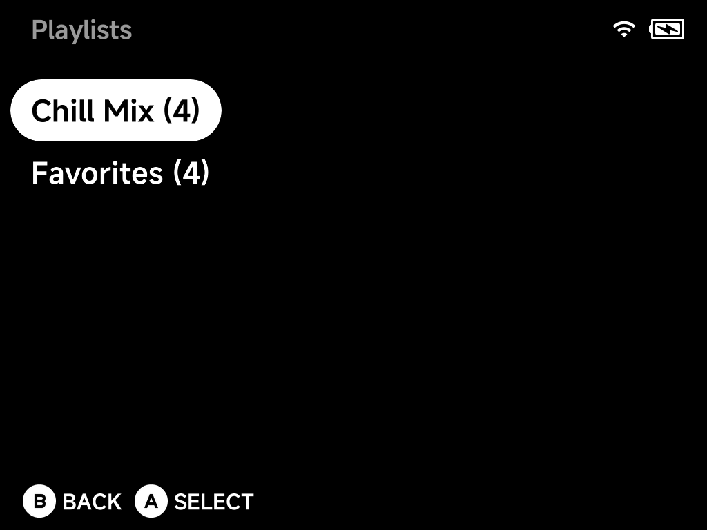

- `A` opens a playlist; from inside, pick a track to start playing.
- `Y` creates a **new playlist**, named with the on-screen keyboard (with no
  playlists yet, `A` on the empty page does the same).
- Tracks get in via the Files view's context menu — **Add to Playlist** for
  a single track, **Add Folder to Playlist** for a whole folder.

Press `MENU` on a playlist to manage it:

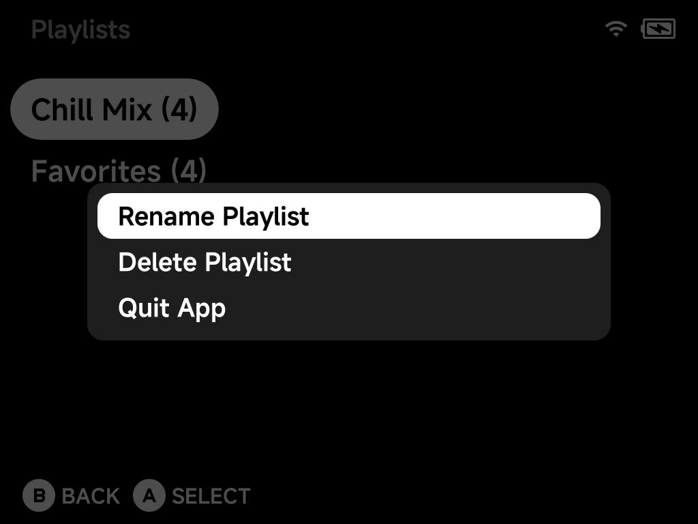

- **Rename Playlist** — via the on-screen keyboard.
- **Delete Playlist** — with a confirmation dialog.

Open a playlist to see its tracks — `A` starts playing from the selected
track:

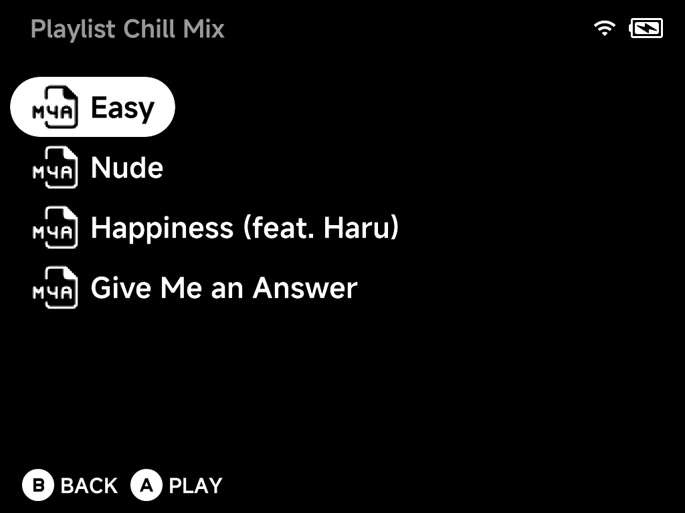

Inside, `MENU` on a track offers **Remove from Playlist** (also confirmed
before removing):

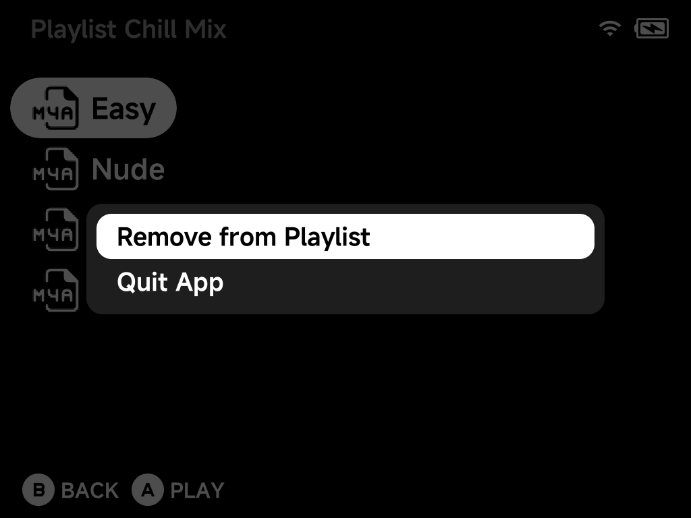

Under the hood playlists are standard `.m3u` files stored in
`.userdata/shared/music-player/playlists`, so you can also create or edit
them from a computer.

## Now playing

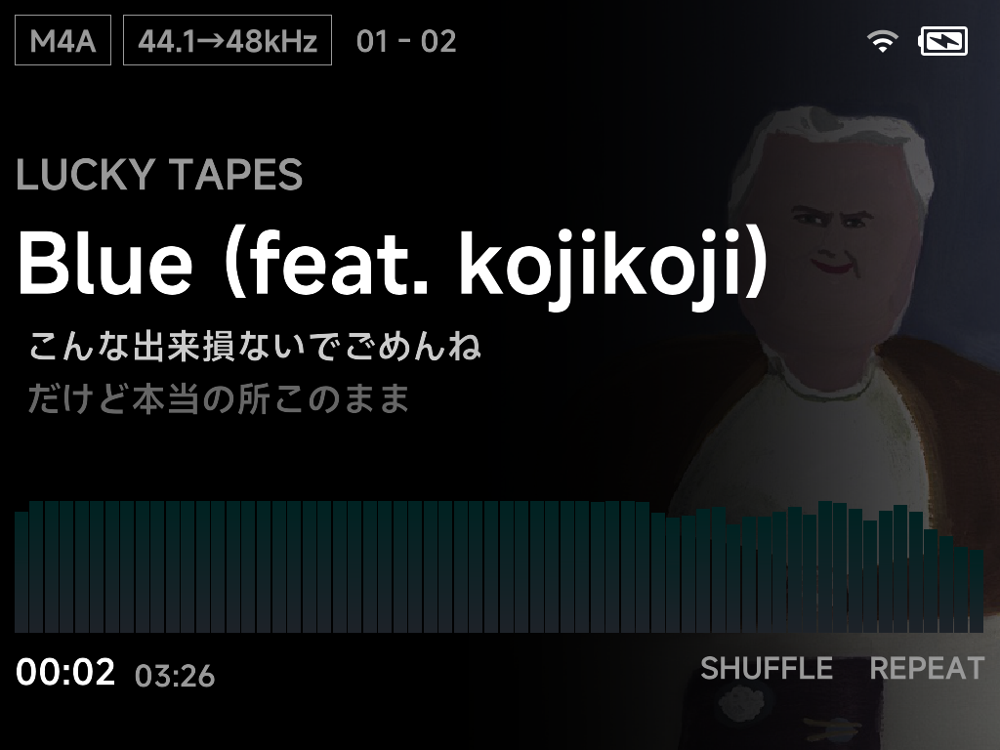

The now-playing screen shows cover art, a spectrum visualizer, shuffle and
repeat state, the format badge (`M4A`, `FLAC`…) and the **live sample-rate
badge** — e.g. `96kHz` when playing natively on a capable output, or
`44.1→48kHz` when resampling.

**Synced lyrics** are fetched automatically from
[LRCLIB](https://lrclib.net/) when online, cached on the SD card, and scroll
in time with the song.

### Controls

| Button | Action |
| --- | --- |
| `A` | Pause / resume |
| `B` | Back to the browser — **music keeps playing** while you browse |
| `Left` / `Right` | Seek −/+ 5 s (hold to keep seeking) |
| `Up` / `R1` | Next track |
| `Down` / `L1` | Previous track |
| `X` | Toggle shuffle |
| `Y` | Toggle repeat |
| `F1` / `L2` | Cycle the visualizer style |
| `F2` / `R2` | Toggle lyrics on or off |
| `MENU` | Show this controls list on screen (any button closes it) |
| `SELECT` | Turn the screen off now (see below) |
| `SELECT` + `A` | Wake the screen when it is off |

With shuffle on, *previous* retraces the tracks that actually played, in
order.

### Auto screen off

While music plays, the screen switches itself off after a configurable idle
time (default 60 s) — saving battery and preventing accidental button
presses; while it's off, ordinary buttons are ignored. Tap `SELECT` to turn
the screen off right away instead of waiting. Press `SELECT` + `A` to wake
it. Media buttons on a USB or Bluetooth headset keep working even with the
screen off.

## Online Radio

**Online Radio** streams internet stations through the same high-quality
resampler as local playback, with cover art fetched for the currently
playing song.

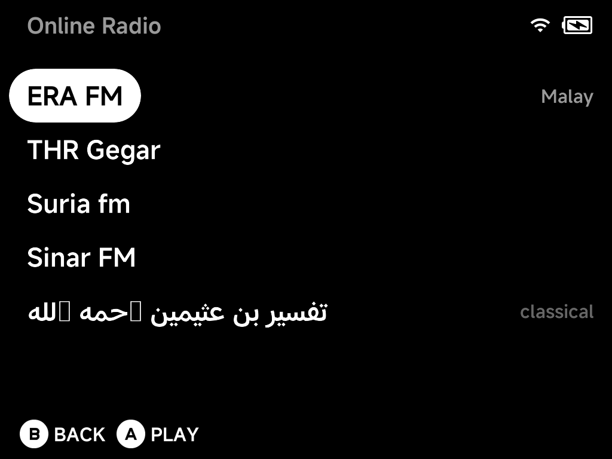

The page lists *your* stations — `A` plays one. Press `MENU` for the
context menu: **Manage Stations** (browse the online catalog), **Delete
Station**, and **Playback Controls**.

While a station plays, the screen shows the station name, the current song
from the stream's metadata — with **cover art fetched automatically for the
playing song** — and the live stream bitrate:

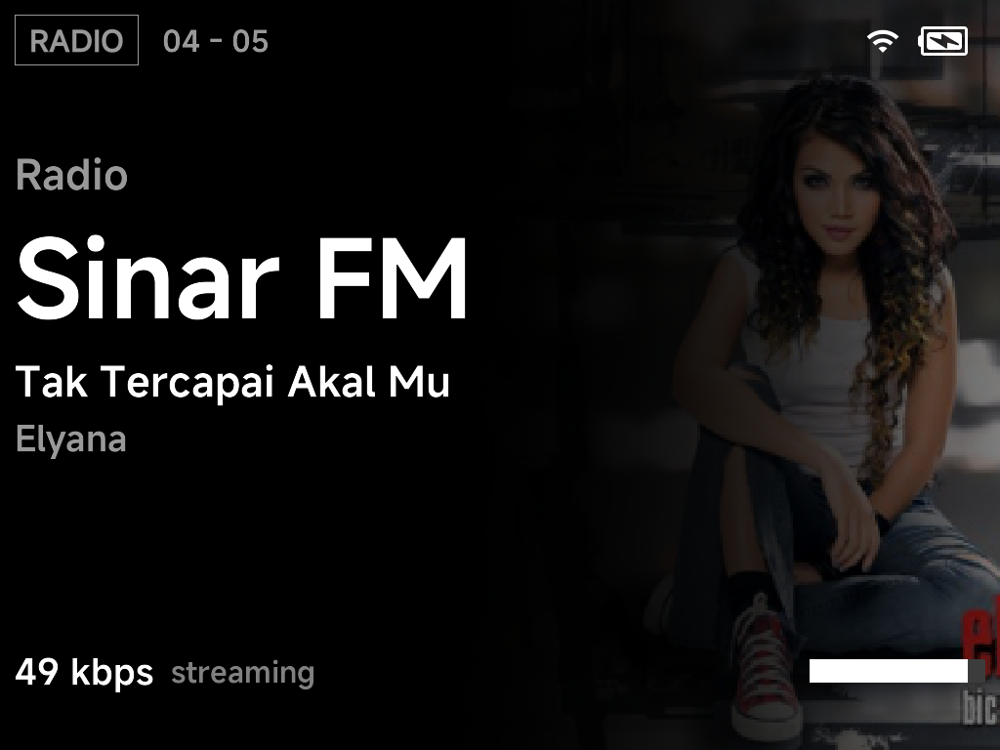

### Radio controls

| Button | Action |
| --- | --- |
| `A` | Stop / resume the stream |
| `B` | Back to the station list — **the radio keeps playing** |
| `Up` / `R1` | Next station |
| `Down` / `L1` | Previous station |
| `MENU` | Context menu (including **Playback Controls**, this list on screen) |
| `SELECT` | Turn the screen off now |
| `SELECT` + `A` | Wake the screen when it is off |

[Auto screen off](#auto-screen-off) works here exactly like local playback —
including the idle timeout and headset media buttons staying live while the
screen is dark.

### Adding stations

The station catalog comes from the community-run
[radio-browser.info](https://www.radio-browser.info/) index — browse by
country, add what you like (availability varies, as the one-time notice
says). Inside the catalog, `MENU` offers **Refresh List** and **Manual
Setup Help**.

You can also add stations by hand, exactly as the built-in help describes —
edit:

```
.userdata/shared/music-player/radio/stations.txt
```

one station per line:

```
Name|URL|Genre|Slogan
```

MP3, AAC and M3U8 streams are supported, up to 32 stations; the slogan is
optional (shown when the stream carries no song info). A good directory for
stream URLs is [fmstream.org](https://fmstream.org/).

## Podcasts

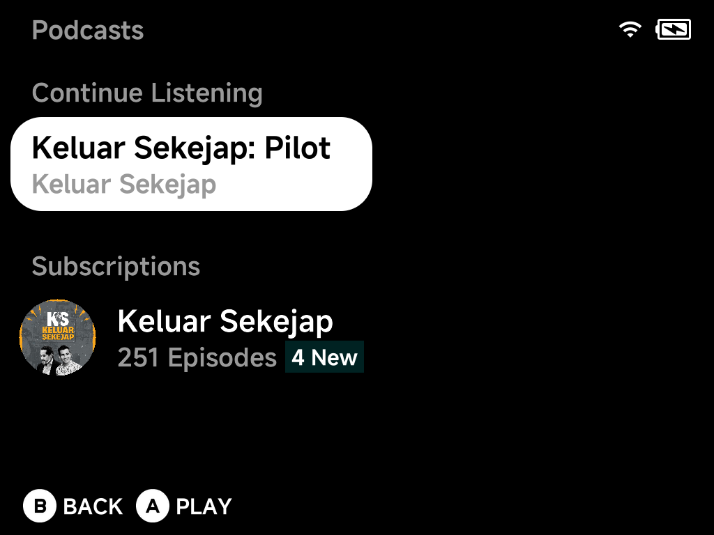

The Podcasts page shows **Continue Listening** (episodes you're partway
through — playback position is remembered per episode) and your
**Subscriptions**, each with its episode count and a *New* badge.

Press `MENU` on a subscription for its context menu:

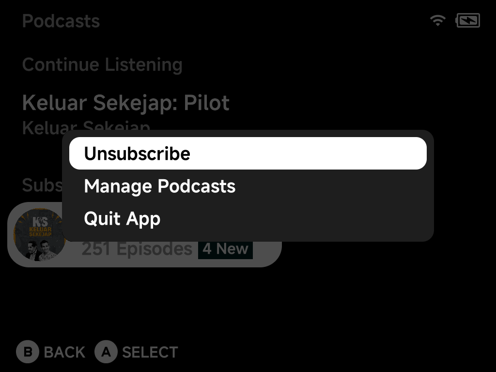

- **Unsubscribe** — remove the podcast, with a confirmation.
- **Manage Podcasts** — subscribe to new shows (below).
- **Refresh List** appears when you need to re-fetch feeds.

### Subscribing

**Manage Podcasts** offers two ways in, both backed by the Apple Podcasts
directory:

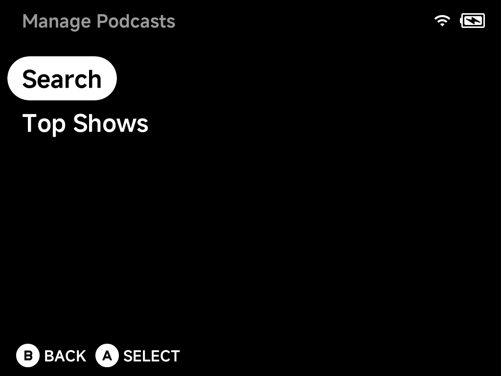

- **Search** — find a show by name with the on-screen keyboard.
- **Top Shows** — browse the podcast charts for your country:

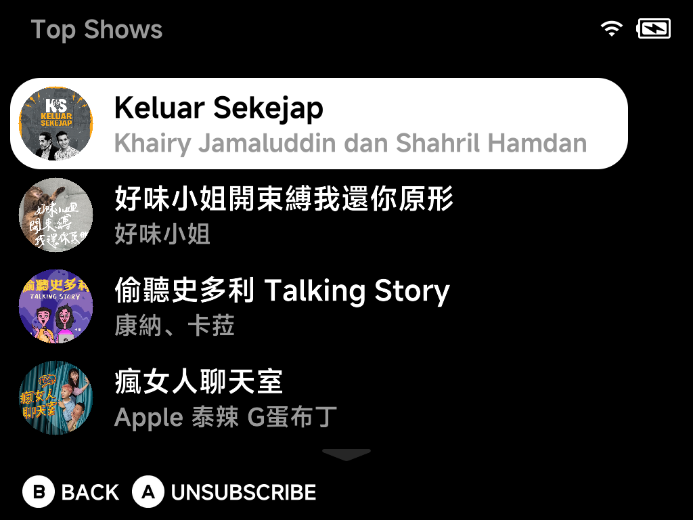

`A` subscribes to the selected show — or unsubscribes if you already follow
it (the hint bar tells you which).

### Episodes

Opening a show lists its episodes under the show's artwork and description
— each with its duration, age, a **New** badge for fresh episodes, and a
download indicator:

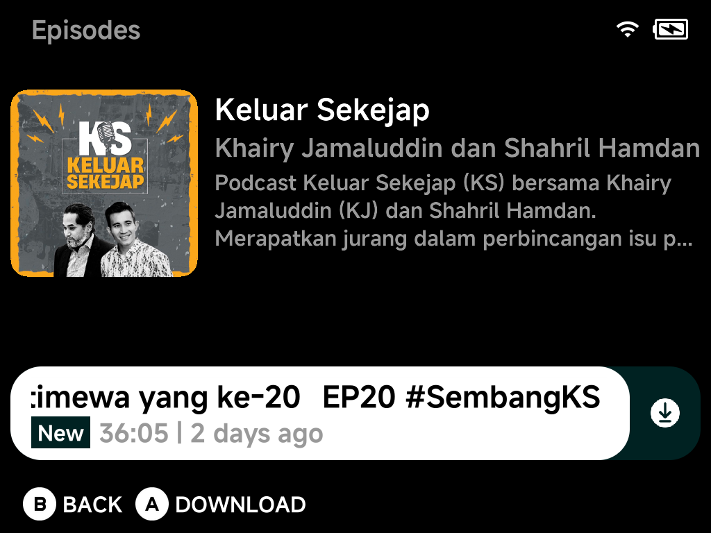

Episodes are **downloaded to the SD card** for offline listening — on a new
episode `A` starts the download (the hint bar shows it), and once
downloaded, `A` plays.

Press `MENU` on an episode for its context menu:

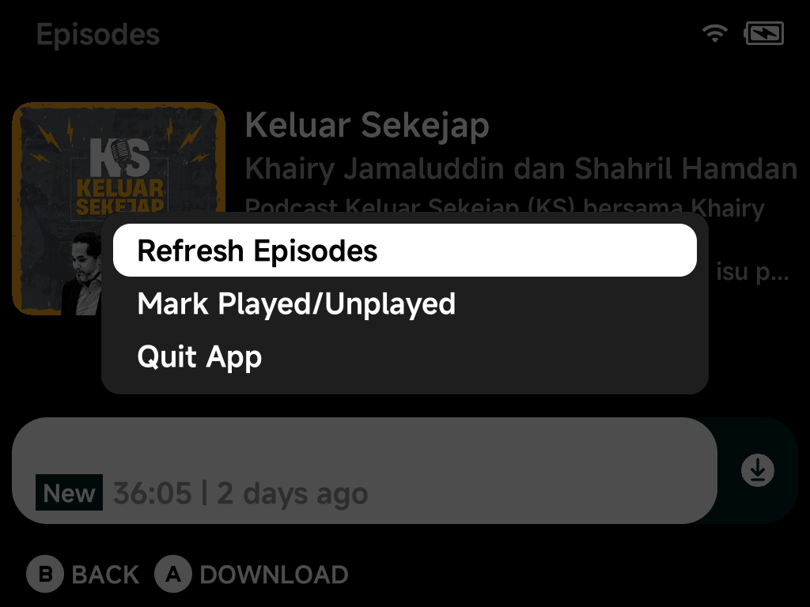

- **Refresh Episodes** — re-fetch the show's feed.
- **Mark Played/Unplayed** — toggle the episode's played state.
- The menu adapts to the episode: a downloaded episode adds **Remove
  Download**, and one mid-download offers cancelling it.

### Podcast player

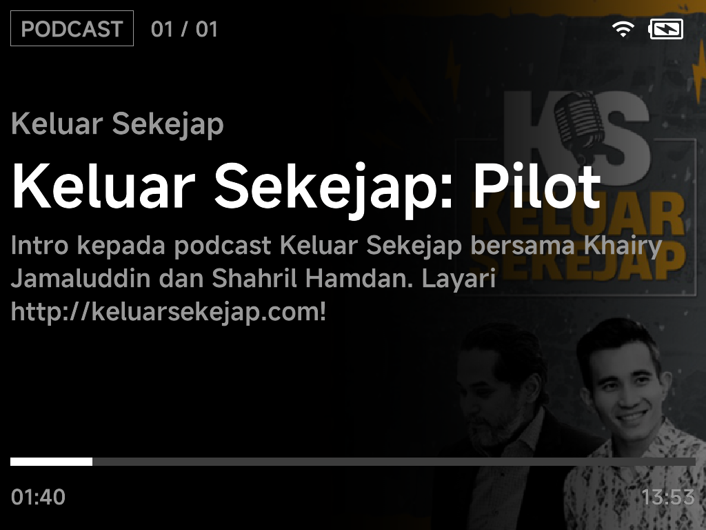

The player shows the episode description over the show's artwork, with a
progress bar and position. Playback position is saved as you listen, so
**Continue Listening** can pick the episode back up later.

| Button | Action |
| --- | --- |
| `A` | Pause / resume |
| `B` | Back to the episode list — **audio keeps playing** (if paused, stops) |
| `Left` | Skip back 10 s (hold to keep skipping) |
| `Right` | Skip forward 30 s (hold to keep skipping) |
| `Up` / `Down` | Playback speed up / down (0.5× – 2×, in 0.25 steps) |
| `SELECT` | Turn the screen off now |
| `SELECT` + `A` | Wake the screen when it is off |

[Auto screen off](#auto-screen-off) applies here too — idle timeout, and
headset media buttons keep working while the screen is dark.

## Settings

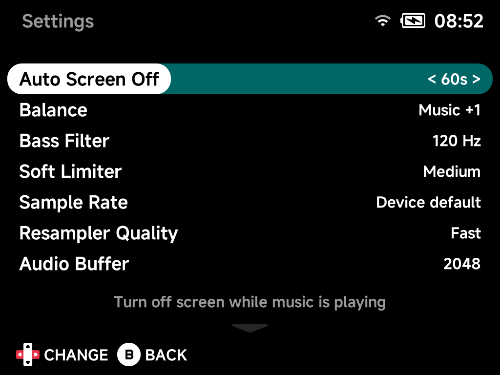

- **Auto Screen Off** — idle time before the screen turns off during
  playback.
- **Bass Filter** — high-pass filter to reduce speaker distortion.
- **Soft Limiter** — limits volume peaks to prevent clipping.
- **Sample Rate** — `Device default`, or `Follow source` for bit-exact
  hi-res playback on USB DACs (no resampling); applies on the next track.
- **Resampler Quality** — higher quality costs more CPU.
- **Audio Buffer** — larger buffers prevent dropouts.
- **Clear Album Art / Clear Lyrics** — empty the on-SD caches.

Output routing is system-wide: speaker, Bluetooth or USB-C DAC, switched
automatically as devices connect — see
[Settings → Audio](../settings/audio.md).
