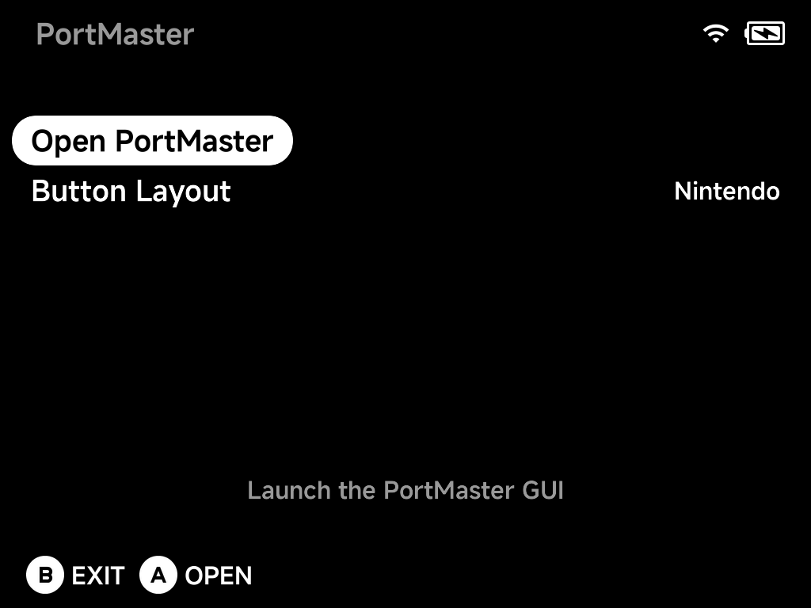
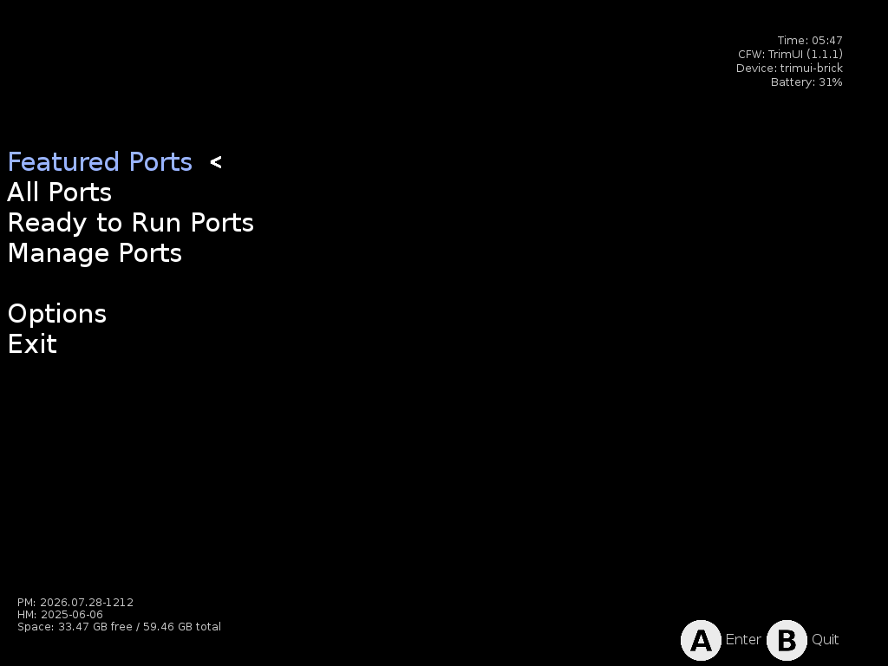
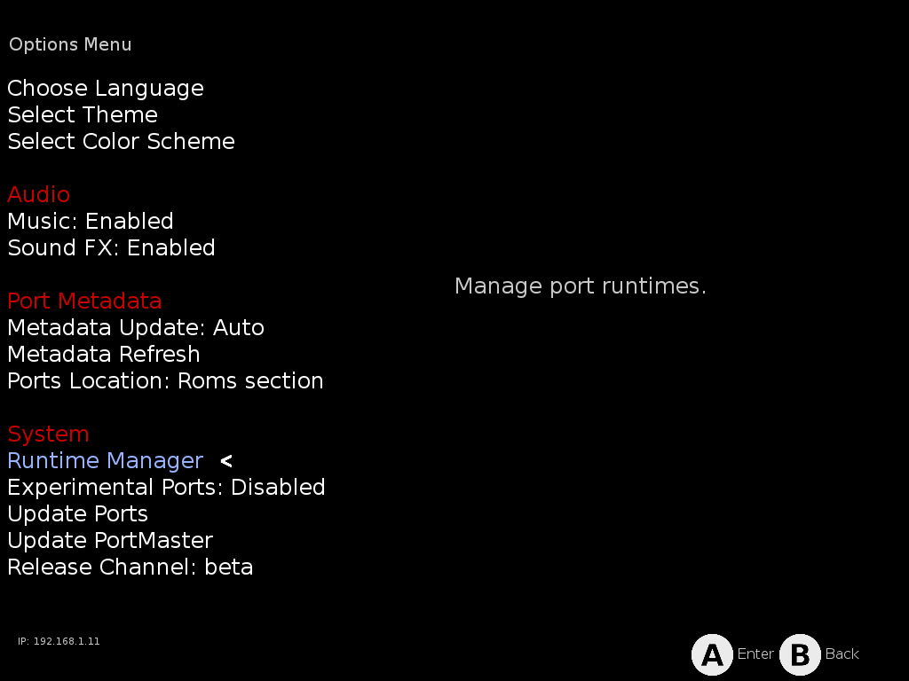
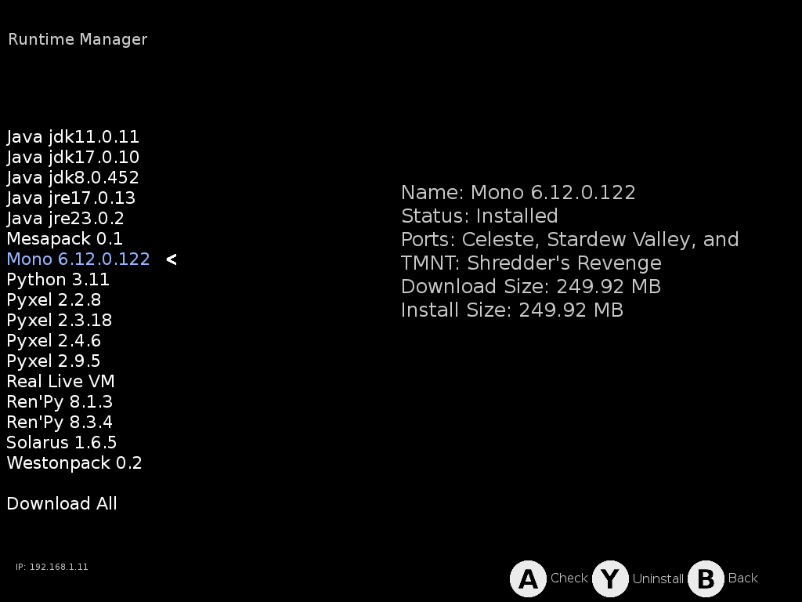

# PortMaster

[PortMaster](https://portmaster.games/) is the community launcher for game
ports — hundreds of games ported to run on handhelds. It is not part of the
core NX Redux install: install it on-device from the
[Xtras store](xtras.md)'s **TOOLS** tab, and it appears in the Tools menu.

## Launching

Opening **Tools → PortMaster** shows a small launcher first:



- **Open PortMaster** — launch the full PortMaster interface.
- **Button Layout** — `Nintendo` by default; switch it here if you prefer
  the other layout.

## Installing ports

The PortMaster interface is where you browse and install ports — Featured,
All Ports, and Ready to Run (games that need no extra files):



Installed ports land in the `Roms/Ports (PORTS)` folder and show up under
**Ports** in the main menu, launching like any other game. Some ports need game data
files from the original game — each port's details page says what it needs.

## Missing runtimes

Many ports rely on a shared **runtime** (Mono, Godot, Java, …) that
PortMaster downloads separately from the game. If you copied ports over
from another device or SD card — rather than installing them through
PortMaster — the games arrive but the runtimes they need don't, and the
port won't start.

Two ways to fix it:

1. **Reinstall the port from PortMaster** — installing through the app
   pulls in the runtimes it needs.
2. **Download the runtime directly**: open **Options → Runtime Manager**:

    

    Select the runtime the game needs — the details panel shows its status,
    size, and **which of your installed ports depend on it**, so it's easy
    to spot what's missing:

    

    Press `A` to download/check the selected runtime (or use **Download
    All** at the bottom of the list to grab everything at once).

## FAQ

### A port I copied from another device won't start

Most likely a missing runtime — see
[Missing runtimes](#missing-runtimes) above.

### A port fails because its launch script uses symlinks

The SD card is formatted exFAT/FAT32, which **does not support symlinks** —
and some ports' launch scripts create them (typically to link save
directories into the game folder). NX Redux's PortMaster integration
already works around the common cases (its installer creates real copies
where upstream uses library symlinks, and the launcher bind-mounts the game
data), but a port whose own script calls `ln -s` still needs a minor
adjustment — usually replacing the symlink with a bind mount.

NX Redux ships **ready-fixed launch scripts** for known cases (for example
`SteelAssault.sh`, which replaces the port's save-directory symlinks with
bind mounts) in:

```
Emus/shared/PortMaster/patchedScripts/
```

These are applied **automatically**: whenever you open the PortMaster app,
every patched script that matches a port on your card replaces the stock
one in `Roms/Ports (PORTS)/`. So a port installed through PortMaster is
fixed from the start — and if you copied a game over from another device,
just open PortMaster once (or reinstall the port) and the fix lands too.
Copying a script from `patchedScripts/` by hand is only ever a fallback.

### A port doesn't work on this device at all

Some older ports are built **only for 32-bit ARM (armhf)**. The TrimUI
firmware ships no 32-bit libraries or loader, so those ports cannot run on
NX Redux devices — PortMaster itself detects this (`DEVICE_HAS_ARMHF=N`)
and generally hides them, but an armhf-only port copied over manually will
never start. 64-bit (aarch64) builds of ports work normally.

## Good to know

- **Sleep works in PortMaster games** — press the power button like
  anywhere else.
- PortMaster keeps itself up to date (it checks for updates when it starts).
