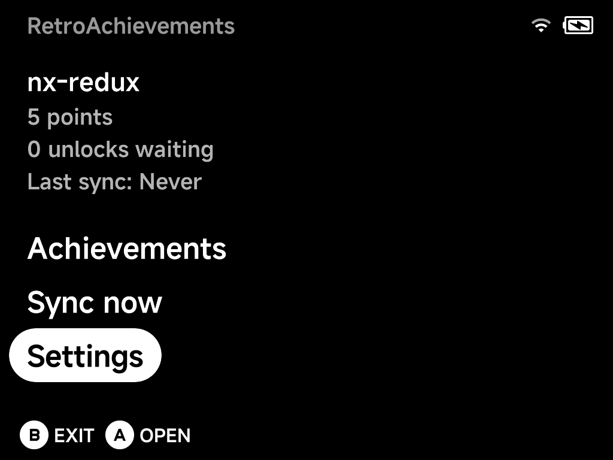
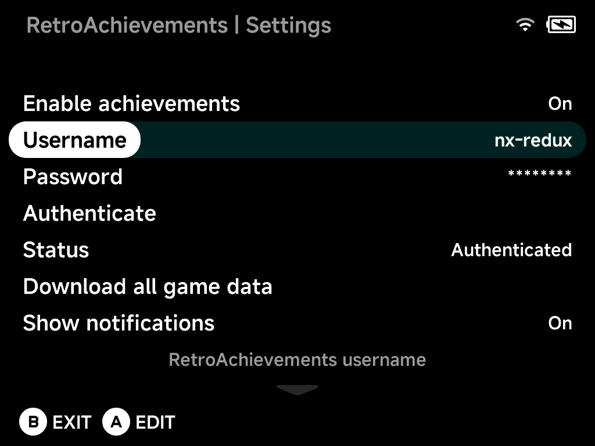
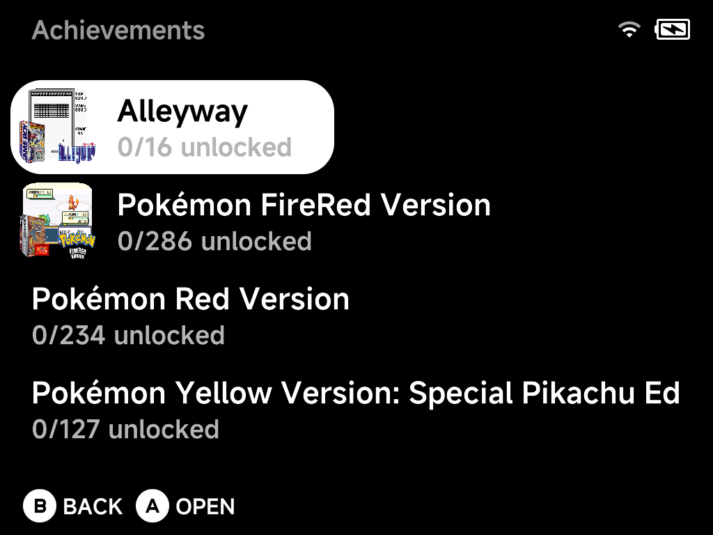
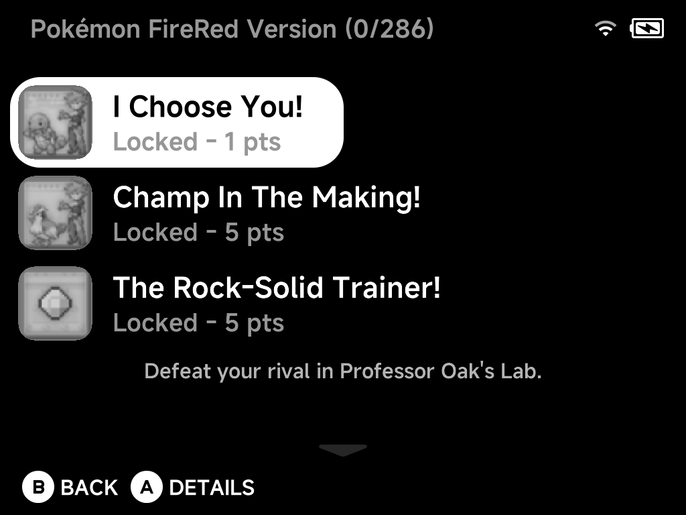
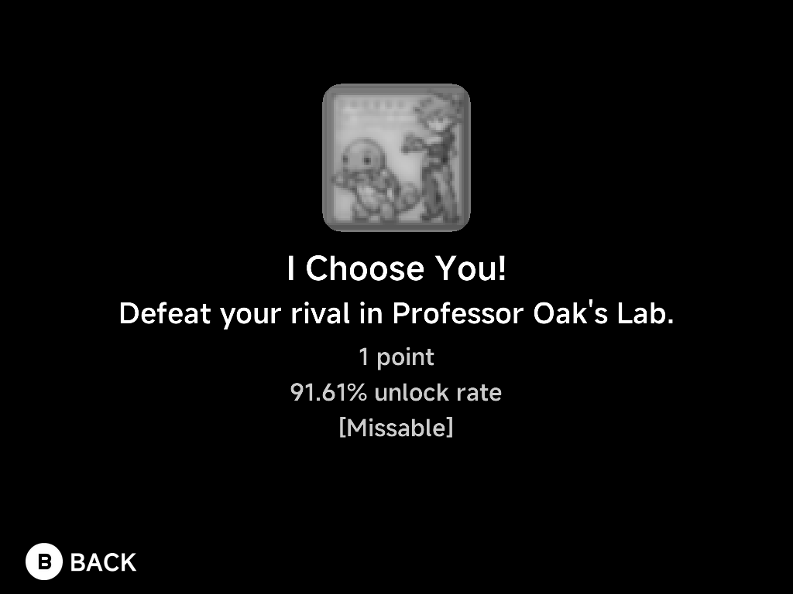

# RetroAchievements

NX Redux integrates [RetroAchievements](https://retroachievements.org/) with
**full offline support**, powered by
[rcheevos](https://github.com/RetroAchievements/rcheevos). The
**RetroAchievements** tool in Tools is the single home for the feature:
sign in, browse your achievements and manage every setting here.

The home screen shows your account at a glance — points, unlocks waiting to
be synced, and when the last sync happened — above the three entries:
**Achievements**, **Sync now** and **Settings**.

## Setting up

You need a free [retroachievements.org](https://retroachievements.org/)
account. Then, in **Settings**:

1. Set **Enable achievements** to `On`.
2. Enter your **Username** and **Password** with the on-screen keyboard.
3. Choose **Authenticate** — it tests the credentials and retrieves your API
   token; **Status** shows `Authenticated` when it works.

Below the account block, Settings also holds:

- **Download all game data** — pre-cache your whole library (see
  [Offline support](#offline-support)).
- **Show notifications** and **Notification duration** — in-game unlock
  popups and how long they stay.
- **Progress duration** — how long progress updates (top-left) stay on
  screen; `Off` disables them.
- **Achievement sort order** — how achievements are sorted, both here and
  in the in-game menu.
- **Reset account data** — clear login and progress, keeping cached game
  data (for switching accounts).
- **Erase all achievement data** — remove everything, including games and
  badges.
- **Reset settings to defaults**.

## Earning achievements

Achievements work in the **built-in emulator cores** — launch a recognized
game and unlocks are tracked automatically as you play:

- An **unlock notification** pops up when you earn an achievement.
- **Progress updates** (e.g. collectible counters) appear in the top-left.
- The in-game [pause menu](../guide/playing-games.md#the-in-game-menu)'s
  **Options** gains an **Achievements** entry: browse the game's
  achievements without leaving the game, press `Y` to filter to locked
  ones, and press `X` to **mute** a specific achievement's notifications
  (handy for spammy progress trackers).

!!! info "Softcore only, by design"
    NX Redux is not an RA-approved hardcore emulator, so hardcore mode is
    intentionally omitted to keep your account safe. Unlocks are submitted
    as softcore.

## Offline support

Everything is built to work without a connection:

- **Earn offline** — unlocks are journaled to the SD card and submitted
  automatically the next time you play online (the home screen counts
  "unlocks waiting").
- **Cached game data** — achievement definitions, unlock state and badges
  are cached as you play, so a game you've launched once keeps working
  offline.
- **Pre-download** — **Download all game data** caches achievement data for
  every game in your library with a live progress bar, so even games you
  have *never* launched online work offline.

## Browsing your achievements

**Achievements** lists every cached game with box art and unlock progress —
fully offline:

Open a game to see its achievements, each with its badge and points — the
selected achievement's description shows below the list. Unlocked,
pending-sync and locked achievements are all here, in your chosen sort
order:

Press `A` for the full details of an achievement — badge, description,
points, global unlock rate, and type tags like `[Missable]`,
`[Progression]` or `[Win Condition]`:

## Syncing

Offline unlocks sync automatically when you're back online; **Sync now** on
the home screen pushes them immediately. The home screen's "unlocks
waiting" and "Last sync" tell you where you stand.
