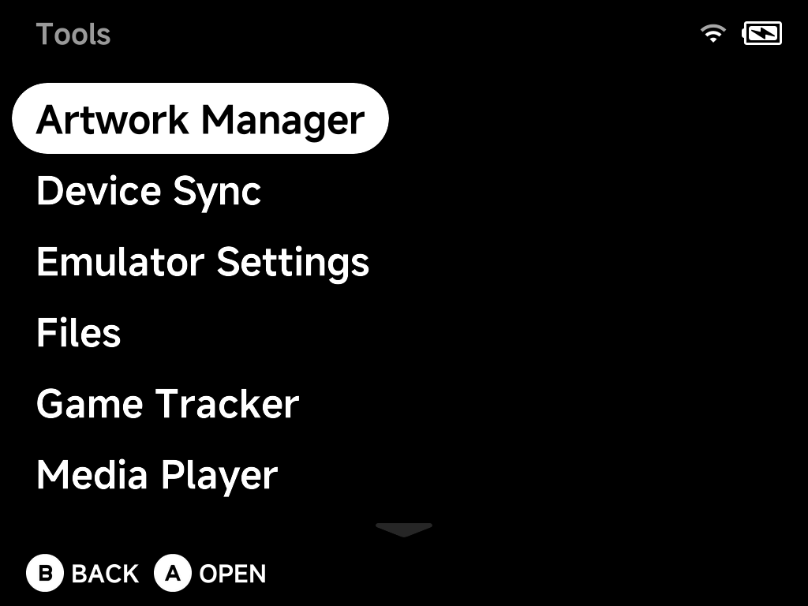

# Tools Overview

The **Tools** entry at the bottom of the main menu collects every built-in app
and utility.

| Tool | What it does |
| --- | --- |
| [Artwork Manager](artwork-manager.md) | Fetch custom mix box art for your ROMs |
| [Device Sync](device-sync.md) | Sync saves, states, settings and ROMs across devices |
| [Emulator Settings](emulator-settings.md) | Configure each system's emulator options |
| [Files](files.md) | Dual-pane file manager for the SD card |
| [Game Tracker](game-tracker.md) | Play-time statistics per game |
| [Media Player](media-player.md) | Video player with audio/subtitle switching |
| [Music Player](music-player.md) | Music, internet radio and podcasts |
| [PortMaster](portmaster.md) | Community game ports (installed via Xtras) |
| [RetroAchievements](retroachievements.md) | Achievements, fully offline-capable |
| [Settings](../settings/index.md) | Display, audio, network, input, Simple Mode and more — see the [Settings](../settings/index.md) page |
| [Xtras](xtras.md) | On-device add-on store |

Tools installed from the [Xtras store](xtras.md) — such as PortMaster — appear
in this menu too.

## Installing community paks

Community paks built for **NextUI** still work: copy the `<Name>.pak` folder
into `/Tools` on the SD card (or `/Emus` for an emulator pak) and it appears
in this menu — follow each pak's own installation steps.

Some paks' instructions say to place them inside a **platform folder** (e.g.
`Tools/tg5040/<Name>.pak`) — that layout works too, and for paks whose
scripts reference the platform path internally it is **required**, so when a
pak's README says to use it, do. The platform folder name depends on your
device:

| Device | Platform folder |
| --- | --- |
| Brick / Brick Hammer / Brick Pro / Smart Pro | `tg5040` |
| Smart Pro S | `tg5050` |

If the same pak exists in both places, the flat copy (`Tools/<Name>.pak`)
wins.

!!! warning
    Don't give your pak the same name as a tool or emulator shipped with NX
    Redux — same-named paks in `/Tools` and `/Emus` are treated as NX Redux
    leftovers and removed on every update. And remember these paks target
    NextUI, not NX Redux — see the support notes in
    [Additional Emulators](../emulators/additional.md).
