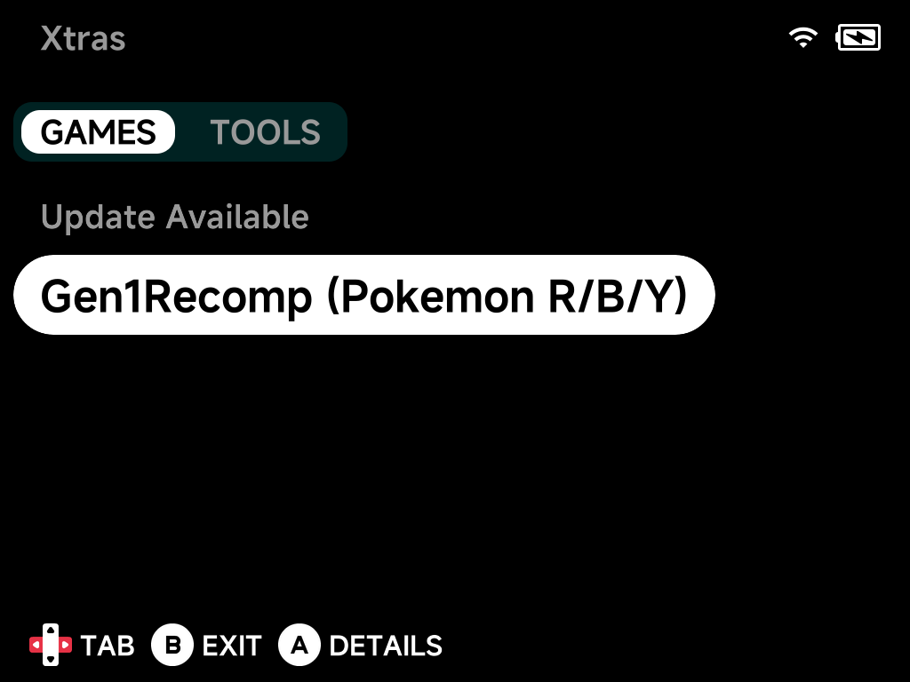
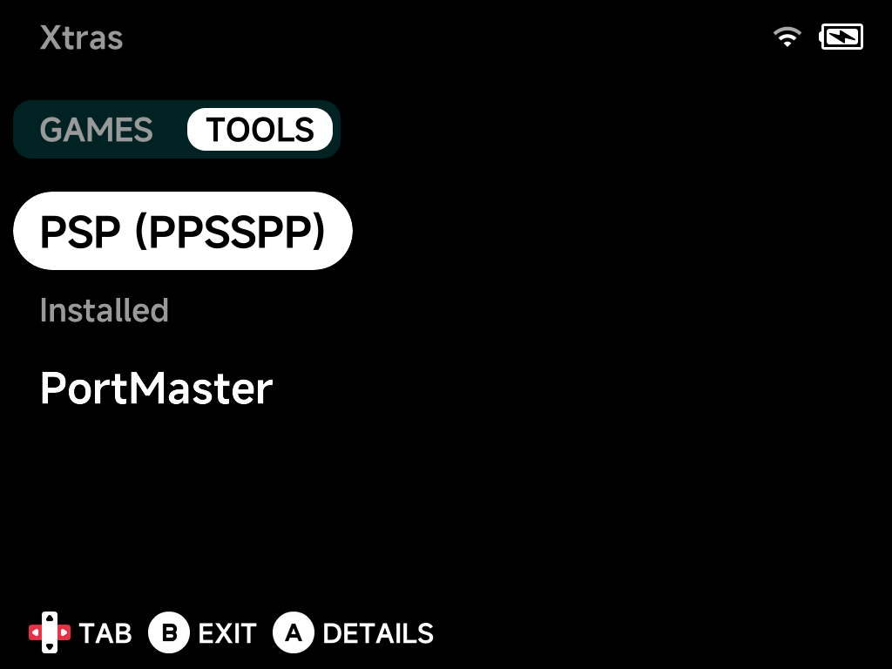

# Xtras Store

**Tools → Xtras** is an on-device add-on store for optional games and tools
that are not part of the core install. Browse the **GAMES** and **TOOLS** tabs
(`Left` / `Right` to switch), press `A` for details, and install or update
right from the device.

The **TOOLS** tab holds installable tools and emulators — already-installed
entries are grouped under an *Installed* header:

Installed entries show up in your regular menus — a game appears in **Xtra
Games**, a tool appears in [Tools](tools.md). When an update is available, the
store labels the entry accordingly.

!!! note "The catalog grows"
    More standalone games and tools will be added to Xtras over time — check
    back after updating NX Redux.

## PSP emulator

**PSP (PPSSPP)** installs
[ben16w's community PSP.pak](https://github.com/ben16w/minui-psp) directly
on-device (~31 MB download) — no computer needed. Put your games in
`Roms/Sony Playstation Portable (PSP)` afterwards. Community-pak
[support notes](../emulators/additional.md) apply.

## PortMaster

[PortMaster](https://portmaster.games/) — the community launcher for game
ports — is the flagship entry in the **TOOLS** tab. Once installed it
appears in the Tools menu; see the dedicated
[PortMaster page](portmaster.md) for how it works.
