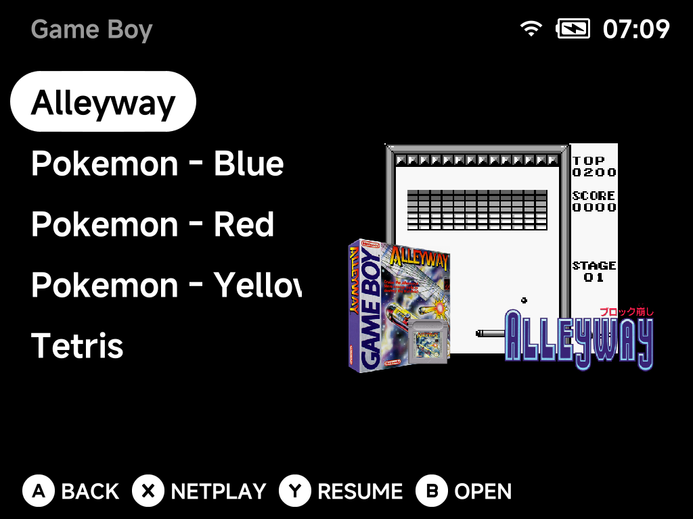
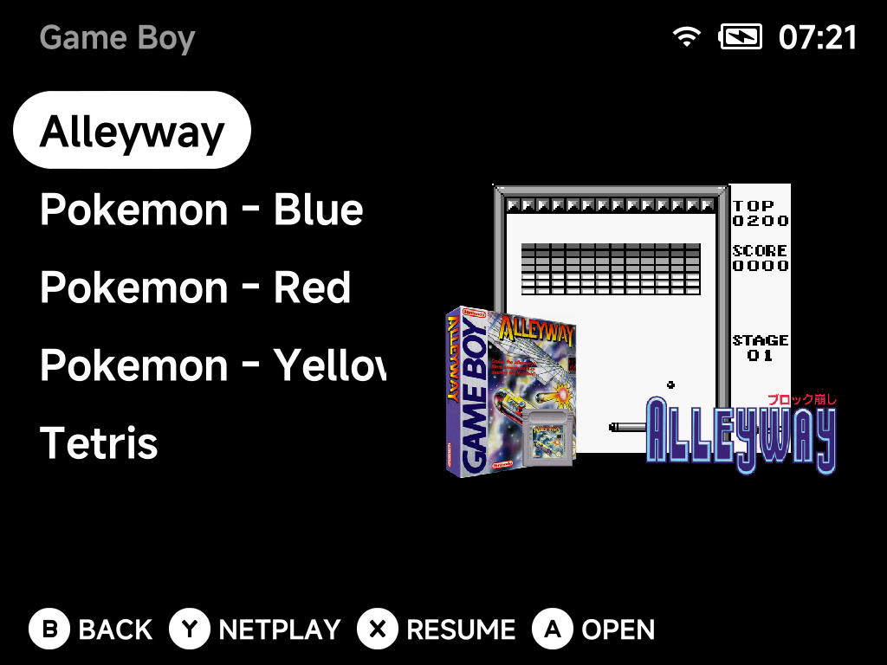
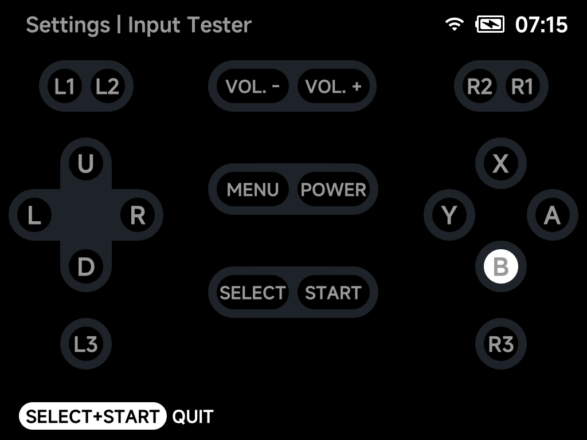

# Button Layout

The face buttons on every supported device are printed in the Nintendo
arrangement: `A` on the right, `B` at the bottom, `X` on top, `Y` on the
left. If you are used to the Xbox arrangement — confirm at the bottom, back
on the right — NX Redux can swap them for you, everywhere at once.

## Switching to the Xbox layout

Open **Settings → System → Button layout** and pick `Xbox`. From then on:

- the **bottom** button is `A` (confirm) and the **right** button is `B`
  (back);
- the **top** button is `Y` and the **left** button is `X`.

Every other button keeps its place. `Nintendo` is the default.

The change applies as soon as you leave Settings — in the menus, the apps,
the in-game menu and every emulator. The one exception is the
[On-Screen Display](osd.md), which only picks the new layout up after a
restart, so restart once and the whole device agrees.

!!! note "Where the swap applies"
    The swap is a device-wide setting, not a per-emulator one. It covers the
    menus and every app, the in-game menu, all libretro cores (their button
    remapping screens included), the standalone Nintendo DS and Nintendo 64
    emulators together with their in-game overlays, the Dreamcast in-game
    overlay, PortMaster ports, and the On-Screen Display. If a game's
    controls feel wrong after a change, quit it and start it again —
    emulators read the layout when they launch.

    Dreamcast games are the exception: their face buttons always map by
    position (bottom is Dreamcast `A`) whichever layout you pick. See
    [Dreamcast → Controls](../emulators/dreamcast.md#controls).

## Hint labels

The button hints at the bottom of every screen name the button to press.
When the Xbox layout is on, **Settings → System → Hint labels** decides which
letter they show:

- **Printed caps** (default) — the hint shows the letter printed on the cap
  you actually press. The confirm hint reads `B`, because the bottom cap is
  printed `B`.

  

- **Layout letters** — the hint shows the button's role, so the confirm hint
  reads `A` even though you press the bottom cap. Pick this if you have
  physically swapped the caps, or simply think in Xbox terms.

  

This setting changes only what the hints say, never what the buttons do, and
it takes effect immediately — the hint bar in Settings updates as you toggle
it. It has no effect while the layout is `Nintendo`.

!!! tip "Swap the caps for a seamless switch"
    The face-button caps on these devices are removable. If you move them
    into the Xbox arrangement (`A` bottom, `B` right, `X` left, `Y` top), the
    device reads like an Xbox controller: the letters you see are the
    letters the games use. Do that together with `Button layout` = `Xbox`
    **and** `Hint labels` = `Layout letters` — the default `Printed caps`
    assumes the caps are still in the Nintendo arrangement, so with swapped
    caps it would show the wrong letters.

## Checking the result

Open **Settings → Input Tester**. The button circles are drawn where the
buttons are on the device, so under the Xbox layout the bottom circle lights
up when you press the bottom button and is labelled the way your hints are.

## Good to know

- Libretro button remaps you save in a game's **Controls** screen are stored
  by role (`A`, `B`, …), so they keep working when you change the layout —
  only the letters shown on that screen follow the hint-label setting.
- The Settings app keeps the layout it started with until you leave it, so
  the buttons never swap under your thumb mid-session.
- PortMaster no longer has a layout switch of its own; ports follow this
  setting.
