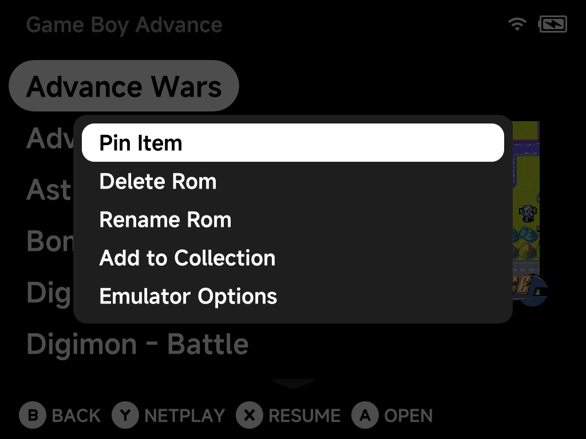

# Game Context Menu

Press `MENU` on a highlighted game in any game list to open its context menu.

Depending on the game, the menu offers:

- **Pin Item / Unpin** — pin the game to the main menu for one-press access.
- **Delete Rom** — remove the game (with a confirmation dialog).
- **Rename Rom** — rename a game; its box art, saves and save states are
  renamed along with it.
- **Add to Collection** — add the game to an existing collection or create a
  new one on the spot.
- **Remove from Recently Played** — clear the game from your recent list.
- **Emulator Options** — edit
  [per-game emulator options](emulator-options.md), overriding the
  system-wide defaults.
- **Fetch Box Art** — download box art for this game in the background (shown
  when the game has none yet).
- **Refresh Roms** — rescan the ROMs list.

!!! tip "Bulk box art"
    To fetch artwork for many games at once, use the
    [Artwork Manager](../apps/artwork-manager.md) instead of fetching one
    game at a time.
