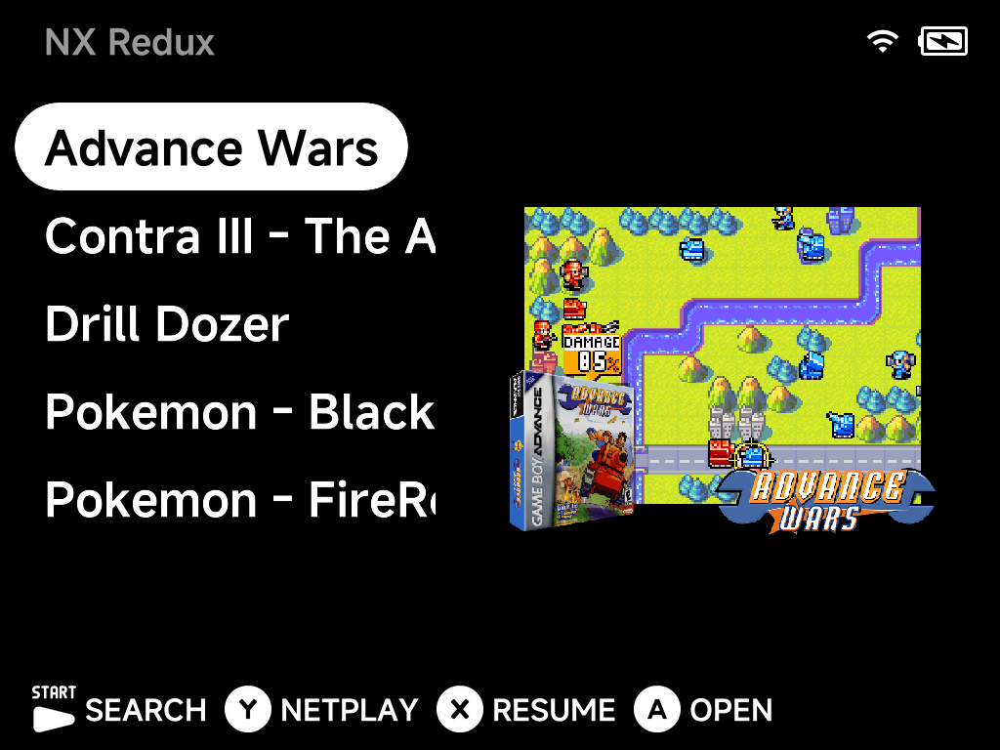
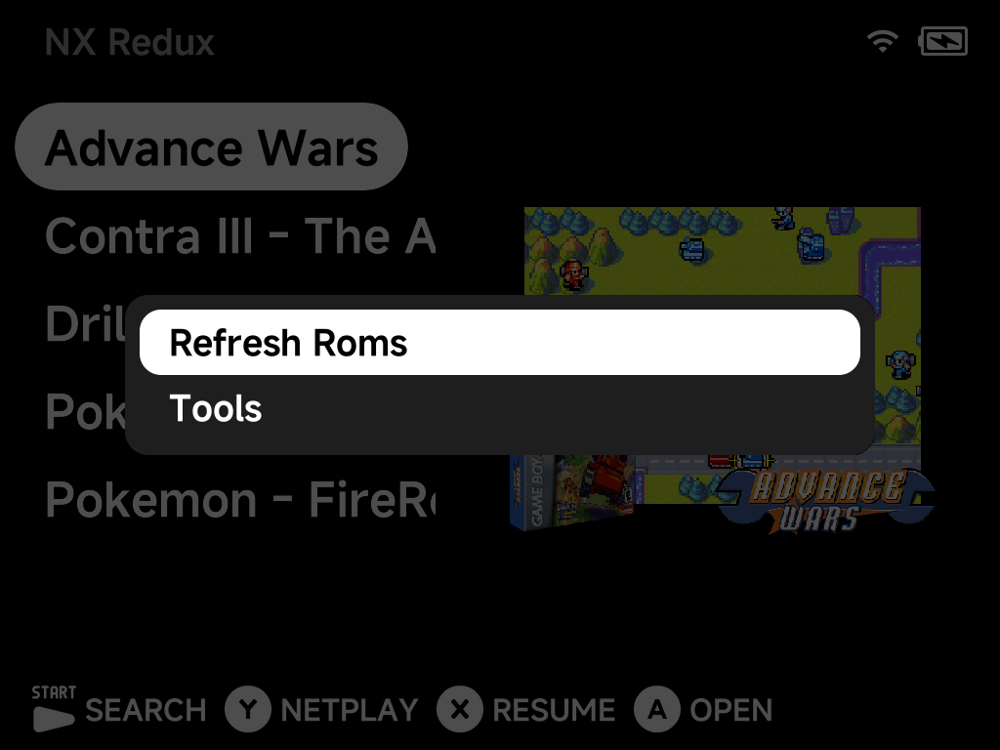

# Five-Game Menu

Turn the main menu into a tiny, distraction-free list of just the games you
actually play — pick up, pick one of five, play. Inspired by the
["Five Game Handheld"](https://www.youtube.com/watch?v=t2rMB5z9dQw) idea.

The whole menu is your hand-picked games with their box art — no system
folders, no Recently Played, no Tools. It takes two steps:

## 1. Pin your games

For each game you want on the menu, press `MENU` on it in its game list and
choose **Pin Item** (see the [context menu](context-menu.md)). Pinned games
appear directly on the main menu.

## 2. Hide everything else

In **Settings →** [Appearance](../settings/appearance.md), turn off:

- **Show Recents**
- **Show Tools**
- **Show Collections**
- **Show Emulators**

That removes the Recently Played entry, the Tools entry, Collections, and
all the system folders — leaving only your pinned games.

## Getting back to Tools

Nothing is locked away: press `MENU` on the main menu and the context menu
still offers **Tools** —

— so Settings stays reachable whenever you want to add a game, adjust
something, or turn the hidden entries back on.

!!! tip "Handing the device to a child?"
    The five-game menu is a convenience, not a lock — Tools is one `MENU`
    press away. For a setup that actually locks Settings behind a PIN, use
    [Simple Mode](simple-mode.md) (the two combine nicely).
