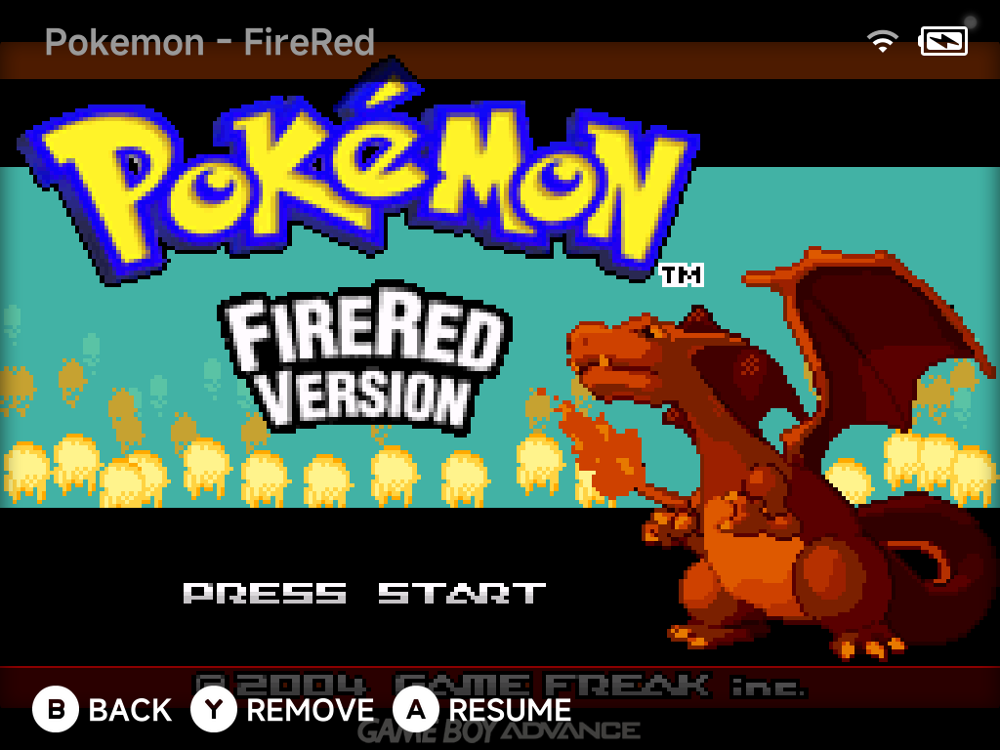

# Game Switcher

Tap `SELECT` anywhere in the menus to open the Game Switcher — a full-screen
carousel of your recent games that resumes any of them instantly.

- `Left` / `Right` flip through games.
- `A` **Resume** — continue exactly where you left off.
- `Y` **Remove** — take the game out of the switcher.
- `B` **Back** — return to the menu.

## Always resumable

Quitting a game auto-saves to a hidden save slot (minarch cores, Nintendo 64
and Dreamcast), so the Game Switcher always resumes exactly where you left off
— no manual save states needed.

Games without a save state show their box art as a fallback, so the switcher
stays visual even for freshly added titles.

## Resumable-only by default

By default the switcher lists **only resumable games**. If you would rather see
all recent games, switch the behavior in **Settings → System** (`All recent
games`).
