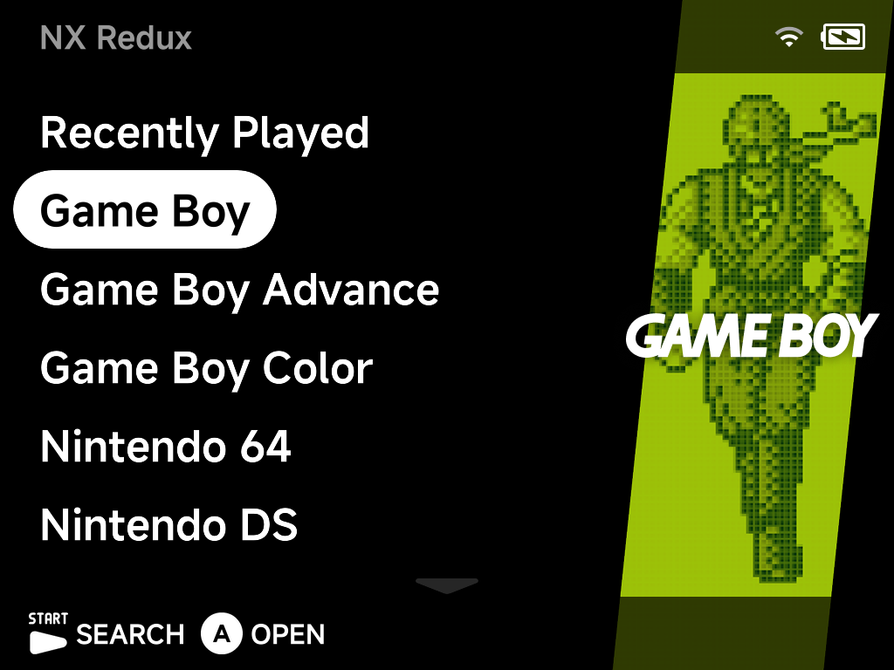
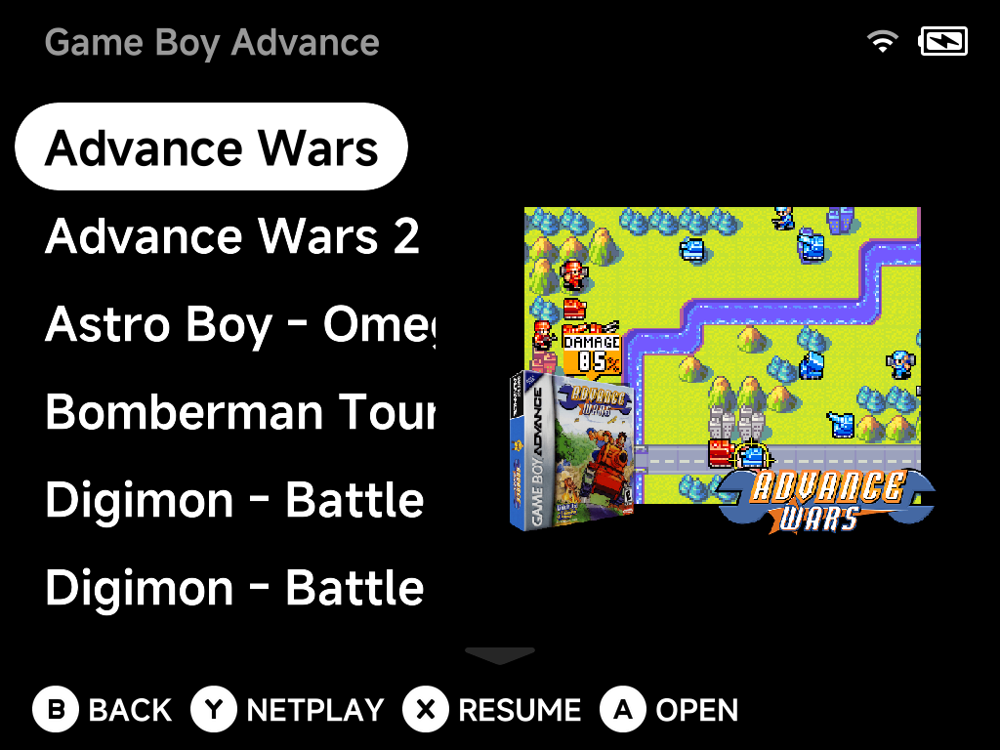
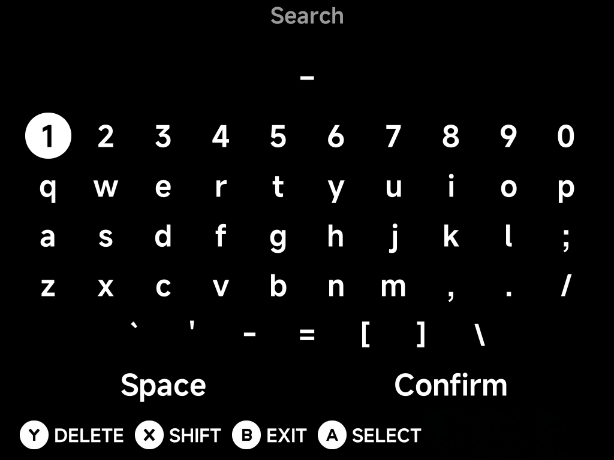

# Main Menu & Game Lists

The main menu lists your systems, with **Recently Played** at the top and
**Tools** at the bottom. The artwork panel on the right previews the selected
system or game.



## Navigating

- `Up` / `Down` move through the list — the list wraps around at both ends, so
  one press `Up` from the top jumps straight to Tools at the bottom.
- `A` opens the selected system, folder or game.
- `B` goes back.
- Scroll indicators at the top and bottom edges show when there is more to see.

## Game lists

Opening a system shows its games, with box art and a screenshot preview for the
selected title.



The hint bar shows what is available for the selected game:

- `A` **Open** — launch the game.
- `X` **Resume** — jump straight back into your auto-saved session (shown when
  the game has one).
- `Y` **Netplay** — host or join a local wireless session for
  [supported systems](../netplay.md).
- `B` **Back** — return to the main menu.
- `MENU` — open the [game context menu](context-menu.md).

## Search

Press `START` on the main menu to search your entire library.



Type with the on-screen keyboard (`A` select, `X` shift, `Y` delete) and
confirm to see matching games from every system.

## Shortcuts and pinned games

- Games can be **pinned to the main menu** from their
  [context menu](context-menu.md) for one-press access.
- Tools can be pinned the same way — press `MENU` on a tool in the Tools
  list and choose **Pin Tool**.
- Prefer a minimal menu with only hand-picked games? See the
  [Five-Game Menu](five-game-menu.md) guide.

## Reordering systems

The main menu lists systems alphabetically by folder name — so to put your
favorites first, add a number prefix to the folder names under `Roms/`:

```
Roms/
├── 1) Game Boy Advance (GBA)
├── 2) Super Nintendo ES (SFC)
├── 3) Sony PlayStation (PS)
└── Sega Genesis (MD)          ← unnumbered folders follow, alphabetically
```

The number is **only used for sorting — it never shows in the menu**: the
list still displays "Game Boy Advance", "Super Nintendo ES" and so on.
Rename the folders from a computer, or right on the device with the
[Files](../apps/files.md) tool.

Two things to keep in mind:

- Sorting is alphabetical, so with **ten or more** numbered folders use
  zero-padding (`01)`, `02)`, … `10)`) — otherwise `10)` sorts before `2)`.
- Keep the tag in parentheses (e.g. `(GBA)`) untouched — it's what links
  the folder to its emulator. Only add the prefix at the front.

!!! note "Only the tag matters"
    The folder name itself is free-form — the **uppercase tag in
    parentheses at the end** is the only part that links the folder to its
    emulator. `Roms/GBA Games (GBA)` or `Roms/1) My Handheld Picks (GBA)`
    work exactly like `Roms/Game Boy Advance (GBA)`; rename the front part
    to whatever you want the menu to show. The tag values are listed on
    [Cores & BIOS Files](../emulators/cores.md).

The same trick works on files and folders *inside* a system — prefix game
names with `1) `, `2) ` to control their order in the game list.

## Multi-disc games

Give a multi-disc game its own folder inside the system folder, with the
disc images plus an `.m3u` file named **exactly after the folder**, listing
one disc file per line:

```
Roms/Sony PlayStation (PS)/Final Fantasy VII/
├── Final Fantasy VII.m3u      ← contains the three .cue names, one per line
├── Final Fantasy VII (Disc 1).cue / .bin
├── Final Fantasy VII (Disc 2).cue / .bin
└── Final Fantasy VII (Disc 3).cue / .bin
```

The folder then behaves as a **single game**: it shows as one entry in the
game list, launches disc 1 when opened, can be pinned to the main menu, and
shares one save/resume identity across discs. While playing, swap discs
from the in-game [pause menu](playing-games.md#the-in-game-menu), which
shows the current **Disc N** — save states remember which disc they belong
to.

The same folder trick works for single-disc `.cue`/`.bin` games too: a
folder containing a matching folder-named `.cue` shows and launches as one
game instead of exposing the file pair.

## Custom display names (map.txt)

To rename games without touching the files, drop a `map.txt` inside the
system folder. Each line maps a **filename** to a display name, separated
by a single **tab**:

```
Roms/Game Boy Advance (GBA)/map.txt:

Advance Wars 2 - Black Hole Rising (USA).gba	Advance Wars 2
Legend of Zelda, The - The Minish Cap (USA).gba	Zelda: Minish Cap
```

The list re-sorts by the new display names, and the number-prefix trick
above works inside them too. Since the files themselves are untouched,
save files, states and box art all stay matched — unlike the context
menu's **Rename**, which renames the actual files. An alias starting with
a dot (e.g. `Track01.bin	.hidden`) **hides** the entry from the list
entirely.

A `map.txt` at the top level (`Roms/map.txt`) does the same for the
**system folders** — an alternative to renaming the folders themselves.

## Refreshing the ROMs list

The system and ROM lists are **cached** for fast boots. The cache refreshes
itself on startup whenever files changed while the device was off — but if
you add, rename or reorganize ROMs **while the device is running** (over
USB, ADB or a network share), the menus won't see the changes yet.

Press `MENU` on the main menu and choose **Refresh Roms** to rebuild the
list on the spot. The same action is available in a game's
[context menu](context-menu.md) (**Refresh Roms**) and in
[Settings → System](../settings/system.md#refresh-emulatorroms-list)
(**Refresh emulator/roms list**).

## Collections

Build your own game collections from the game list: press `MENU` on a game and
choose **Add to Collection** — add it to an existing collection or create a new
one on the spot. Collections appear as a **Collections** entry on the main
menu (hide it via [Appearance](../settings/appearance.md) if unused).

Under the hood each collection is a plain text file at
`Collections/<Name>.txt` — one SD-relative path per line — so you can also
build them on a computer:

```
Collections/RPG Nights.txt:

/Roms/Game Boy Advance (GBA)/Golden Sun.gba
/Roms/Sony PlayStation (PS)/Final Fantasy VII/Final Fantasy VII.m3u
```

Entries whose file is missing are silently skipped, and a
`Collections/map.txt` can alias the displayed names, same
[format as above](#custom-display-names-maptxt).
