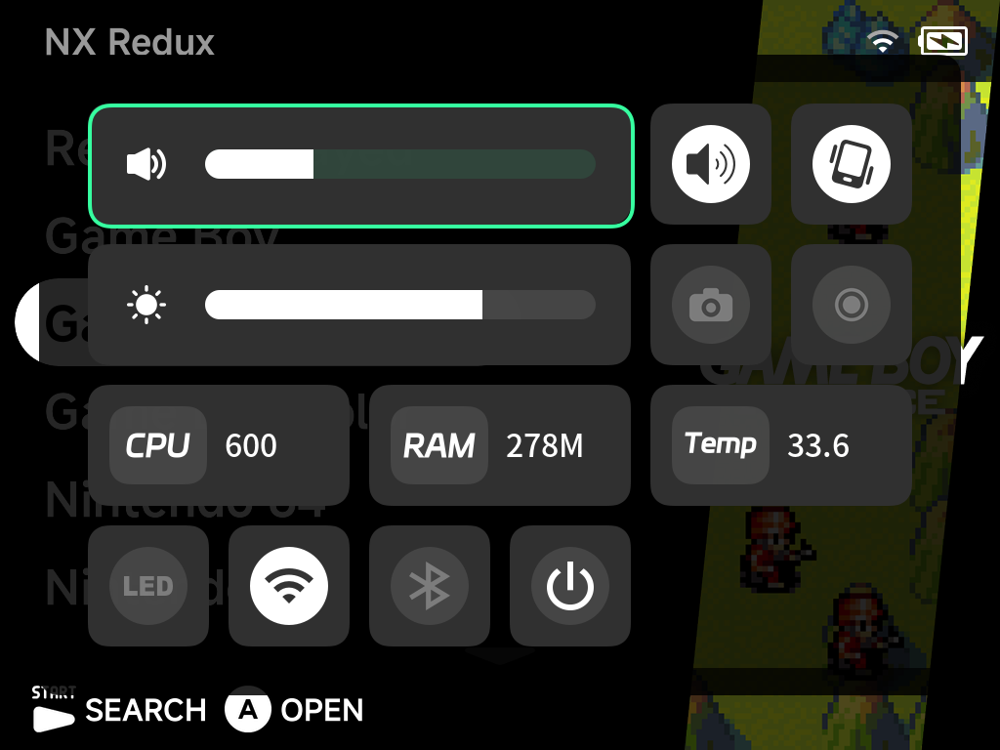

# On-Screen Display

The On-Screen Display (OSD) gives quick access to common actions from anywhere
— in the menus or in-game — without quitting what you're doing.

## Opening the OSD

- **Smart Pro S**: press the `HOME` button.
- **Brick / Brick Pro / Smart Pro**: long-press the `MENU` button.

The OSD overlays the screen with a grid of widgets:

- **Volume slider** with mute toggle, **brightness slider**, and **rumble**
  toggle.
- **Wi-Fi**, **Bluetooth** and **LED** toggles with live state.
- **Screenshot** and **Screen Recorder** toggles (see below).
- System monitors: CPU frequency, memory usage and temperature (plus fan
  control on the Smart Pro S).
- **Power off** button.

The entire OSD (layout, widgets, icons) ships on the SD card, so it stays
consistent regardless of the stock firmware version.

## Screenshots

Enable **Screenshot** in the OSD to arm the capture daemon — a camera icon
appears in the status bar while it is armed.

- Press `L2` + `R2` to capture the screen. An on-screen hint shows the
  shortcut when you arm it, and a toast confirms each saved capture.
- Captures are saved to `Images/Screenshots` on the SD card.
- The OSD closes itself when you arm the capture, so it never gets in the way.

## Screen recording

Enable **Screen Recorder** in the OSD and recording runs automatically in the
background — the record icon in the status bar turns red while recording.
Recordings are saved as MP4 to `Videos/Recordings` on the SD card. Turn the
toggle off to stop.

!!! note
    Where a capture isn't possible (some third-party content on certain
    devices), the screenshot tool tells you honestly with a "Capture not
    available here" toast instead of saving a black image.
