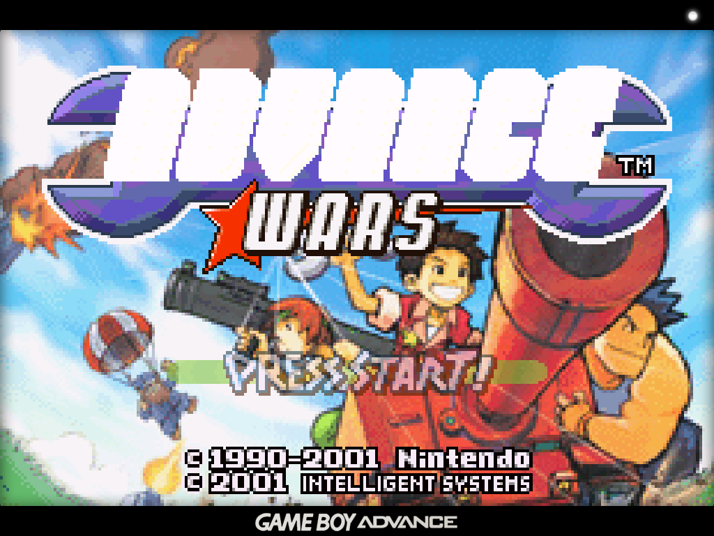
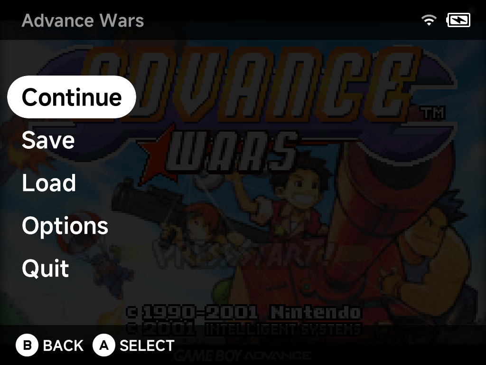

# Playing Games

Launch a game with `A` from any game list, or resume your last session with
`X` (or through the [Game Switcher](game-switcher.md)).



## The in-game menu

Press `MENU` while playing to pause the game and open the in-game menu. All
emulators — the built-in cores and the standalone Nintendo 64, Nintendo DS and
Dreamcast emulators — share the same menu with UI styling consistent with the
rest of the system.



- **Continue** — return to the game.
- **Save** / **Load** — save states, complete with screenshots so you can see
  what you're loading.
- **Options** — [emulator options](emulator-options.md) for the running
  game, applied live.
- **Quit** — exit back to the menu. Quitting auto-saves to a hidden slot, so
  the [Game Switcher](game-switcher.md) can always resume exactly where you
  left off.

## Saves and save states

**Battery saves** (the game's own save files) live on the SD card in
`Saves/<TAG>/` (e.g. `Saves/GBA/`). By default they are written as
**uncompressed RetroArch-compatible `.srm`** files — you can move them
between NX Redux and RetroArch on another device as-is. The format is
changeable in [Settings → System](../settings/system.md#save-format)
(`MinUI` `.sav`, RetroArch compressed/uncompressed `.srm`, or Generic).

**Save states** offer **8 slots per game**, each with a screenshot, via the
pause menu's Save/Load. They are stored per core under
`.userdata/shared/`, and default to RetroArch-style naming (also
[configurable](../settings/system.md#save-state-format)). Keep in mind
save states are tied to the emulator core that made them — unlike battery
saves, they generally don't survive moving to a different emulator.

On top of the 8 slots, quitting a game writes a **hidden auto-resume
state** (a ninth, invisible slot). That's what the
[Game Switcher](game-switcher.md) resumes from — it never touches your
manual slots.

[Device Sync](../apps/device-sync.md) carries both: `Saves/` and the
shared state folder.

## Cheats

Cheat files use the standard **RetroArch `.cht` format** (the
[libretro cheat database](https://github.com/libretro/libretro-database/tree/master/cht)
is a ready source). Name the file after the game and put it in the
system's folder under `Cheats/`:

```
Roms/Game Boy (GB)/Super Example World (USA).zip
Cheats/GB/Super Example World (USA).cht        ← with or without the .zip
```

While playing, open the pause menu → **Options → Cheats** to toggle
individual cheats on and off.

## Shaders

The pause menu's **Options → Shaders** page controls the video shader
pipeline:

- **Presets** — ready-made looks shipped in the `Shaders/` folder:
  `crt-perfect`, `lcd-perfect`, `dmg-perfect` (original Game Boy),
  `real-gameboy`, `real-gba`, `scanlines`, `old-tv`, pixel-perfect
  variants and more. Loading a preset replaces your current shader
  settings — to just try one out, exit the game without saving settings.
- **Manual setup** — up to **3 shader passes**, each picking a `.glsl`
  shader from `Shaders/glsl/`, with per-pass filter and scaling options.

Shader choices save with the emulator's config, so they can be set
system-wide or [per game](emulator-options.md).

## Overlays

Overlays are border/bezel images drawn around the game screen. Releases
ship a set for many systems (Native/Aspect variants, with optional LCD
grid); pick one in-game under pause menu → **Options → Frontend →
Overlay**.

To add your own, drop a PNG at your device's screen resolution into the
system's folder under `Overlays/` (e.g. `Overlays/GBA/My Bezel.png`) — it
appears in the Overlay list by filename.

## Sleep

Press the power button to put the device to sleep — this works in all
standalone emulators and PortMaster games, not just the built-in cores.

## Audio output

All emulators support USB-C and Bluetooth audio. Hot-plugging a USB-C DAC or
connecting Bluetooth mid-game reroutes audio automatically — a headphone icon
appears in the status bar while an external output is active. See
[Settings → Audio](../settings/audio.md) for details.

## In-game notifications

RetroAchievements unlock and progress notifications appear in-game as you play
— see [RetroAchievements](../apps/retroachievements.md). Their behavior can be
tuned in **Settings → In-game Notifications**.
