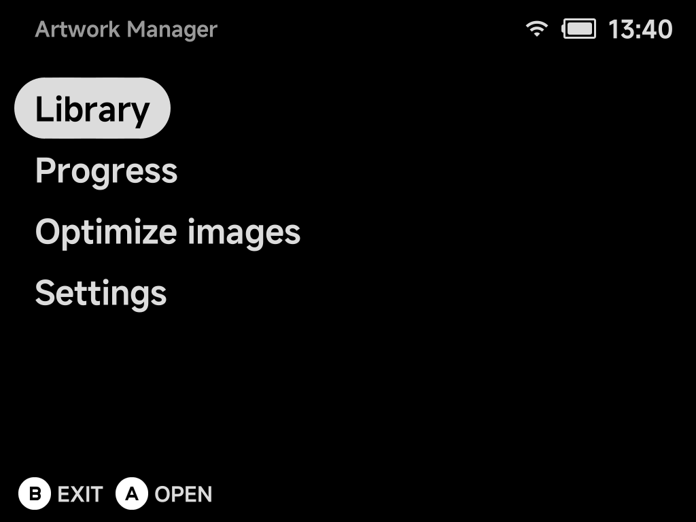
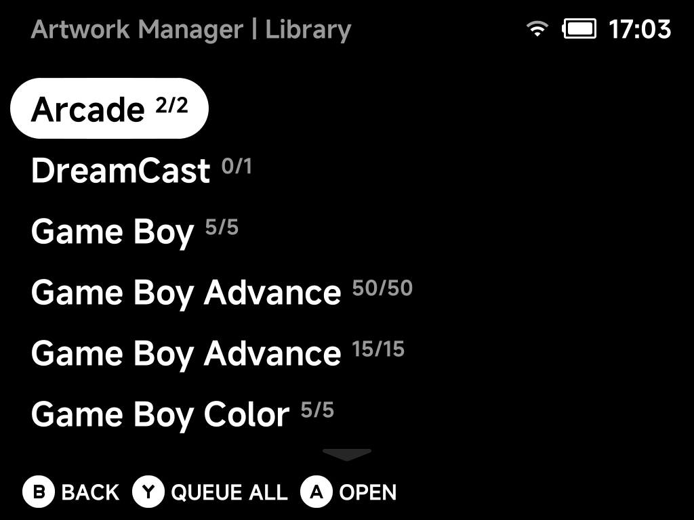
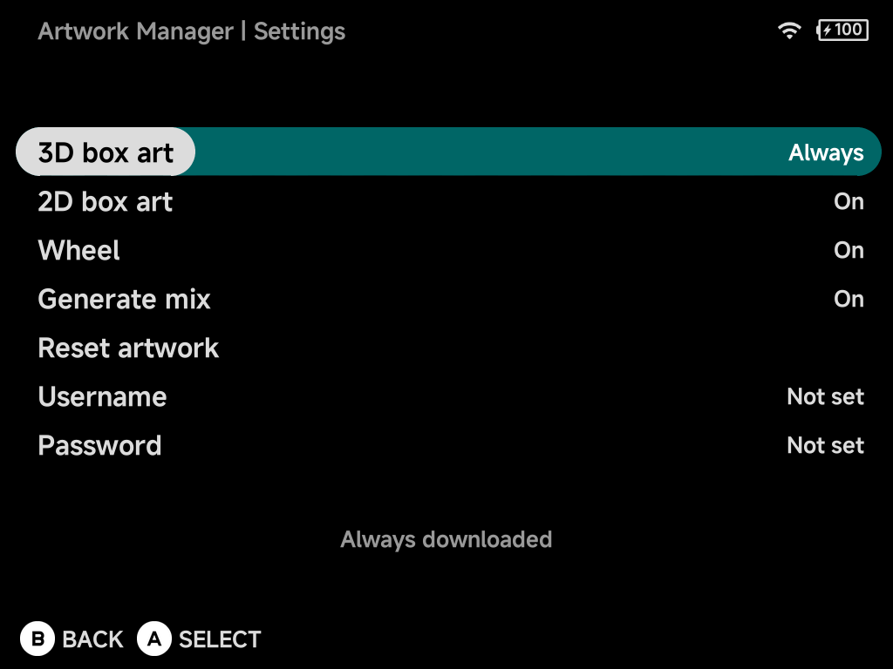

# Artwork Manager

**Tools → Artwork Manager** fetches box art, screenshots and a mix composite
for your ROMs in bulk.

## Library

The Library lists every system with its artwork coverage (games with art /
total games).

A system is any folder directly under `Roms` whose name ends in a tag in
parentheses, for example `Virtual Boy (VB)`. The tag picks the system. A folder
marked **Unsupported** has a tag ScreenScraper has no system for, so you can
rename it.

| Button | What it does |
| --- | --- |
| `A` **Open** | Drill into a system to queue individual games |
| `Y` **Queue All** | Queue every missing artwork in the selected system |
| `B` **Back** | Go back |

??? info "More detail: how systems and games are matched"
    **System tags.** The tag picks the ScreenScraper system; the folder name
    before it is only a label. Common tags and their aliases (`SNES`/`SFC`,
    `PSX`/`PS1`, `TG16`/`PCE`, `SS`/`SATURN`, …) are recognised. A folder whose
    tag ScreenScraper has no system for still appears, marked **Unsupported**,
    so you can rename it rather than wonder why it is missing. Empty folders
    are skipped.

    **Sega and arcade.** The Sega `MD` and
    [`GPGX`](../emulators/cores.md#supported-cores) tags cover several systems,
    so each game there is matched by its file extension instead:

    | Extension | Matched as |
    | --- | --- |
    | `.sms` | Master System |
    | `.gg` | Game Gear |
    | `.sg` | SG-1000 |
    | `.chd`, `.cue`, `.m3u`, `.iso` (CD images) | Sega CD |
    | everything else | Mega Drive / Genesis |

    Keeping all your Sega games under `(GPGX)` folders therefore scrapes
    correctly without renaming anything. Likewise the
    [Naomi and Atomiswave](../emulators/dreamcast.md#arcade-games-naomi-atomiswave)
    zips in the `DC` folder are matched as Arcade sets by their short zip name,
    the same way `FBN` games are.

    **What counts as a game.** Inside a system folder the scanner sees exactly
    what the game list shows:

    - Every file that is not hidden counts as a game, whatever its extension.
    - Sub-folders are searched too.
    - A multi-disc folder that holds a `.cue` or `.m3u` named after the folder
      counts as one game.
    - A game you have renamed (with **Rename Rom** in its
      [context menu](../guide/context-menu.md)) is listed under its new name,
      just like on the main game list.

    Art for a game in a sub-folder lands in that sub-folder's `.media`. A
    multi-disc folder's art lands next to the folder.

### Queue games in a system

Opening a system lists its games with the artwork already on the card for each
one:

| Status | Meaning |
| --- | --- |
| **Done** | All three images are present |
| **No screenshot** / **No box art** | The Mix is there but that one variant is missing (ScreenScraper had no such image, or it was fetched before the variants existed) |
| **Mix only** | Just the Mix, with neither variant |
| *(nothing)* | No art yet. Once queued, it shows its live status (**Queued**, **Downloading…**, **Done**, **Not Found**, …) |

In the game list:

| Button | What it does |
| --- | --- |
| `A` **Queue** | Queue just the highlighted game. This re-fetches even if it already has art, so use it to fill in a missing **screenshot** or **box art**, or replace a bad match, for one game |
| `Y` **Queue All** | Queue every game in the system that has no Mix yet |
| `B` **Back** | Go back |

## Progress

Queued downloads run in the background. The **Progress** page shows what's
being fetched. Art is placed alongside the ROMs, so it shows up in the game
lists immediately.

!!! tip "Single game instead?"
    For one game, use **Fetch Box Art** in the game's
    [context menu](../guide/context-menu.md). No need to open the Artwork
    Manager at all.

## What gets saved

Each fetch stores up to three images per game: a **Mix** (screenshot with the
box art and logo floating over it), the screenshot alone, and the box art alone.

To choose which one the game list shows, go to **Settings → Appearance →
[Game art type](../settings/appearance.md)** (Mix / Screenshot / Box art). If
the chosen image is missing for a game, the list falls back to the Mix.

??? info "More detail"
    All three images come from a single set of ScreenScraper downloads and go
    inside the system's `.media` folder:

    | File | Content |
    |---|---|
    | `.media/<game>.png` | **Mix**: screenshot with the box art and logo floating over it |
    | `.media/screenshot/<game>.png` | the in-game screenshot on its own |
    | `.media/boxart/<game>.png` | the box art on its own |

    A variant is skipped when ScreenScraper has no such image for a game.

    **Game art type** sits next to **Game art style** (thumbnail or
    full-height background). The **Background** style always uses the
    screenshot, whatever the type is set to. It shows an empty background for
    a game whose screenshot has not been fetched.

!!! note "Upgrading from v1.9.0 or older"
    Releases up to v1.9.0 saved only the Mix image. **Screenshot** and
    **Box art** fall back to it. The **Background** art style never falls back,
    so it shows nothing for art fetched back then.

    To get the extra images for an existing library:

    1. Open **Artwork Manager → Settings → Reset artwork**.
    2. Queue your systems again from the Library page.

## Settings — reset

**Reset artwork** deletes every fetched image (Mix, screenshot and box art)
after a confirmation. The folder backgrounds `bg.png` and `bglist.png` are
kept. It is refused while a queue is still running.

??? info "More detail"
    Reset covers the `.media` folder of every system folder under `Roms`. That
    includes systems the scraper does not recognise, folder games and
    leftovers from renamed ROMs.

!!! tip "Fixing one game? Don't reset everything"
    **Reset artwork** wipes the whole library. To redo the art for a single
    game (one whose status reads **No screenshot** or **No box art**, or that
    matched the wrong game), open its system from the Library, highlight it and
    press `A`. That re-fetches just that game and overwrites its images,
    without touching anything else.

## Settings — your ScreenScraper account

Artwork comes from [ScreenScraper](https://www.screenscraper.fr/). Fetching
works **without any account**. But anonymous access shares a limited request
budget: fine for a game here and there, slow going for a whole library.

Enter your own (free) ScreenScraper **username** and **password** here. Every
fetch then runs on your account's allowance:

| You get | What it means |
| --- | --- |
| **Higher rate limits** | Your account's own daily request quota, which for registered users is well above the shared anonymous budget |
| **Live quota display** | Once logged in, the page shows **Requests Today** and **Max Requests** (your account's daily limit), fetched straight from your ScreenScraper account |
| **Logout** | A logged-in page gains a Logout entry that clears the saved credentials from the device |

Type both fields with the on-screen keyboard. The password is stored on the SD
card and always displayed masked.
