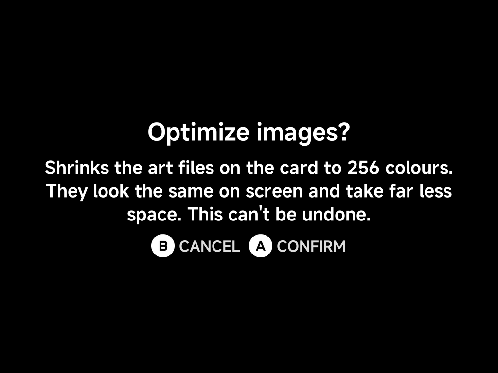

# Artwork Manager

**Tools → Artwork Manager** fetches screenshots and box art for your ROMs in
bulk.

## Library

The Library lists every system with its artwork coverage (games with art /
total games).

A system is any folder directly under `Roms` whose name ends in a tag in
parentheses, for example `Virtual Boy (VB)`. The tag picks the system. A folder
marked **Unsupported** has a tag ScreenScraper has no system for, so you can
rename it.

| Button | What it does |
| --- | --- |
| `A` **Open** | Drill into a system to queue individual games |
| `Y` **Queue All** | Queue every missing artwork in the selected system |
| `B` **Back** | Go back |

??? info "More detail: how systems and games are matched"
    **System tags.** The tag picks the ScreenScraper system; the folder name
    before it is only a label. Common tags and their aliases (`SNES`/`SFC`,
    `PSX`/`PS1`, `TG16`/`PCE`, `SS`/`SATURN`, …) are recognised. A folder whose
    tag ScreenScraper has no system for still appears, marked **Unsupported**,
    so you can rename it rather than wonder why it is missing. Empty folders
    are skipped.

    **Sega and arcade.** The Sega `MD` and
    [`GPGX`](../emulators/cores.md#systems-with-a-choice-of-core) tags cover several systems,
    so each game there is matched by its file extension instead:

    | Extension | Matched as |
    | --- | --- |
    | `.sms` | Master System |
    | `.gg` | Game Gear |
    | `.sg` | SG-1000 |
    | `.chd`, `.cue`, `.m3u`, `.iso` (CD images) | Sega CD |
    | everything else | Mega Drive / Genesis |

    Keeping all your Sega games under `(GPGX)` folders therefore scrapes
    correctly without renaming anything. Likewise the
    [Naomi and Atomiswave](../emulators/dreamcast.md#arcade-games-naomi-atomiswave)
    zips in the `DC` folder are matched as Arcade sets by their short zip name,
    the same way `FBN` games are.

    **What counts as a game.** Inside a system folder the scanner sees exactly
    what the game list shows:

    - Every file that is not hidden counts as a game, whatever its extension.
    - Sub-folders are searched too.
    - A multi-disc folder that holds a `.cue` or `.m3u` named after the folder
      counts as one game.
    - A game you have renamed (with **Rename Rom** in its
      [context menu](../guide/context-menu.md)) is listed under its new name,
      just like on the main game list.

    Art for a game in a sub-folder lands in that sub-folder's `.media`. A
    multi-disc folder's art lands next to the folder.

### Queue games in a system

Opening a system lists its games with the artwork already on the card for each
one:

| Status | Meaning |
| --- | --- |
| **Done** | Both the screenshot and the box art are present |
| **No screenshot** / **No box art** | Only one of the two is there (ScreenScraper had no such image) |
| *(nothing)* | No art yet. Once queued, it shows its live status (**Queued**, **Downloading…**, **Building mix…**, **Done**, **Not Found**, …) |

With [Generate mix](#settings-extra-art) on, a game that has no mix yet counts
as having no art: its status is blank and **Queue All** queues it, so one run
fills in the mixes. The 2D box art and wheel never change a game's status.

In the game list:

| Button | What it does |
| --- | --- |
| `A` **Queue** | Queue just the highlighted game. This re-fetches even if it already has art, so use it to fill in a missing **screenshot** or **box art**, or replace a bad match, for one game |
| `Y` **Queue All** | Queue every game in the system that has no art yet |
| `B` **Back** | Go back |

## Progress

Queued downloads run in the background. The **Progress** page shows what's
being fetched. Art is placed alongside the ROMs, so it shows up in the game
lists immediately.

!!! tip "Single game instead?"
    For one game, use **Fetch Artwork** in the game's
    [context menu](../guide/context-menu.md). No need to open the Artwork
    Manager at all.

## What gets saved

Each fetch stores the in-game **screenshot** and the **box art** for every
game. Each [menu layout](../guide/layouts.md) uses what it needs: the
screenshot for List, Grid and Carousel, and both for Backdrop. The
[extra art](#settings-extra-art) you turn on in Settings (2D box art, wheel,
mix) is saved too, for the [List art](../settings/layouts.md#list-art) and
[Backdrop art](../settings/layouts.md#backdrop-art) options.

??? info "More detail"
    Every image comes from a single set of ScreenScraper downloads and goes
    inside the system's `.media` folder:

    | File | Content | Saved as |
    |---|---|---|
    | `.media/screenshot/<game>.png` | the in-game screenshot | 256 colours |
    | `.media/boxart/<game>.png` | the 3D box art (the 2D one when there is no 3D) | 256 colours |
    | `.media/boxart2d/<game>.png` | the flat 2D box art, with **2D box art** on | full colour, at most 480×576 |
    | `.media/wheel/<game>.png` | the game's logo, with **Wheel** on | full colour, at most 480×576 |
    | `.media/mix/<game>.png` | the mix, with **Generate mix** on | full colour, 384×288 |

    An image is skipped when ScreenScraper has none for the game. A game with
    no art at all gets a generated placeholder picture in the menus instead.

    The 256-colour PNGs look the same on the handheld's screen and take about
    a third of the space. [Optimize images](#optimize-images) shrinks the 2D
    box art the same way, and art fetched by older releases too. The wheel and
    mix stay full colour, since their gradients would band.

    The scraper never writes `.media/<game>.png` directly in `.media`. That
    spot is yours: a picture you put there (a Port's art, a hand-made
    picture) is used when a game has no screenshot, and no Artwork Manager
    action changes it.

!!! note "Art fetched by older releases"
    Releases up to v1.13.0 also made a **Mix** image (the screenshot with
    the box art and logo over it) at `.media/<game>.png`, and releases up to
    v1.9.0 made only the Mix. That file is now treated as your own picture:
    it is shown when a game has no screenshot, and for
    [List art](../settings/layouts.md#list-art) `Mix` when the game has no
    new mix. **Reset artwork** and **Optimize images** leave it alone. A
    game with only that old Mix still counts as having no art: queue it again
    to fetch the screenshot and box art.

## Optimize images

**Optimize images** shrinks the art already on your SD card. Each screenshot,
box art and 2D box art is rewritten as a 256-colour PNG at the same size, so it looks the
same in the menus but takes far less space, typically a third of the
original. It is most useful for art fetched by older releases, which saved
full-colour files.

After you confirm, a progress page shows the system being worked on and how
many files are done. Press `B` to stop: the file in progress is finished first,
so nothing is left half-written. When it ends, a summary shows how many files
were optimized and how much space was saved.

!!! warning "This can't be undone"
    The original full-colour files are replaced. If you want to keep them,
    copy the `.media` folders off the card first.

??? info "More detail"
    - It covers every `.media` folder under `Roms`, including art inside game
      sub-folders: the `screenshot`, `boxart` and `boxart2d` folders.
    - The `wheel` and `mix` folders stay full colour, and the pictures
      directly in `.media` (your own art, old Mix files, `bg.png`,
      `bglist.png`) are left alone.
    - A file that is already optimized, or that would not get smaller, is
      skipped, so running it again is quick and safe.
    - The device stays awake while it runs. A large library can take a few
      minutes: about 400 images took 6 minutes on a Smart Pro S and saved
      over half the space.
    - It can't start while a fetch queue is running.

## Settings — extra art

The first rows of **Settings** pick what each fetch downloads besides the
screenshot. Toggle a row with `Left` / `Right` or `A`. It is saved at once and
applies to the next fetch.

| Row | Default | What it does |
| --- | --- | --- |
| **3D box art** | `Always` | Always downloaded |
| **2D box art** | `Off` | Also download the flat 2D box art |
| **Wheel** | `Off` | Also download the game's logo (wheel). Locked `On` while **Generate mix** is on, which needs it |
| **Generate mix** | `Off` | Build a picture of the screenshot, 3D box art and wheel on the device. Fetching takes longer and uses more storage |

Show them with [List art](../settings/layouts.md#list-art) and
[Backdrop art](../settings/layouts.md#backdrop-art) in Settings → Layouts. To
add them to games that already have art, open a system and press `A` on a
game. With **Generate mix** on, **Queue All** also picks up every game
without a mix.

## Settings — reset

**Reset artwork** deletes every image the scraper downloaded (screenshot, box
art, 2D box art, wheel and mix) after a confirmation. Your own pictures
directly in `.media`, old Mix files and the folder backgrounds `bg.png` and
`bglist.png` are kept. It is refused while a queue is still running.

??? info "More detail"
    Reset empties the `screenshot`, `boxart`, `boxart2d`, `wheel` and `mix`
    folders of every `.media` under `Roms`, including those in game
    sub-folders. That includes systems the scraper does not recognise, folder
    games and leftovers from renamed ROMs.

!!! tip "Fixing one game? Don't reset everything"
    **Reset artwork** wipes the whole library. To redo the art for a single
    game (one whose status reads **No screenshot** or **No box art**, or that
    matched the wrong game), open its system from the Library, highlight it and
    press `A`. That re-fetches just that game and overwrites its images,
    without touching anything else.

## Settings — your ScreenScraper account

Artwork comes from [ScreenScraper](https://www.screenscraper.fr/). Fetching
works **without any account**. But anonymous access shares a limited request
budget: fine for a game here and there, slow going for a whole library.

Enter your own (free) ScreenScraper **username** and **password** here. Every
fetch then runs on your account's allowance:

| You get | What it means |
| --- | --- |
| **Higher rate limits** | Your account's own daily request quota, which for registered users is well above the shared anonymous budget |
| **Live quota display** | Once logged in, the page shows **Requests Today** and **Max Requests** (your account's daily limit), fetched straight from your ScreenScraper account |
| **Logout** | A logged-in page gains a Logout entry that clears the saved credentials from the device |

Type both fields with the on-screen keyboard. The password is stored on the SD
card and always displayed masked.
