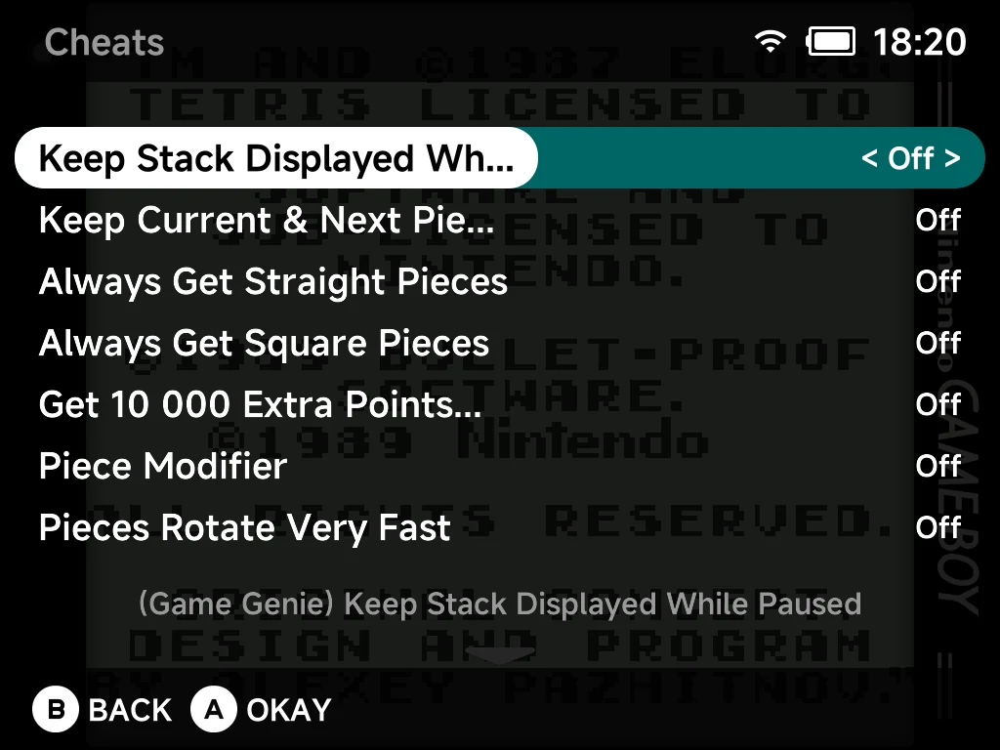
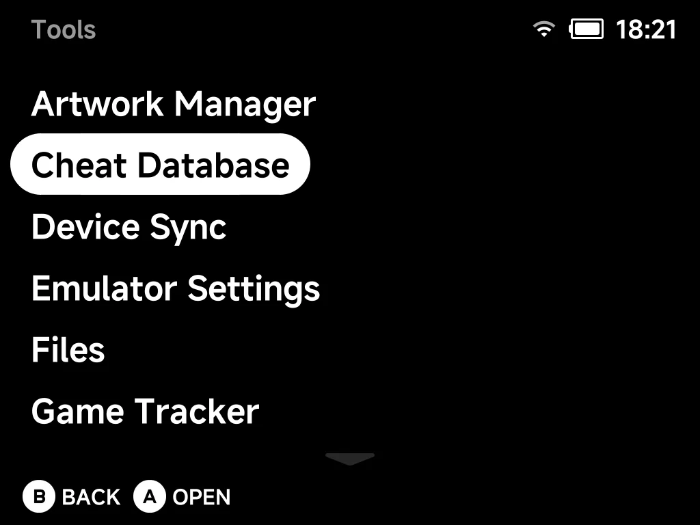

# Cheats

NX Redux can load [libretro](https://www.libretro.com/) cheat files for your
games. Setup takes two steps, all on the device with no computer:

1. Install the small **Cheat Database** tool from the [Xtras Store](xtras.md).
2. Open it from [Tools](tools.md) and **download** the cheat files.

Then turn individual cheats on and off from a game's in-game menu.



## Installing the Cheat Database tool

1. Open **Tools → Xtras**.
2. Press `Right` to switch to the **TOOLS** tab.
3. Select **Cheat Database**.

When it finishes you'll see *"Installed. Open Cheat Database in Tools to
download the cheats."* The entry moves to the *Installed* group in Xtras, and
**Cheat Database** appears in your [Tools](tools.md) menu:



!!! note
    This installs a **small tool** (about 1 MB). It does **not** download the
    cheats yet. That happens on demand from inside the tool.

## Downloading the cheats

1. Open **Tools → Cheat Database**.
2. The first time, the menu offers one choice: **Download cheat database**.
   Select it.
3. A progress bar advances system by system as it installs.
4. When it finishes you'll see *"Done. Open a game and see Options > Cheats."*

You need about **256 MB** free on the SD card.

!!! note "One download, every system"
    A single download covers every supported system at once. You don't grab
    cheats per game or per console. Come back to the tool later to update them.

??? info "More detail"
    The tool downloads the libretro cheat collection (~37 MB) and unpacks it
    onto the SD card. It takes about **185 MB** once extracted (you'll need
    ~256 MB free).

## Keeping things up to date

There are **two separate kinds of update**, from two places:

| What to update | Where | How |
| --- | --- | --- |
| **The cheat files (data)**: new or corrected cheats | Inside the tool | Open **Tools → Cheat Database → Check for updates**. It checks libretro's latest release and re-downloads if it's newer. Otherwise it reports *"Cheat database is up to date."* |
| **The Cheat Database tool itself (code)**: its menus and behaviour | The **[Xtras Store](xtras.md)** | Update it like any other tool. Xtras labels the entry when a new version is available, and a NX Redux system update refreshes it automatically |

## Using cheats in a game

1. Launch a game on a **built-in emulator core**.
2. Press `MENU` to open the in-game menu and choose **Options** (see
   [Emulator Options](../guide/emulator-options.md#in-game-the-pause-menu)).
3. Choose **Cheats**.
4. Toggle any cheat `On` or `Off`. Changes apply **immediately** while you
   play. Each entry carries a short description you can read from the list.

If no cheats are found for the game, the menu tells you so. It points you to
**Tools > Cheat Database** to download them.

!!! tip "Variants are merged automatically"
    Some games have cheat sets from several sources (Game Genie, GameShark,
    Code Breaker, Action Replay). NX Redux loads **all** of them for the
    current game and merges them into one list. Each cheat is tagged with its
    source (for example `[GameShark]`) so you can tell them apart.

### RetroAchievements hardcore mode blocks cheats

If [RetroAchievements](retroachievements.md) **hardcore mode** is active,
cheats cannot be enabled. Trying to toggle one shows *"Cheats disabled in
Hardcore mode"* and the switch snaps back off. This keeps hardcore runs
legitimate. Leave hardcore mode to use cheats.

## DS and N64 { #ds-n64-and-dreamcast }

!!! warning "Built-in cores only, for now"
    Cheats take effect on the **built-in libretro cores** (Game Boy, GBA, NES,
    SNES, Mega Drive, PlayStation, Dreamcast, and the like). They **don't take
    effect yet** on Nintendo DS or Nintendo 64.

The Cheat Database still **delivers** files for these two systems. You'll
find them under `Cheats/NDS/` and `Cheats/N64/`. They are shipped for future
use.

??? info "More detail: why they don't work yet"
    **Nintendo DS and Nintendo 64** run on **standalone emulators** (DraStic
    and mupen64plus). These use their own native cheat formats and don't read
    these libretro `.cht` files.

## Where the files go

Cheats are stored as loose `.cht` text files on the SD card, one folder per
system, under `Cheats/`.

??? info "More detail"
    Example paths:

    ```
    /mnt/SDCARD/Cheats/GBA/Advance Wars (USA, Europe) (Code Breaker).cht
    /mnt/SDCARD/Cheats/SFC/...
    /mnt/SDCARD/Cheats/FC/...
    ```

    Each `Cheats/<system>/` folder uses the same short system tag as your
    `Roms` folders (`GBA`, `SFC`, `FC`, `GB`, `GBC`, `MD`, `PS`, and so on).
    That's how the right cheats are matched to the right games automatically.

## Removing cheats and hand-made cheats

**Write your own cheats:** drop a `<Game Name>.cht` file into the matching
`Cheats/<system>/` folder. It is picked up and merged with the downloaded ones,
like any other cheat file.

**Remove the downloaded database:** there are two ways, and **both always keep
your hand-made `.cht` files**.

| Where | What it removes |
| --- | --- |
| **Tools → Cheat Database → Remove cheat database** | Only the files it downloaded. The tool stays installed so you can download again later. You'll see *"Cheat database removed. Hand-made cheats kept."* |
| Uninstall **Cheat Database** from **Xtras** | The tool **and** its downloaded cheat files, in one step |

You can safely install, download, remove and reinstall without losing your own
cheats.

??? info "More detail"
    Both ways keep a record of exactly what was downloaded and delete only
    that. Any `Cheats/<system>/` folder that still holds one of your own files
    is kept as well.
