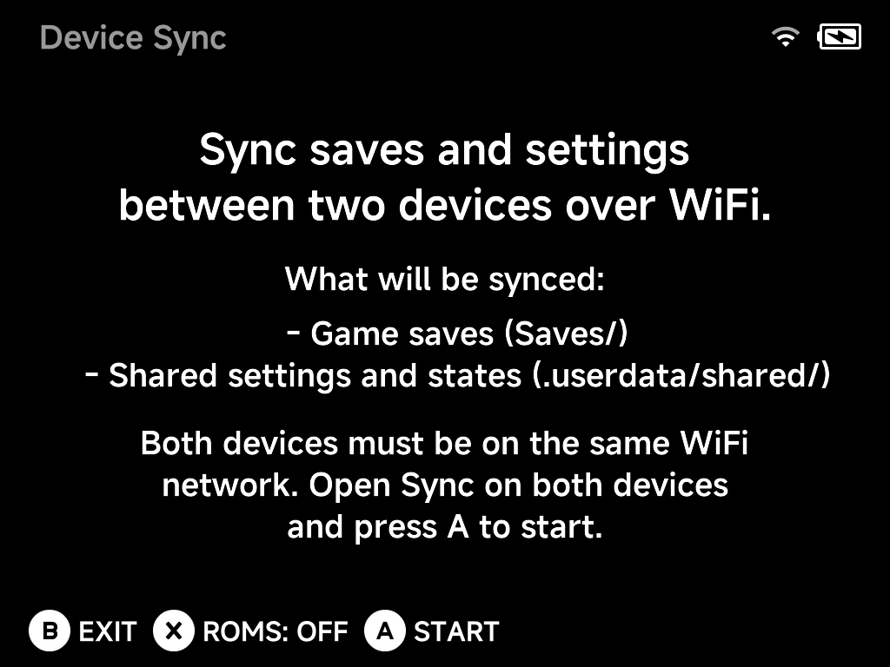

# Device Sync

**Tools → Device Sync** moves your data between two NX Redux devices over
Wi-Fi. It is the supported way to carry your progress to another device.

SD cards are built for one device model, so don't swap them between devices.

## What gets synced

- **Game saves** (`Saves/`)
- **Shared settings and states** (`.userdata/shared/`)
- **ROMs** — optional: press `X` to toggle `ROMS: OFF/ON` before starting.

## How to sync

1. Connect both devices to the **same Wi-Fi network**.
2. Open **Tools → Device Sync** on both devices.
3. Press `A` **Start** on both — the devices find each other and sync.

!!! note
    Device Sync needs an active Wi-Fi connection. If Wi-Fi is off or not
    connected, the tool asks you to turn it on first. The quickest way is the
    Wi-Fi toggle in the [OSD](../guide/osd.md).
