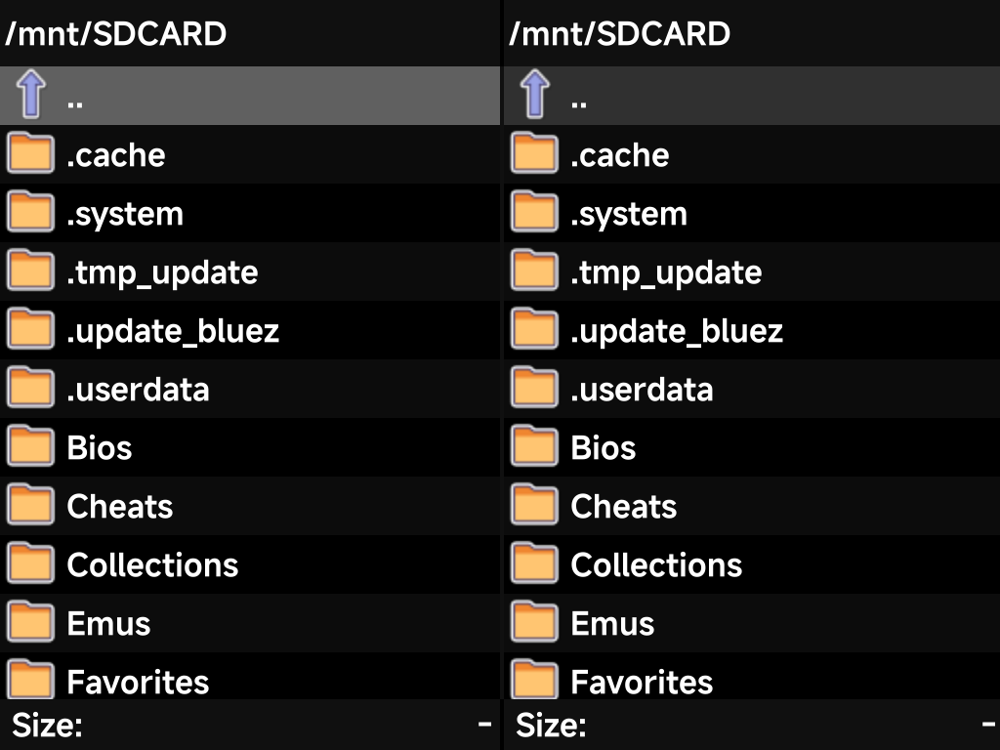
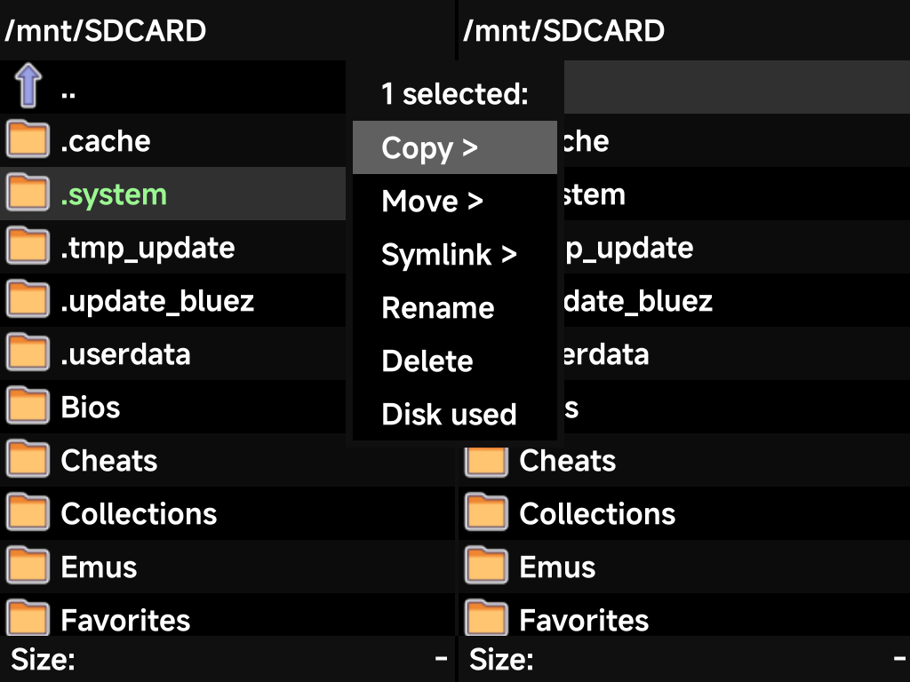

# Files

**Tools → Files** is a dual-pane file manager for the device — browse the SD
card and copy, move, rename or delete files without a computer.

It has two independent panes. Set each pane to a folder, then copy or move
between them.

| Button | What it does |
| --- | --- |
| D-pad or left stick | Move the cursor (hold to scroll through a long folder) |
| `LEFT` / `RIGHT` | Switch panes |
| `A` | Open the selected folder or file |
| `B` | Go up a directory |
| `X` | Open the **file actions** menu for the current selection |
| `MENU` (or `Y`) | Open the system menu: **Select all / Select none**, **New directory**, **Disk info**, and **Quit** to leave the app |

The face buttons follow the device-wide
[Button Layout](../guide/button-layout.md) setting. Under the Xbox layout, the
bottom button is `A` here too.

## File actions

Press `X` on a file or folder to act on it:

| Action | What it does |
| --- | --- |
| **Copy / Move / Symlink** | Into the folder open in the *other* pane |
| **Rename** | Rename the selection |
| **Delete** | Delete the selection |
| **Disk used** | Size of the current selection |

The menu header shows how many items are selected. To act on a whole folder at
once, use **Select all** from the system menu.

The whole card is visible, including the hidden dot-folders (`.system`,
`.userdata`, and friends). That helps with the occasional maintenance task the
[FAQ](../../reference/faq/handheld.md) mentions, like removing the Simple Mode
PIN file.
