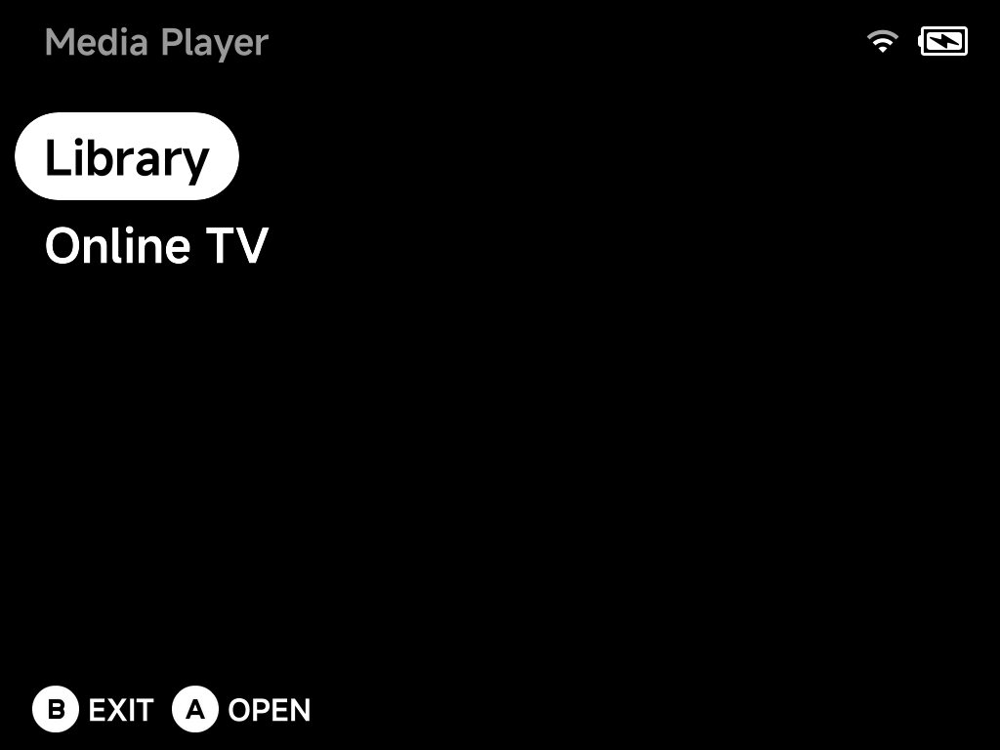
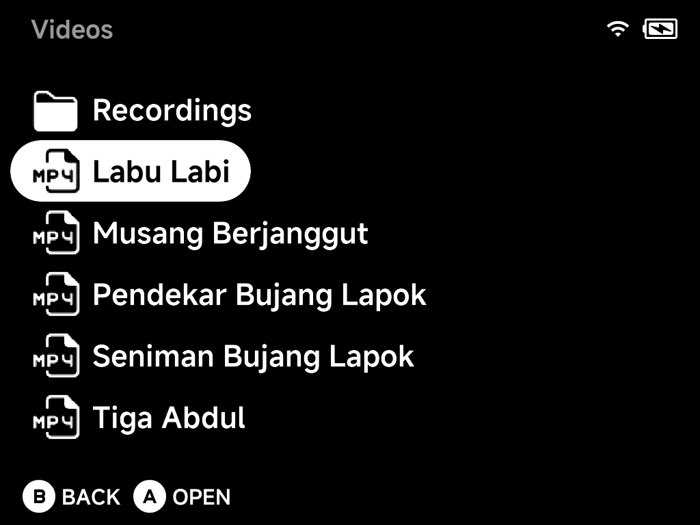
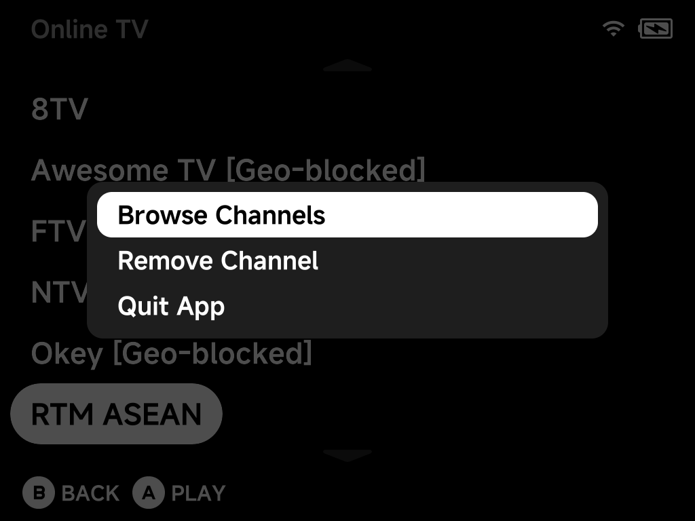

# Media Player

A built-in video player with audio and subtitle track switching, per-video
resume, and internet TV streaming. Open it from **Tools → Media Player**.



## Library

Put your videos in the `Videos` folder on the SD card. Subfolders are fine.
Your [screen recordings](../guide/osd.md#screen-recording) in
`Videos/Recordings` show up here too.



Supported containers: `mp4`, `mkv`, `avi`, `webm`, `mov`, `ts`, `flv`,
`m4v`, `wmv`, `mpg`, `mpeg`, `3gp`.

Every video remembers its playback position:

- `A` plays the video. It **resumes from where you left off** if it has a
  saved position.
- To ignore the saved position once, press `MENU` on the video and choose
  **Play from Start**.

## Playback controls

<!-- SCREENSHOT: mediaplayer-playback — a video playing with the X on-screen info display shown (Brick) -->

| Button | Action |
| --- | --- |
| `A` | Pause / resume |
| `B` | Stop and return to the library |
| `X` | Toggle the on-screen info display |
| `Y` | Cycle aspect ratio |
| `Left` / `Right` | Seek −/+ 10 s (hold to keep seeking) |
| `L1` / `R1` | Seek −/+ 60 s |
| `Up` | **Cycle audio track** |
| `Down` | **Cycle subtitle track** (including *off*) |

## Subtitles

Embedded subtitle streams (e.g. in an `mkv`) work out of the box. Cycle
through them with `Down` during playback.

To add **external subtitles**, drop `srt`, `ass`, `ssa` or `sub` files next
to the video, named after it. `Down` cycles through all of them, plus a
subtitles-off step.

??? info "More detail: subtitle file names"
    Any subtitle file whose name starts with the video's name is picked up
    automatically:

    ```
    Videos/
    ├── movie.mkv
    ├── movie.srt            ← exact match
    ├── movie.en.srt         ← language variants work too
    ├── movie(Malay).srt
    └── movie_english.sub
    ```

## Online TV

**Online TV** streams live internet TV. The page lists *your* channels. Press
`A` to play one.

Before connecting, the player runs a quick reachability check. A dead or
geo-blocked stream fails fast with an `Unavailable — offline or geo-blocked`
toast instead of a black screen.

Press `MENU` for the page's context menu:



- **Browse Channels**: open the channel catalog to add channels (below).
- **Remove Channel**: remove the highlighted channel from your list.
- **Quit App**.

### Adding channels from the catalog

1. Choose **Browse Channels**. It opens a country list, with your device's
   country first.
2. Pick a country to see its channels.
3. Press `A` to **add** a channel to your Online TV list. Added channels are
   marked. Pressing `A` again offers to remove them.

Your list holds up to 64 channels. In the catalog, `MENU` offers **Refresh
List** to re-fetch the catalog.

!!! note
    Streams come from iptv-org, so availability varies. Channels can go
    offline or be blocked in your region at any time, as the catalog toast
    says.

??? info "More detail"
    - The catalog is built from the community-run
      [iptv-org](https://github.com/iptv-org/iptv) catalog. It is cached on the
      SD card; **Refresh List** re-fetches it from iptv-org.
    - Channel names carry iptv-org's status tags such as `[Geo-blocked]` and
      `[Not 24/7]`, so you know what to expect before adding. The tag is
      dropped from the name when the channel is saved to your list.

### Adding your own channels

You can add any direct stream URL (e.g. HLS `.m3u8`) by editing your channel
list, a plain JSON file on the SD card:

```
.userdata/shared/media-player/tv/channels.json
```

!!! warning
    Edit the file with the device powered off or the Media Player closed. The
    app saves the same file when you add or remove channels.

??? info "More detail: channel entry format"
    Each entry looks like:

    ```json
    {
      "name": "My Channel",
      "url": "https://example.com/stream/master.m3u8",
      "group": "News",
      "logo": "https://example.com/logo.png",
      "decryption_key": ""
    }
    ```

    Add a new entry and it appears in Online TV. `decryption_key` is optional
    and accepts a ClearKey hex string for streams that need one. `group` and
    `logo` are optional metadata.
