# Music Player

A full music player built into the firmware: your own music with playlists,
internet radio, podcasts, synced lyrics and audiophile-grade output. Open it
from **Tools → Music Player**.

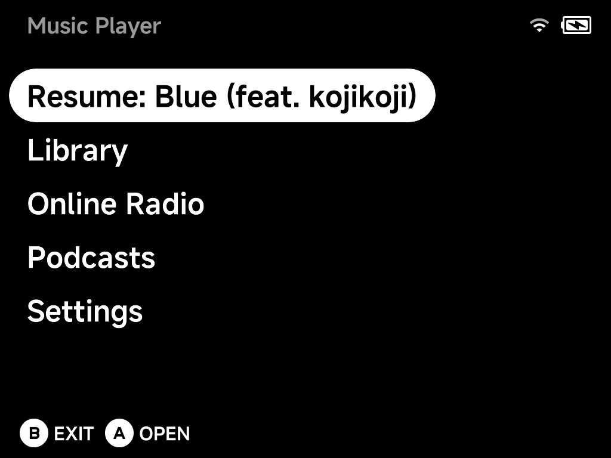

The home screen offers:

- **Resume**: pick up the last track where you left off.
- **Library**
- **Online Radio**
- **Podcasts**
- **Settings**

## Library

Put your music in the `Music` folder on the SD card. The Library has two
views: **Files** (browse your folders directly) and **Playlists**.

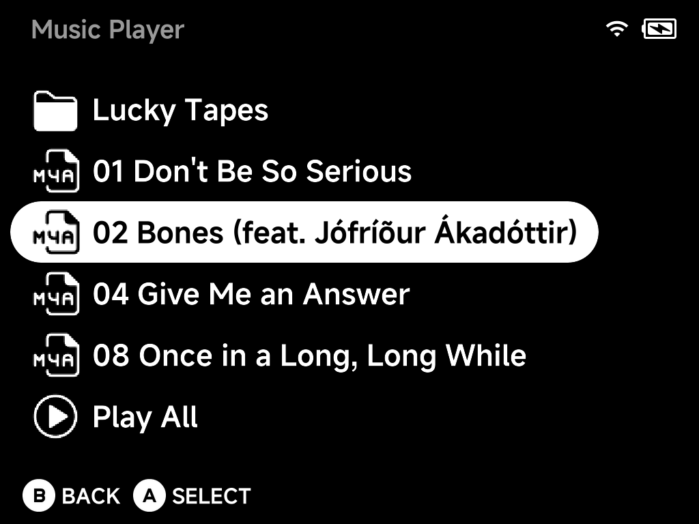

The Files view mirrors your folder structure, so **organizing with folders
works naturally**. Drop loose tracks straight into `Music`, or group songs in
folders. In the screenshot above, a `Lucky Tapes` folder collects that
artist's songs while the other tracks sit at the top level.

- Each file shows its format icon.
- Every folder gets a **Play All** entry that plays its contents in one go.
- For hand-picked track sequences across folders, use
  [Playlists](#playlists). Folders and playlists work side by side.

Supported formats: `mp3`, `flac`, `wav`, `ogg`, `opus`, `m4a`, `aac` and
`mod` tracker modules.

Titles, artists, albums and cover art come from the tags inside your files
(MP3, M4A, FLAC, Ogg and Opus), so tagged music shows its real names and
album art without being online. Untagged files show their file name.

### Managing files

Press `MENU` on any track or folder in the Files view for its context menu:

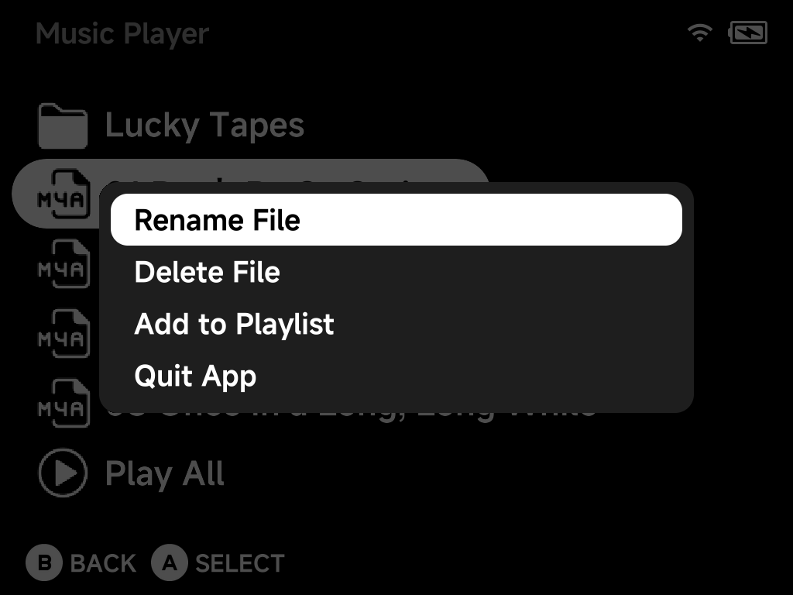

| On a track | On a folder | What it does |
| --- | --- | --- |
| **Rename File** | **Rename Folder** | Rename with the on-screen keyboard |
| **Delete File** | **Delete Folder** | Delete, after a confirmation |
| **Add to Playlist** | **Add Folder to Playlist** | Add the track (or all of the folder's tracks in one go) to an existing playlist, or create a new one on the spot |

### Playlists

The **Playlists** view lists your playlists with their track counts:

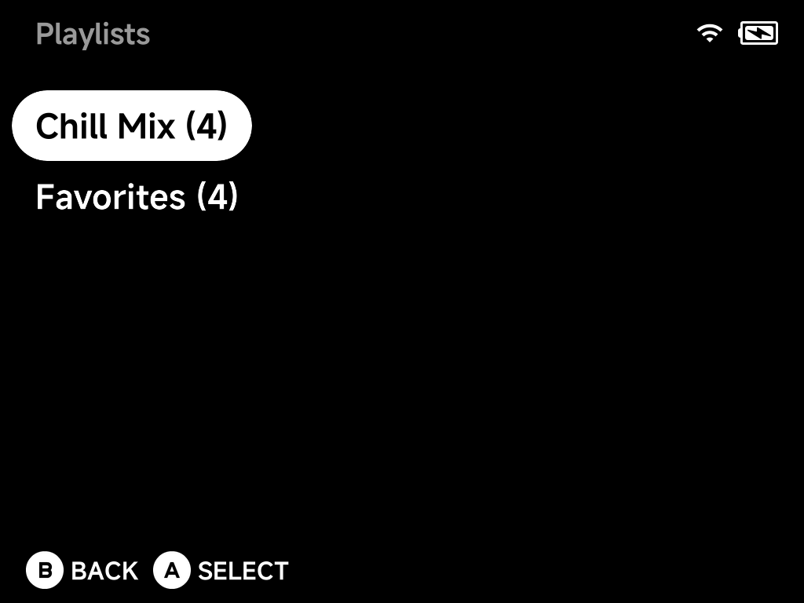

- `A` opens a playlist. From inside, pick a track to start playing.
- `Y` creates a **new playlist**, named with the on-screen keyboard. With no
  playlists yet, `A` on the empty page does the same.
- To add tracks, use the Files view's context menu: **Add to Playlist** for
  a single track, **Add Folder to Playlist** for a whole folder.

Press `MENU` on a playlist to manage it:

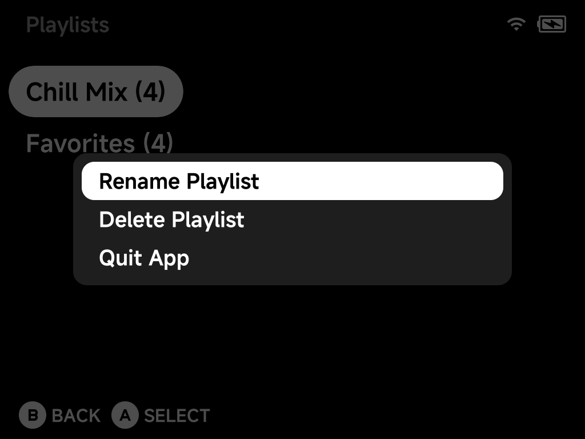

- **Rename Playlist**: via the on-screen keyboard.
- **Delete Playlist**: with a confirmation dialog.

Open a playlist to see its tracks. `A` starts playing from the selected
track:

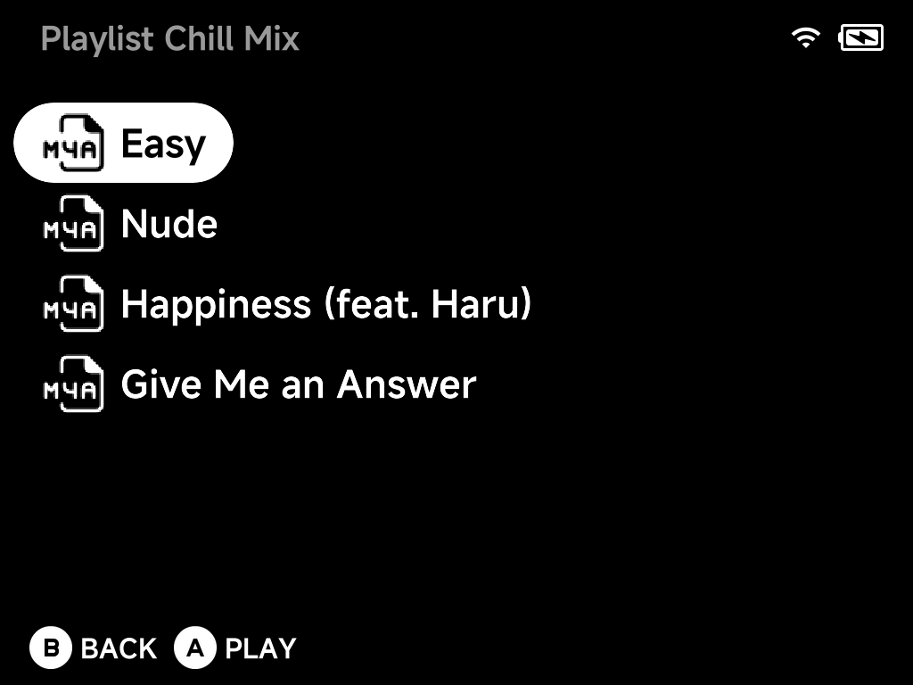

Inside, `MENU` on a track offers **Remove from Playlist** (also confirmed
before removing):

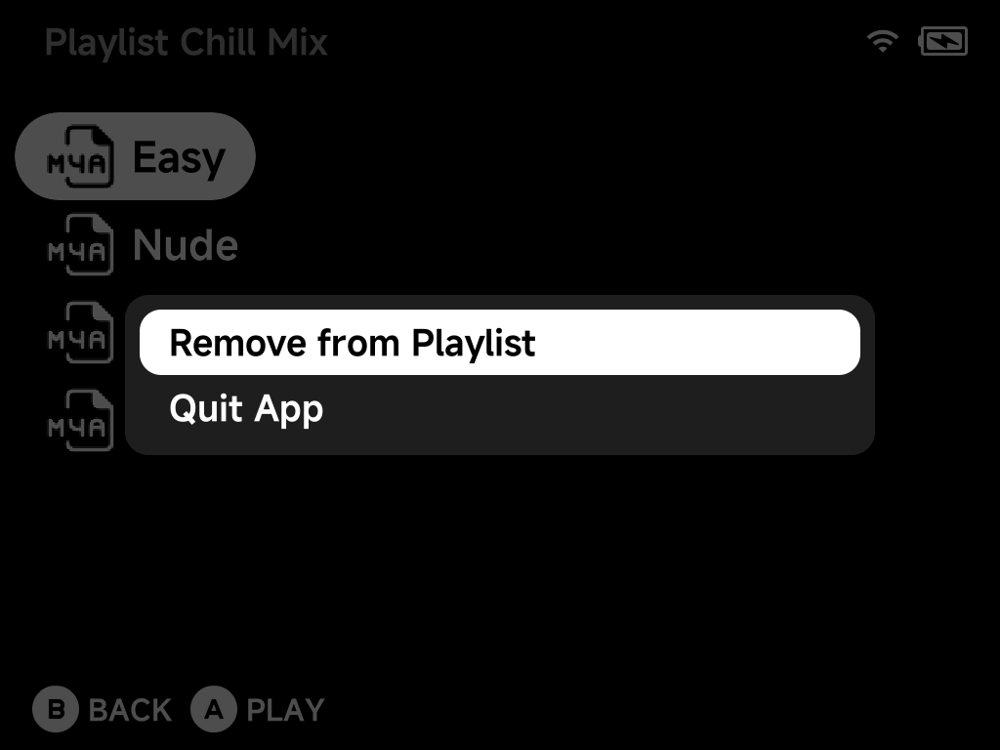

??? info "More detail"
    Playlists are standard `.m3u` files stored in
    `.userdata/shared/music-player/playlists`, so you can also create or edit
    them from a computer.

## Now playing

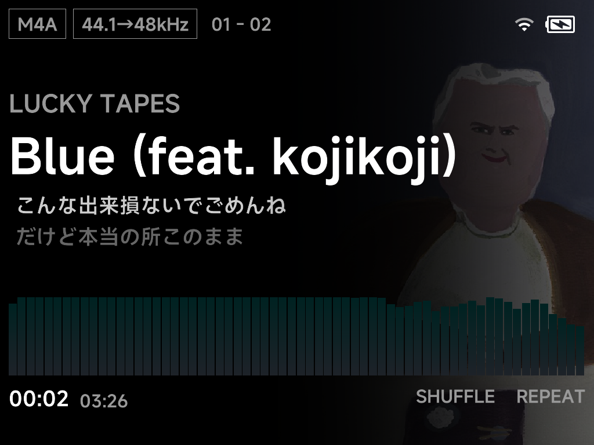

The now-playing screen shows cover art, a spectrum visualizer, shuffle and
repeat state, the format badge (`M4A`, `FLAC`…) and the **live sample-rate
badge**.

**Synced lyrics** scroll in time with the song. Lyrics embedded in the file
are used first; otherwise they are fetched automatically when online.

??? info "More detail"
    - The sample-rate badge reads, for example, `96kHz` when playing natively
      on a capable output, or `44.1→48kHz` when resampling.
    - Lyrics are looked up in this order: timed lyrics embedded in the file,
      the on-SD cache, [LRCLIB](https://lrclib.net/) (cached on the SD card
      once fetched), then plain embedded lyrics, which scroll evenly over the
      song.

### Controls

| Button | Action |
| --- | --- |
| `A` | Pause / resume |
| `B` | Back to the browser — **music keeps playing** while you browse |
| `Left` / `Right` | Seek −/+ 5 s (hold to keep seeking) |
| `Up` / `R1` | Next track |
| `Down` / `L1` | Previous track |
| `X` | Toggle shuffle |
| `Y` | Toggle repeat |
| `F1` / `L2` | Cycle the visualizer style |
| `F2` / `R2` | Toggle lyrics on or off |
| `MENU` | Show this controls list on screen (any button closes it) |
| `SELECT` | Turn the screen off now (see below) |
| `SELECT` + `A` | Wake the screen when it is off |

With shuffle on, *previous* retraces the tracks that actually played, in
order.

### Auto screen off

While music plays, the screen switches itself off after an idle time you can
set (default 60 s). This saves battery and prevents accidental button presses.

- While the screen is off, ordinary buttons are ignored.
- Tap `SELECT` to turn the screen off right away instead of waiting.
- Press `SELECT` + `A` to wake it.
- Media buttons on a USB or Bluetooth headset keep working even with the
  screen off.

## Background playback

Music, radio and podcasts keep playing when you leave the Music Player, both
in the menus and inside games.

### Control it from the OSD

The [OSD](../guide/osd.md)'s **Music** widget shows the current track or
station with play/pause, previous and next, from anywhere.

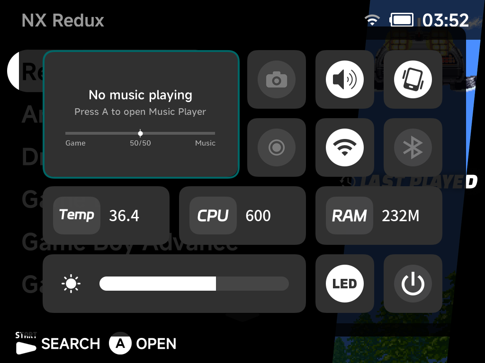

Below it sits the **Game / Music balance** slider (press Down to reach it). It
sets how loud games are relative to the music, from `50/50` through
`Music +5`, on top of the normal volume keys. The same setting is **Balance**
in the Music Player's Settings, so you can still reach it with nothing
playing.

### What happens when the device sleeps or restarts

| Situation | What happens |
| --- | --- |
| **Sleep** | Outside the app, background music follows the device's normal sleep timers. When the screen times out the music stops and the device goes to sleep. Waking it picks the track up where it stopped |
| **Power-off or restart** | Playback **never starts by itself**. The last track, station or episode is restored **paused** at the position you were at, so the first sound the device makes is one you asked for. Press play in the widget or in the app to continue |
| **Nothing playing for a few minutes** | Playback gets out of the way to save battery, keeping its resume point. Opening the Music Player brings it straight back |

!!! tip
    To keep listening with the screen dark, stay in the Music Player and let
    its own [auto screen off](#auto-screen-off) handle the display.

??? info "More detail"
    Playback is owned by a small background service, so the app is just a
    remote control for it. It is this service that shuts itself down when
    nothing has been playing for a few minutes.

## Online Radio

**Online Radio** streams internet stations, with cover art fetched for the
currently playing song.

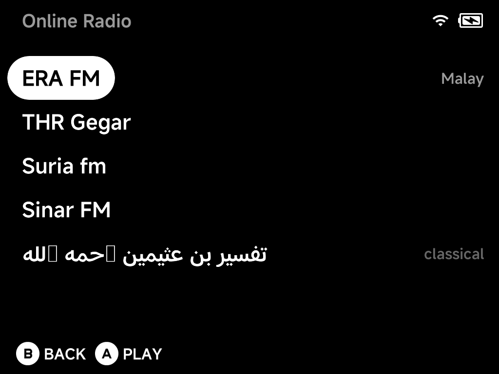

The page lists *your* stations. `A` plays one. Press `MENU` for the context
menu: **Manage Stations** (browse the online catalog), **Delete Station**, and
**Playback Controls**.

While a station plays, the screen shows:

- the station name
- the current song from the stream's metadata, with **cover art fetched
  automatically for the playing song**
- the live stream bitrate

??? info "More detail"
    Radio goes through the same high-quality resampler as local playback.


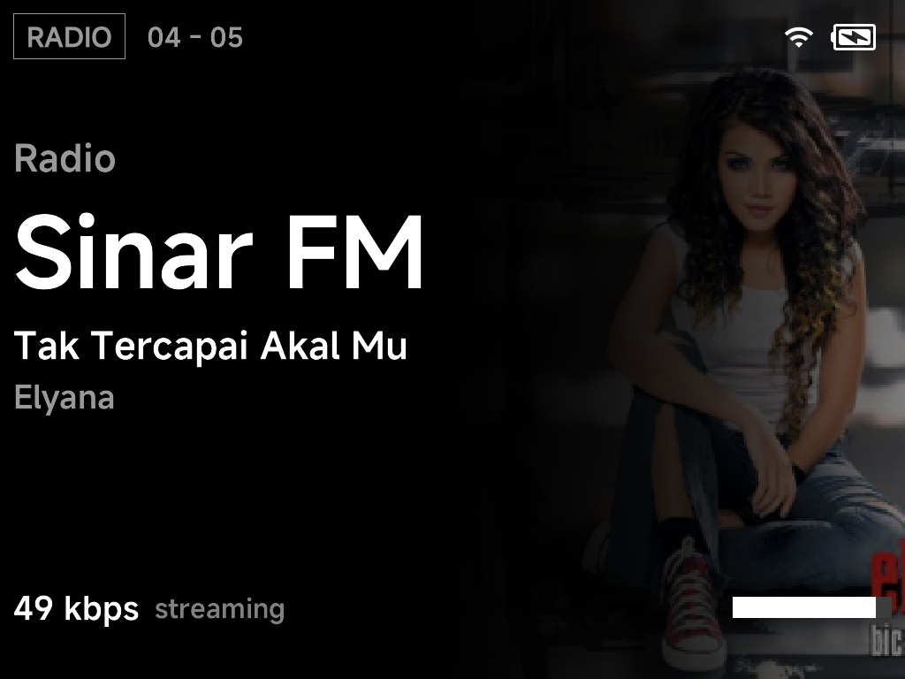

### Radio controls

| Button | Action |
| --- | --- |
| `A` | Stop / resume the stream |
| `B` | Back to the station list — **the radio keeps playing** |
| `Up` / `R1` | Next station |
| `Down` / `L1` | Previous station |
| `MENU` | Context menu (including **Playback Controls**, this list on screen) |
| `SELECT` | Turn the screen off now |
| `SELECT` + `A` | Wake the screen when it is off |

[Auto screen off](#auto-screen-off) works here exactly like local playback,
including the idle timeout and headset media buttons staying live while the
screen is dark.

### Adding stations

Choose **Manage Stations** to browse the station catalog by country, and add
what you like. Availability varies, as the one-time notice says. Inside the
catalog, `MENU` offers **Refresh List** and **Manual Setup Help**.

You can also add stations by hand, as the built-in help describes. Edit this
file:

```
.userdata/shared/music-player/radio/stations.txt
```

MP3, AAC and M3U8 streams are supported, up to 32 stations.

??? info "More detail"
    - The catalog comes from the community-run
      [radio-browser.info](https://www.radio-browser.info/) index.
    - In `stations.txt`, put one station per line:

        ```
        Name|URL|Genre|Slogan
        ```

        The slogan is optional (shown when the stream carries no song info).

    - A good directory for stream URLs is [fmstream.org](https://fmstream.org/).

## Podcasts

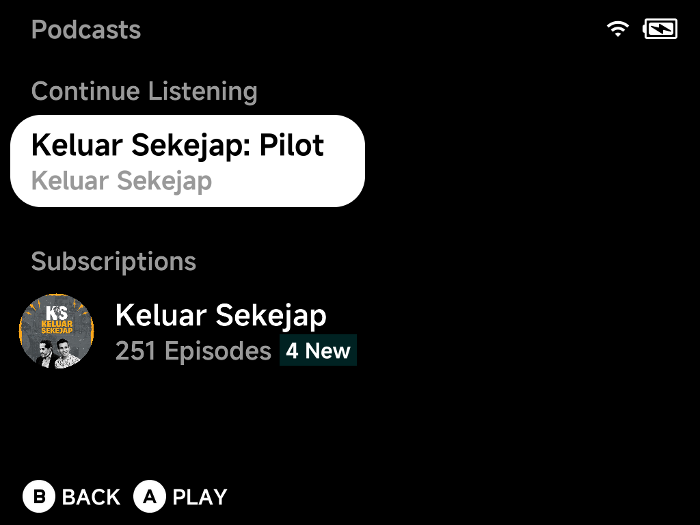

The Podcasts page shows:

- **Continue Listening**: episodes you're partway through. Playback position is
  remembered per episode.
- your **Subscriptions**, each with its episode count and a *New* badge.

Press `MENU` on a subscription for its context menu:

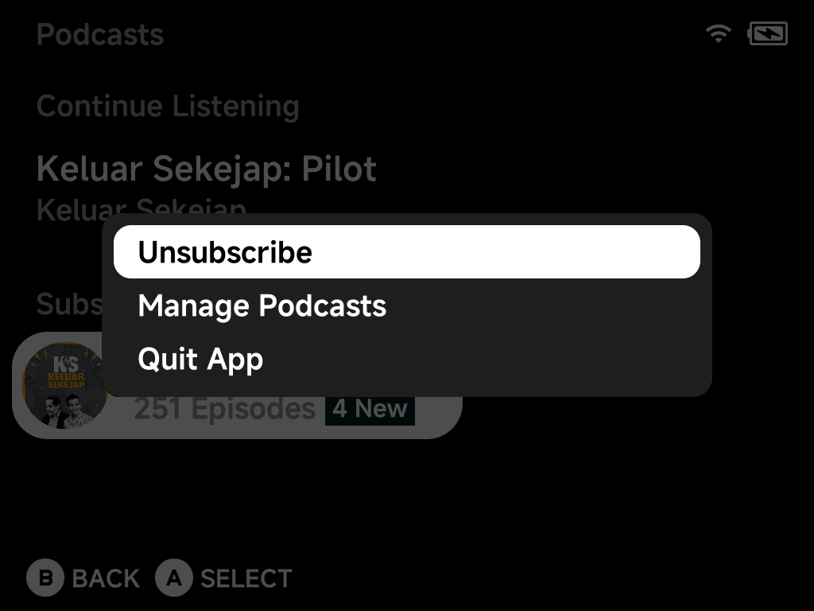

- **Unsubscribe**: remove the podcast, with a confirmation.
- **Manage Podcasts**: subscribe to new shows (below).
- **Refresh List** appears when you need to re-fetch feeds.

### Subscribing

**Manage Podcasts** offers two ways in, both backed by the Apple Podcasts
directory:

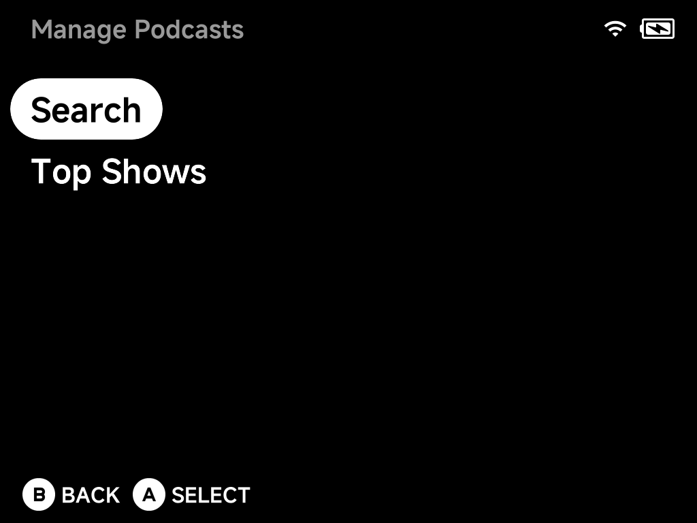

- **Search**: find a show by name with the on-screen keyboard.
- **Top Shows**: browse the podcast charts for your country.

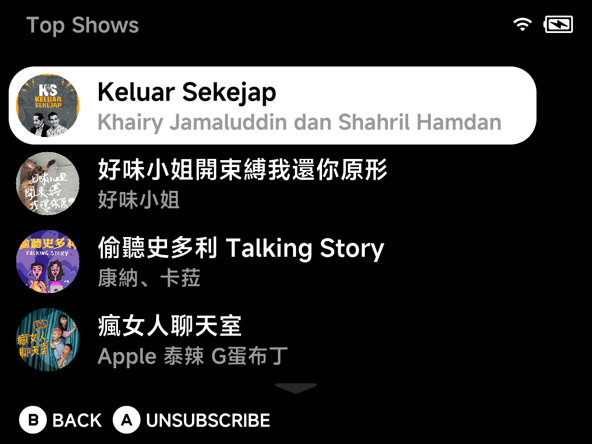

`A` subscribes to the selected show, or unsubscribes if you already follow it.
The hint bar tells you which.

### Episodes

Opening a show lists its episodes under the show's artwork and description.
Each shows its duration, age, a **New** badge for fresh episodes, and a
download indicator:

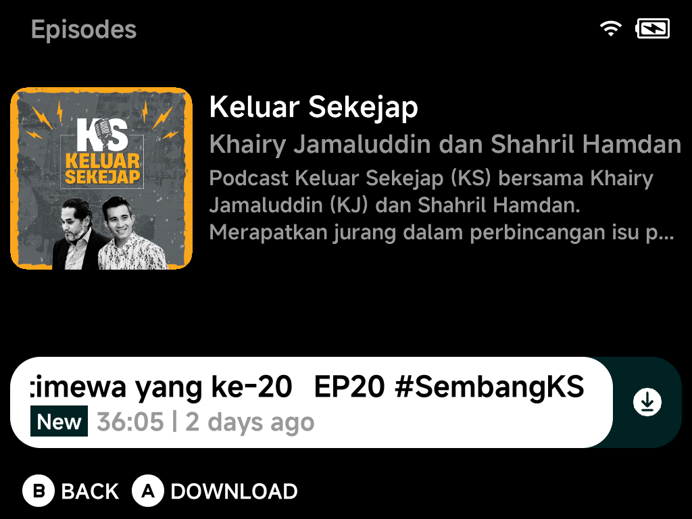

Episodes are **downloaded to the SD card** for offline listening:

1. On a new episode, press `A` to start the download (the hint bar shows it).
2. Once downloaded, press `A` to play.

Press `MENU` on an episode for its context menu:

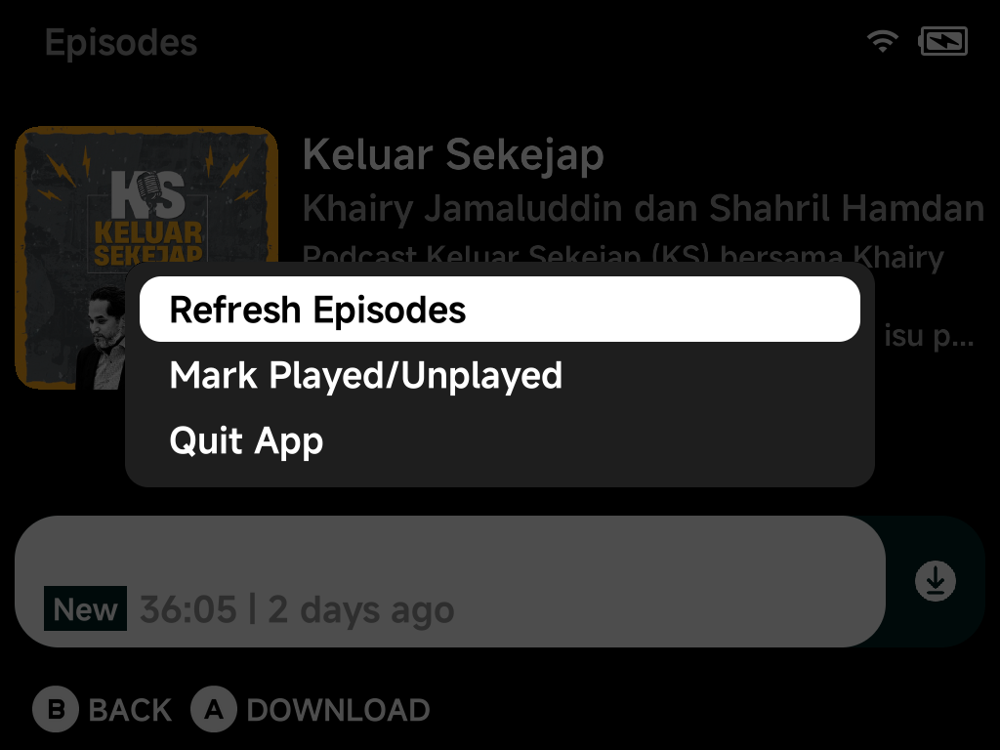

- **Refresh Episodes**: re-fetch the show's feed.
- **Mark Played/Unplayed**: toggle the episode's played state.
- **Remove Download**: added for a downloaded episode.
- An episode mid-download offers cancelling it.

### Podcast player

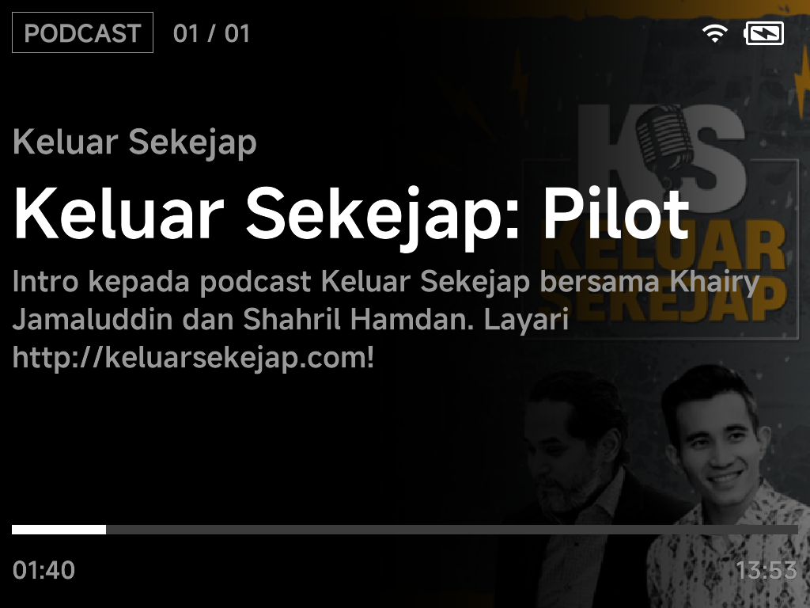

The player shows the episode description over the show's artwork, with a
progress bar and position. Playback position is saved as you listen, so
**Continue Listening** can pick the episode back up later.

| Button | Action |
| --- | --- |
| `A` | Pause / resume |
| `B` | Back to the episode list — **audio keeps playing** (if paused, stops) |
| `Left` | Skip back 10 s (hold to keep skipping) |
| `Right` | Skip forward 30 s (hold to keep skipping) |
| `Up` / `Down` | Playback speed up / down (0.5× – 2×, in 0.25 steps) |
| `SELECT` | Turn the screen off now |
| `SELECT` + `A` | Wake the screen when it is off |

[Auto screen off](#auto-screen-off) applies here too: idle timeout, and
headset media buttons keep working while the screen is dark.

## Settings

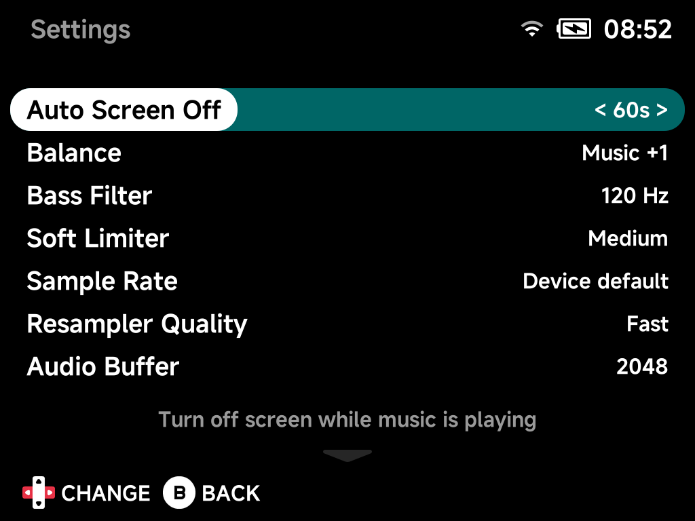

| Setting | What it does |
| --- | --- |
| **Auto Screen Off** | Idle time before the screen turns off during playback |
| **Balance** | The Game / Music mix, the same slider as in the OSD Music widget (see [Background playback](#background-playback)) |
| **Bass Filter** | High-pass filter to reduce speaker distortion |
| **Soft Limiter** | Limits volume peaks to prevent clipping |
| **Sample Rate** | `Device default`, or `Follow source` for bit-exact hi-res playback on USB DACs (no resampling). Applies on the next track |
| **Resampler Quality** | Higher quality costs more CPU |
| **Audio Buffer** | Larger buffers prevent dropouts |
| **Clear Album Art / Clear Lyrics** | Empty the on-SD caches |

Output routing is system-wide: speaker, Bluetooth or USB-C DAC, switched
automatically as devices connect. See [Settings → Audio](../settings/audio.md).
