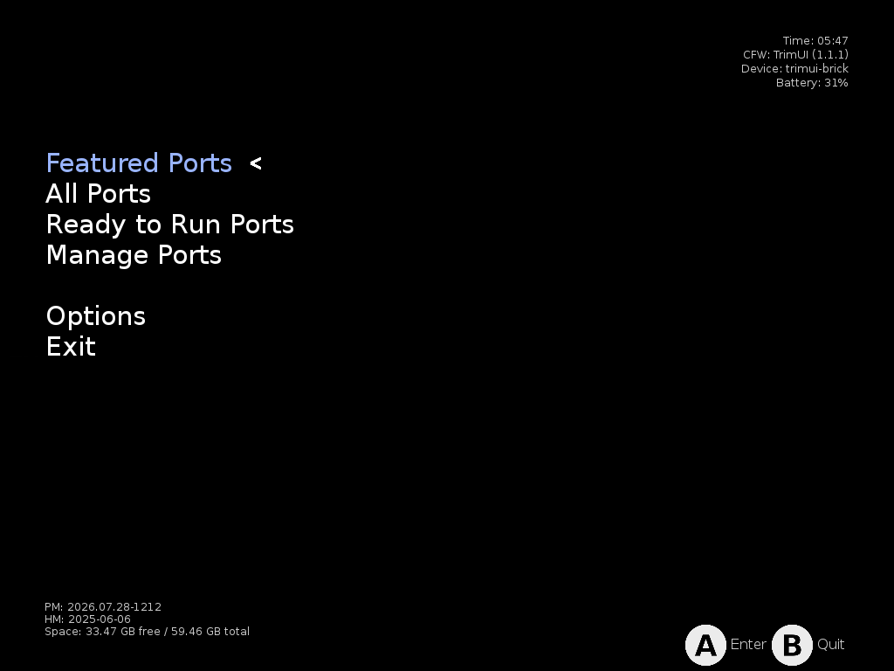
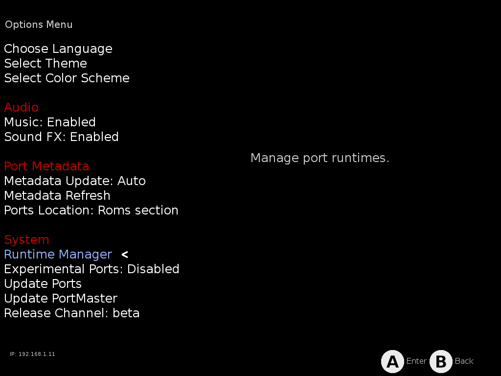
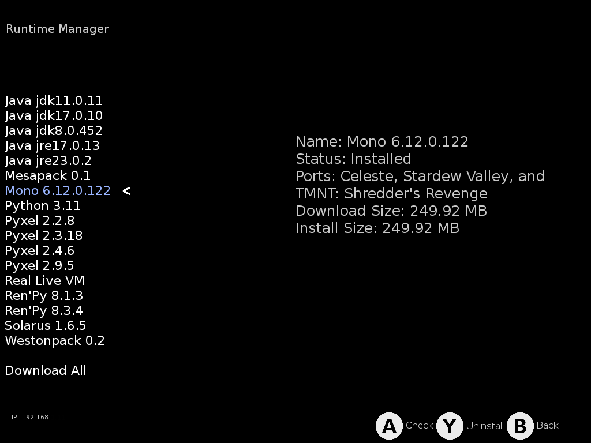

# PortMaster

[PortMaster](https://portmaster.games/) is the community launcher for game
ports: hundreds of games ported to run on handhelds. Install it on the device
from the [Xtras store](xtras.md)'s **TOOLS** tab, and it appears in the Tools
menu. It is not part of the core NX Redux install.



## Launching

Open **Tools → PortMaster** to launch the PortMaster interface directly.
Ports, and PortMaster itself, follow the device-wide
[Button Layout](../guide/button-layout.md) setting (**Settings → System**).

## Installing ports

Browse and install ports in the PortMaster interface: Featured, All Ports,
and Ready to Run (games that need no extra files).

Installed ports land in the `Roms/Ports (PORTS)` folder. They show up under
**Ports** in the main menu and launch like any other game.

Some ports need data files from the original game. Each port's details page
says what it needs.

## Missing runtimes

Many ports rely on a shared **runtime** (Mono, Godot, Java, …) that
PortMaster downloads separately from the game. If you copied ports from
another device or SD card instead of installing them through PortMaster, the
runtimes don't come along. The port won't start.

Two ways to fix it:

1. **Reinstall the port from PortMaster.** Installing through the app pulls in
   the runtimes it needs.
2. **Download the runtime directly:**
    1. Open **Options → Runtime Manager**.

        

    2. Select the runtime the game needs. The details panel shows its status,
       size, and **which of your installed ports depend on it**, so it's easy
       to spot what's missing.

        

    3. Press `A` to download/check the selected runtime. Or use **Download
       All** at the bottom of the list to grab everything at once.

## FAQ

### A port I copied from another device won't start

Most likely a missing runtime. See [Missing runtimes](#missing-runtimes)
above.

### A port fails because its launch script uses symlinks

The SD card is formatted exFAT/FAT32, which **does not support symlinks**.
Some ports' launch scripts create them. NX Redux ships **ready-fixed launch
scripts** for known cases and applies them **automatically** whenever you open
the PortMaster app.

- A port installed through PortMaster is fixed from the start.
- If you copied a game from another device, open PortMaster once (or
  reinstall the port) and the fix lands too.

Found a port that still fails this way? Open an issue on
[GitHub](https://github.com/mohammadsyuhada/nx-redux/issues) with the port's
name and the error you see. A ready-fixed launch script for it can be added to
the next release.

??? info "More detail"
    Ports' launch scripts typically create symlinks to link save directories
    into the game folder. NX Redux's PortMaster integration already works
    around the common cases: its installer creates real copies where upstream
    uses library symlinks, and the launcher bind-mounts the game data. A port
    whose own script calls `ln -s` still needs a minor adjustment, usually
    replacing the symlink with a bind mount.

    The ready-fixed scripts live in:

    ```
    Emus/shared/PortMaster/patchedScripts/
    ```

    One example is `SteelAssault.sh`, which replaces the port's save-directory
    symlinks with bind mounts. Whenever you open the PortMaster app, every
    patched script that matches a port on your card replaces the stock one in
    `Roms/Ports (PORTS)/`. Copying a script from `patchedScripts/` by hand is
    only ever a fallback.

### A port doesn't work on this device at all

Some older ports are built **only for 32-bit ARM (armhf)**. Those ports cannot
run on NX Redux devices. 64-bit (aarch64) builds of ports work normally.

??? info "More detail"
    The TrimUI firmware ships no 32-bit libraries or loader. PortMaster itself
    detects this (`DEVICE_HAS_ARMHF=N`) and generally hides armhf-only ports,
    but one copied over manually will never start.

## Good to know

- **Sleep works in PortMaster games.** Press the power button like anywhere
  else.
- PortMaster keeps itself up to date (it checks for updates when it starts).
- **NX Redux updates keep PortMaster installed.** A system update refreshes
  the PortMaster entry in Tools and the Ports launcher on its own. Your
  installed ports, saves and PortMaster settings stay where they are, and
  there is nothing to reinstall.
