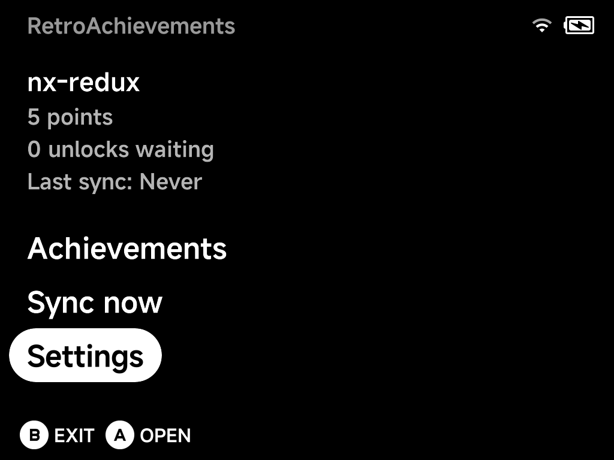
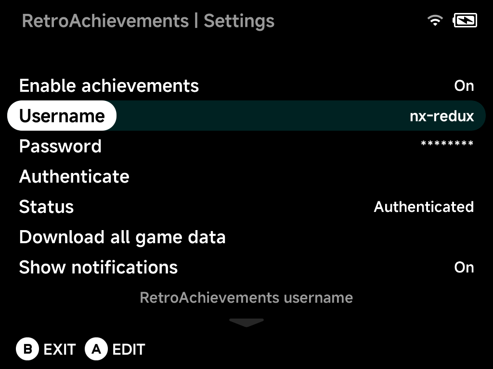
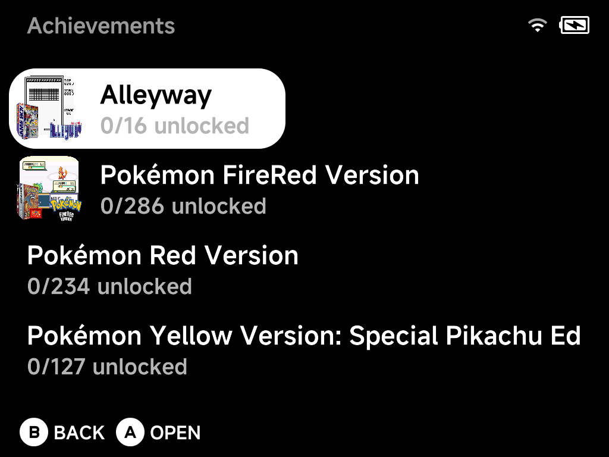
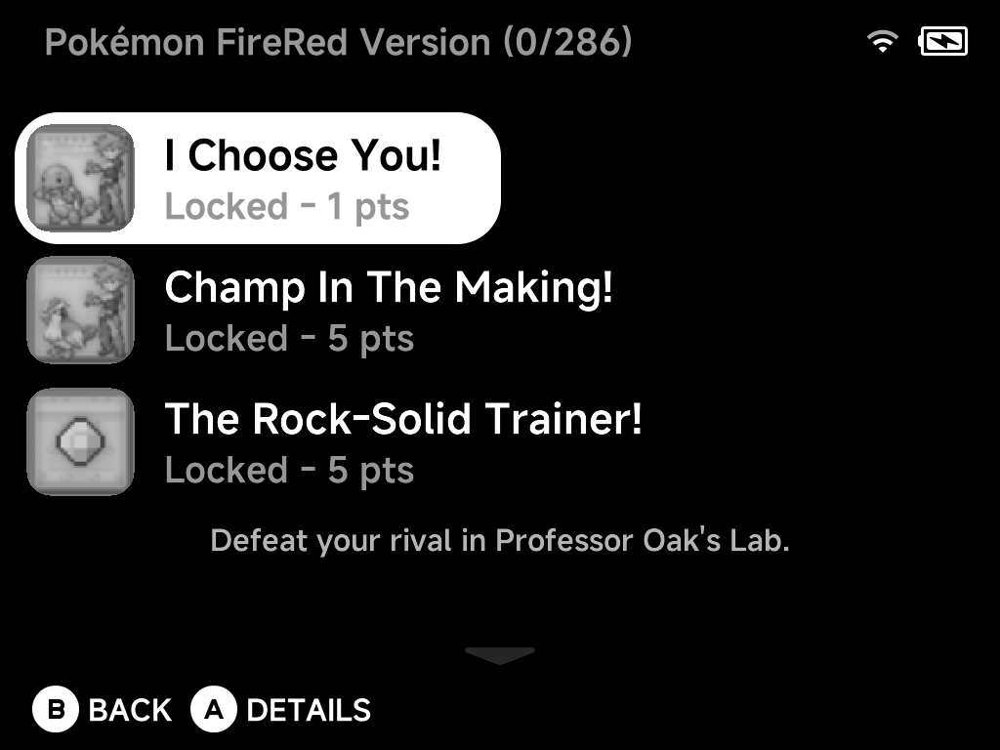
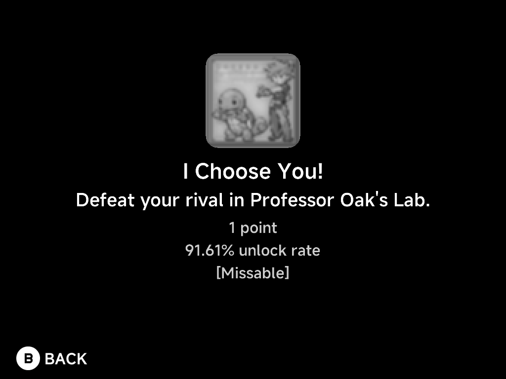

# RetroAchievements

NX Redux supports [RetroAchievements](https://retroachievements.org/) with
**full offline support**. The **RetroAchievements** tool in Tools is the single
home for the feature: sign in, browse your achievements and manage every
setting here.

The home screen shows your account at a glance: points, unlocks waiting to
be synced, and when the last sync happened. Below that are three entries:
**Achievements**, **Sync now** and **Settings**.

??? info "More detail"
    The integration is powered by
    [rcheevos](https://github.com/RetroAchievements/rcheevos).

## Setting up

You need a free [retroachievements.org](https://retroachievements.org/)
account. Then, in **Settings**:

1. Set **Enable achievements** to `On`.
2. Enter your **Username** and **Password** with the on-screen keyboard.
3. Choose **Authenticate**. It tests the credentials and retrieves your API
   token. **Status** shows `Authenticated` when it works.

Below the account block, Settings also holds:

| Setting | What it does |
| --- | --- |
| **Download all game data** | Pre-cache your whole library (see [Offline support](#offline-support)) |
| **Show notifications** and **Notification duration** | In-game unlock popups and how long they stay |
| **Progress duration** | How long progress updates (top-left) stay on screen; `Off` disables them |
| **Achievement sort order** | How achievements are sorted, both here and in the in-game menu |
| **Reset account data** | Clear login and progress, keeping cached game data (for switching accounts) |
| **Erase all achievement data** | Remove everything, including games and badges |
| **Reset settings to defaults** | Put every setting back to its default |

## Earning achievements

Achievements work in the **built-in emulator cores**. Launch a recognized
game and unlocks are tracked automatically as you play:

- An **unlock notification** pops up when you earn an achievement.
- **Progress updates** (e.g. collectible counters) appear in the top-left.
- The in-game [pause menu](../guide/playing-games.md#the-in-game-menu)'s
  **Options** gains an **Achievements** entry. Browse the game's achievements
  without leaving the game:
    - Press `Y` to filter to locked ones.
    - Press `X` to **mute** a specific achievement's notifications (handy for
      spammy progress trackers).

<!-- SCREENSHOT: ra-ingame-achievements — the Achievements entry in the in-game Options menu, listing a game's achievements (Brick) -->

!!! tip "Genesis Plus GX covers every Sega system"
    Keep your Sega games in `(GPGX)` folders and RetroAchievements just works.
    The alternate Sega core [Genesis Plus GX](../emulators/cores.md) plays
    Genesis/Mega Drive, Master System, Game Gear, SG-1000 and Sega CD under a
    single `GPGX` tag. It still identifies each game with the correct console
    for achievements, by picking the system from the ROM's file extension.

!!! tip "Dreamcast is covered too"
    [Dreamcast](../emulators/dreamcast.md), Naomi and Atomiswave games run on a
    built-in core, so their achievements work like every other system,
    offline journal included.

!!! tip "WonderSwan is built in"
    WonderSwan and WonderSwan Color games in the `Wonderswan Color (WSC)` folder
    earn achievements too. If you installed the WonderSwan pak from the Pak
    Store before, it keeps working and keeps priority over the built-in one;
    delete it from `Emus/` to switch. Your saves stay where they are.

!!! info "Softcore only, by design"
    NX Redux is not an RA-approved hardcore emulator, so hardcore mode is
    intentionally omitted to keep your account safe. Unlocks are submitted
    as softcore.

## Offline support

Everything is built to work without a connection:

| Feature | What it does |
| --- | --- |
| **Earn offline** | Unlocks are journaled to the SD card and submitted automatically once you're back online (the home screen counts "unlocks waiting") |
| **Connection drops** | An unlock earned while the connection is down, for example right after waking from sleep, is journaled too, so it isn't lost if you quit before WiFi comes back. The popup reads *RetroAchievements: offline, unlocks will sync later* |
| **Slow WiFi at launch** | If WiFi isn't ready when a game starts (such as a game resumed after the device powered off in sleep), the login keeps retrying for a few seconds, then the game continues offline from the cache |
| **Cached game data** | Achievement definitions, unlock state and badges are cached as you play, so a game you've launched once keeps working offline |
| **Pre-download** | **Download all game data** caches achievement data for every game in your library, with a live progress bar. Even games you have *never* launched online then work offline |

??? info "More detail: Dreamcast and multi-disc games"
    - Pre-download includes Dreamcast folders. Disc images (`.chd`, `.gdi`,
      `.cdi`, `.cue`) and Naomi/Atomiswave sets (`.zip`) are identified the
      same way the Dreamcast core does it.
    - Multi-disc games (PlayStation, Dreamcast) are covered too. Every disc is
      cached so any disc is recognised offline, and the game shows up once in
      the browser.

## Browsing your achievements

**Achievements** lists every cached game with box art and unlock progress,
fully offline:

Open a game to see its achievements, each with its badge and points. The
selected achievement's description shows below the list. Unlocked,
pending-sync and locked achievements are all here, in your chosen sort
order:

Press `A` for the full details of an achievement: badge, description,
points, global unlock rate, and type tags like `[Missable]`,
`[Progression]` or `[Win Condition]`:

## Syncing

Offline unlocks sync automatically, in the background, when WiFi is
connected:

- when a game logs in online,
- when you open the in-game menu during an offline session,
- when you quit a game.

Nothing checks the connection while you play. A *N offline achievements
synced* popup confirms it. If none of these get through, the unlocks wait
for the next launch or for **Sync now**. An unlock for an achievement that
has since been removed from RetroAchievements is dropped instead of retried
forever.

**Sync now** on the home screen does two things in one go:

1. **Push**: submits any offline unlocks still waiting.
2. **Pull**: refreshes your cloud status, meaning the points total and the
   unlock state of every cached game. Achievements earned on another device or
   on the website show up here too. Games whose progress changed on the server
   are re-fetched.

Both steps show the same progress bar as **Download all game data**. Press
`B` to cancel. Unsent unlocks stay queued for the next sync, and games
already refreshed are kept.

The home screen's points, "unlocks waiting" and "Last sync" tell you where
you stand.
