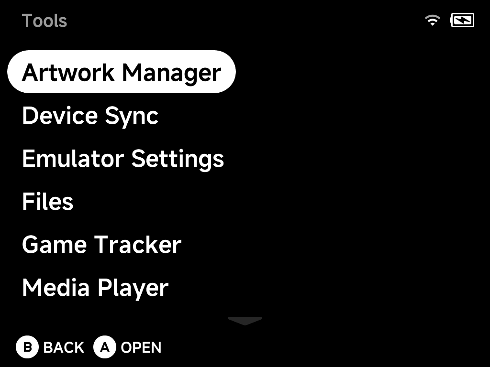

# Tools Overview

**Tools**, at the bottom of the main menu, holds every built-in app and
utility.

| Tool | What it does |
| --- | --- |
| [Artwork Manager](artwork-manager.md) | Fetch custom mix box art for your ROMs |
| [Device Sync](device-sync.md) | Sync saves, states, settings and ROMs across devices |
| [Emulator Settings](emulator-settings.md) | Configure each system's emulator options |
| [Files](files.md) | Dual-pane file manager for the SD card |
| [Game Tracker](game-tracker.md) | Play-time statistics per game |
| [Image Viewer](image-viewer.md) | Browse and view screenshots and photos |
| [Media Player](media-player.md) | Video player with audio/subtitle switching |
| [Music Player](music-player.md) | Music, internet radio and podcasts |
| [PortMaster](portmaster.md) | Community game ports (installed via Xtras) |
| [RetroAchievements](retroachievements.md) | Achievements, fully offline-capable |
| [Settings](../settings/index.md) | Display, audio, network, input, Simple Mode and more — see the [Settings](../settings/index.md) page |
| [Xtras](xtras.md) | On-device add-on store |

Tools you install from the [Xtras store](xtras.md), such as PortMaster, appear
in this menu too.

## Installing community paks

Community paks built for **NextUI** still work here.

1. Copy the `<Name>.pak` folder to the SD card: into `/Tools` for a tool, or
   `/Emus` for an emulator pak.
2. Follow the pak's own installation steps.
3. The pak appears in this menu.

Some paks say to use a **platform folder**, for example
`Tools/tg5040/<Name>.pak`. If the pak's README says so, do it.

!!! warning
    Don't give your pak the same name as a tool or emulator shipped with NX
    Redux. Same-named paks in `/Tools` and `/Emus` count as NX Redux leftovers
    and are removed on every update.

These paks target NextUI, not NX Redux. See the support notes in
[Additional Emulators](../emulators/additional.md).

??? info "More detail"
    The platform-folder layout also works. For paks whose scripts reference
    the platform path internally, it is **required**.

    The platform folder name depends on your device:

    | Device | Platform folder |
    | --- | --- |
    | Brick / Brick Hammer / Brick Pro / Smart Pro | `tg5040` |
    | Smart Pro S | `tg5050` |

    If the same pak exists in both places, the flat copy (`Tools/<Name>.pak`)
    wins.
