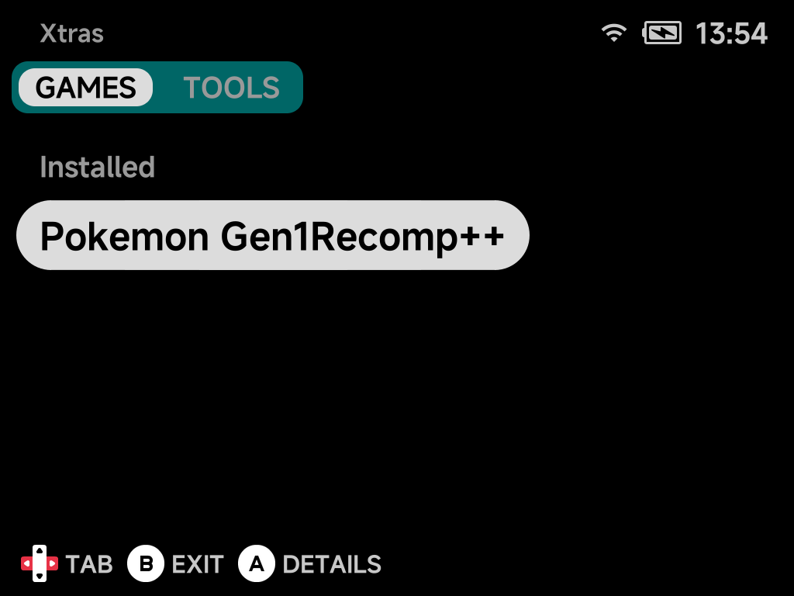
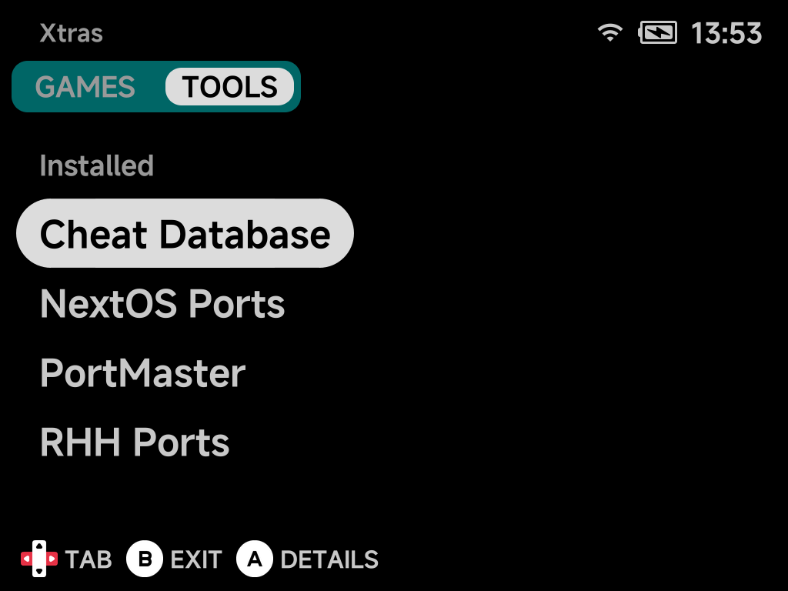

# Xtras Store

**Tools → Xtras** is an on-device add-on store for optional games and tools
that are not part of the core install. Install or update them right from the
device.

1. Press `Left` / `Right` to switch between the **GAMES** and **TOOLS** tabs.
2. Press `A` on an entry for its details.
3. Install or update it from there.

The **TOOLS** tab holds installable tools and emulators. Already-installed
entries are grouped under an *Installed* header:

Installed entries show up in your regular menus. A game appears in **Xtra
Games**, a tool appears in [Tools](tools.md). When an update is available, the
store labels the entry accordingly.

!!! note "The catalog grows"
    More standalone games and tools will be added to Xtras over time. Check
    back after updating NX Redux.

## Pokémon Gen1Recomp

**Pokemon Gen1Recomp++** in the **GAMES** tab installs
[bryanthaboi/gen1recomp](https://github.com/bryanthaboi/gen1recomp). It is a
native LÖVE2D recreation of Pokémon Red, Blue, Yellow, Gold, Silver and
Crystal. Three mods come bundled: Stadium battle effects, Running Shoes and
Wilds of Kanto.

You supply your own US cartridge ROMs in `Roms/Game Boy` or
`Roms/Game Boy Color`. The installer copies recognised dumps into the game for
you.

!!! note
    Only the Crystal 1.1 dump is recognised. Crystal 1.0 must be copied by
    hand.

The game opens on its own launcher (ROM import, mods, saves). It is built for
a mouse pointer, so on a handheld it works like this:

| Button | Action |
|---|---|
| D-pad, A | Move between controls and select |
| L1 / R1 | Previous / next tab |
| L2 / R2 | Scroll lists up / down |
| Y | Switch between menu navigation and a free pointer cursor |
| Select | Open the on-screen keyboard (search, names, URLs) |
| Start | Play the selected version |

??? info "More detail"
    The 3D voxel overworld mods offered in its mod browser need far more
    memory than these 1 GB devices have. They are not bundled and not
    recommended.

## PortMaster

[PortMaster](https://portmaster.games/), the community launcher for game
ports, is the flagship entry in the **TOOLS** tab. Once installed it appears
in the Tools menu. See the dedicated [PortMaster page](portmaster.md) for how
it works.

## Community port catalogs

Two more entries in the **TOOLS** tab add community-run catalogs to
PortMaster. Their games show up in PortMaster next to its own, and install
the same way. Install [PortMaster](#portmaster) first: both entries need it.

| Entry | Adds | Examples |
| --- | --- | --- |
| **NextOS Ports** | [NextOS Universal Ports](https://nextos-ports.github.io/nextos-universal-ports/) | Android and iOS games wrapped to run on handhelds |
| **RHH Ports** | [Jeod's Retro Handheld Ports](https://jeodc.github.io/RHH-Ports/) | GameMaker, RPG Maker and Solarus games, many of them fan games |

- **New games appear by themselves.** PortMaster checks each catalog for new
  ports when you open it, so there is nothing to update in Xtras when a
  catalog adds games.
- **You supply the game files.** Most of these ports need your own copy of
  the game (an APK, a Steam download, a ROM). Each port's details page in
  PortMaster says what to add and where.
- **RHH Ports also installs gmtoolkit,** which RHH's GameMaker ports use to
  prepare their game files on first launch.
- **Same game in two catalogs?** PortMaster offers its own build.
- **Uninstalling** the entry takes the catalog out of PortMaster. Games you
  already installed from it stay, with their saves; remove them from
  PortMaster.

!!! warning "No guarantee these ports run"
    These catalogs make the games easy to install, but they aren't made for
    NX Redux devices and nobody tests them there. Some won't run. See
    [Community catalogs](portmaster.md#community-catalogs) on the PortMaster
    page for why.

## Cheat Database

**Cheat Database** in the **TOOLS** tab installs a small (~1 MB) tool into
your [Tools](tools.md) menu. Open it once to download the
[libretro](https://www.libretro.com/) cheat collection (~37 MB, ~185 MB
unpacked). A single download covers every supported system. Cheats then turn
on and off from a game's in-game **Options → Cheats** menu. See the dedicated
[Cheats page](cheats.md) for downloading, using and updating the cheats, and
for writing your own.
