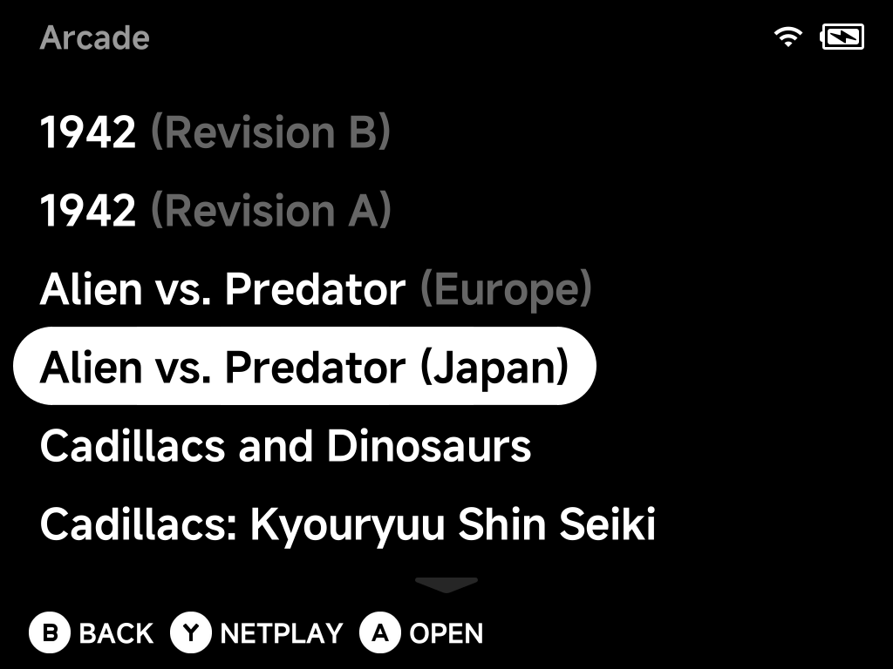

# Arcade (FBNeo)

Arcade games run on the bundled **FBNeo** core. They need more care than
console ROMs:

- the files are zips with cryptic database names
- they must not be renamed
- some games need extra support files

## Where games go

Put your game zips, and any BIOS zips they need, straight into
`Roms/Arcade (FBN)/`:

```
Roms/Arcade (FBN)/
├── dino.zip
├── mslug.zip
├── neogeo.zip      ← BIOS set, next to the games
└── sf2.zip
```

## Never rename the zips

!!! warning "Renaming breaks the game"
    FBNeo identifies a game by its **zip filename** (the MAME-style short
    name, e.g. `sf2` = Street Fighter II) and by the ROM files inside it.
    Renaming `sf2.zip` to `Street Fighter II.zip` breaks the game entirely.

You don't need to rename them for readable names either. The game list shows
each zip's **full title** from FBNeo's own game database: `mslug.zip` shows
as *Metal Slug - Super Vehicle-001*.

To pick your own name, use **Rename Rom** in the
[context menu](../guide/context-menu.md) or a
[`map.txt`](../guide/main-menu.md#custom-display-names-maptxt). Your name
always wins over the database title:

```
Roms/Arcade (FBN)/map.txt:

mslug.zip	Metal Slug
sf2.zip	Street Fighter II
```

Put the filename, then a single **tab**, then the display name.

??? info "More detail"
    The title from the database leaves out the revision and region details
    (`sf2ce.zip` shows as *Street Fighter II': Champion Edition*). Zips the
    database doesn't know keep their filename.

### Keeping several versions of a game

You can keep several versions of the same game in the folder. For example,
keep the English set for RetroAchievements and the Japanese one for gameplay.
The game list tells them apart with a dimmed detail after the title, such as
*Alien vs. Predator (Europe)* and *Alien vs. Predator (Japan)*.



??? info "More detail: how versions are labelled"
    Versions of the same game share one plain title: `avsp.zip` (Europe) and
    `avspj.zip` (Japan) are both *Alien vs. Predator*. The game list adds the
    detail the title leaves out:

    - **Region** when each version is from a different one: *Alien vs.
      Predator (Europe)* and *Alien vs. Predator (Japan)*.
    - The **full version detail** from FBNeo's database when regions repeat
      or are missing: *Street Fighter II': Champion Edition (Japan 920322)*
      and *(Japan 920513)*, *1942 (Revision B)* and *(Revision A)*.
    - A version with no detail at all (usually the parent set) keeps the
      plain title, and the others get theirs.
    - If nothing else tells them apart, the **zip name** goes in brackets:
      *Virtua Tennis 2 (vtennis2)* and *Virtua Tennis 2 (vtenis2c)*.

    Versions with different titles, like *Cadillacs and Dinosaurs* (`dino`)
    and *Cadillacs: Kyouryuu Shin Seiki* (`dinoj`), show those titles. A
    **Rename Rom** or `map.txt` name still wins over all of this.

## Romset version matters

Use a **FBNeo romset**, and prefer **non-merged** sets (each zip
self-contained).

- Sets built for MAME or for a different FBNeo version often fail with
  missing/bad ROM errors. FBNeo only loads zips that match its own ROM
  database.
- With split/merged sets, a clone needs its **parent** zip in the same
  folder.

## BIOS sets (neogeo.zip and friends)

Games on BIOS-based boards need the board's BIOS zip **in the same folder as
the game**. Most commonly that's `neogeo.zip` for Neo Geo titles (Metal Slug,
KOF, …). The BIOS zip is part of the romset, and its version must match too.

??? info "More detail"
    BIOS zips (`neogeo.zip`, `pgm.zip`, …) are **hidden from the game list
    automatically**, so they don't show up as unplayable entries. To show one
    anyway, give it an alias in `map.txt`.

## Sound samples

A few classics (mostly pre-1990) play some or all of their audio from
**sample packs**. Games run without samples: those sounds are just missing
or replaced by approximations.

??? info "More detail"
    FBNeo looks for sample packs under the system's BIOS folder:

    ```
    Bios/FBN/fbneo/samples/<game>.zip
    ```
