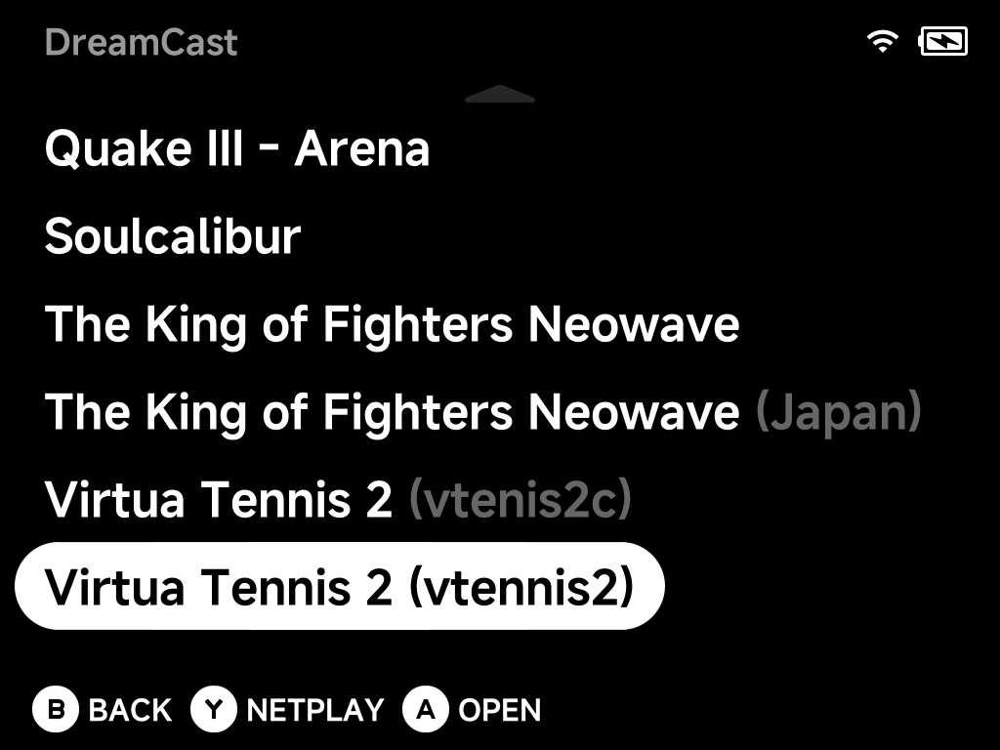

# Sega Dreamcast

Play Dreamcast games, plus the **Sega Naomi** and **Sammy Atomiswave** arcade
games built on the same hardware. Flycast also plays those arcade boards, from
the same folder. Put them all in `Roms/DreamCast (DC)/`.
Dreamcast games need no BIOS; the [arcade games](#arcade-games-naomi-atomiswave)
do.

Dreamcast gets the same features as the other systems:

- the [in-game menu](../guide/in-game-options.md) with save states (slots
  with previews), auto-resume and the [Game Switcher](../guide/game-switcher.md)
- fast-forward, screenshots, shaders and screen effects
- playtime tracking and ambient LEDs
- [RetroAchievements](#retroachievements) through NX Redux

!!! warning "Upgrading from an older NX Redux"
    **Save states made with the old emulator can't be loaded** by the new one.
    Save your progress in-game (on the memory card) before updating if you
    rely on a save state. Your memory cards come across automatically (see
    [Memory cards](#memory-cards-vmu)).

??? info "More detail"
    Dreamcast games run on **Flycast** (v2.7), bundled as a libretro core and
    played inside NX Redux's own emulator, like most other systems. That's
    why it gets the same features.

    Older versions ran Dreamcast on a standalone Flycast with its own overlay
    menu.

## Controls

The face buttons map to the Dreamcast pad **by position**, the way the
Dreamcast controller is laid out:

| Device button | Dreamcast button |
| --- | --- |
| Bottom (`B` on the cap) | A |
| Right (`A` on the cap) | B |
| Left (`Y` on the cap) | X |
| Top (`X` on the cap) | Y |

So a "Press A" prompt means the bottom button, not the cap printed `A`.

| Device control | Dreamcast control |
| --- | --- |
| D-pad | D-pad |
| Left stick | Analog stick |
| `L2` / `R2` | Analog triggers |
| **SELECT** | Insert a coin (Naomi and Atomiswave) |

On Naomi and Atomiswave games the four face buttons act as the cabinet's
buttons. To change the mapping, use **Options → Controls** in the in-game
menu, as for any other system.

??? info "More detail"
    Mapping by position means games that put the camera or movement on the
    face buttons (Unreal Tournament, for one) play as designed.

    The mapping is the same under either
    [Button Layout](../guide/button-layout.md). Only the in-game menu's
    confirm and back follow that setting.

## Memory cards (VMU)

Every game gets **its own memory card**, stored next to your other saves.
Multi-disc games share one card, so Shenmue's discs all use the same card.

To give a game a **fresh, empty card**:

1. Delete the game's `.A1.bin` file in `Saves/DC/`.
2. Launch the game. It starts with a blank card.

!!! warning "Renaming a ROM"
    Renaming a ROM leaves its card behind under the old name, as with any
    save. Rename the card to match.

??? info "More detail"
    Each card is saved as:

    ```
    Saves/DC/<rom name>.A1.bin
    ```

    For example `Saves/DC/Soulcalibur (USA).A1.bin`.

    - **Multi-disc games:** a `(Disc 1)` / `(Disc 2 of 3)` tag in the file
      name is ignored, which is how the discs share one card.
    - **The names match [NX Redux for Android](../../mobile/getting-started.md):**
      copy a card between your phone and handheld and it just works.
    - **Card writes are saved immediately,** so a crash or a forced quit
      can't leave a half-written card.

    **Coming from an older version?** The standalone emulator kept one shared
    card for all games. The first time you launch each game, its new card
    starts as a **copy of that shared card**, so every existing save is still
    there. The old card itself is never changed or deleted. It stays in
    `.userdata/shared/DC-flycast/` as a backup. Your console settings and
    arcade high scores are copied over the same way, once.

    When you delete a game's `.A1.bin` for a fresh card, the old shared card
    is not copied back.

## BIOS

Dreamcast runs **out of the box without a BIOS**. To boot through the real
BIOS instead, drop `dc_boot.bin` into `Bios/DC/`.

??? info "More detail"
    Without a BIOS, Flycast uses its built-in replacement (HLE).

    A RetroArch-style `Bios/DC/dc/` subfolder also works. If it exists, it's
    used instead.

    Flycast also keeps the console's settings and clock (`dc_nvmem.bin`) and
    a couple of shared files in that same folder. Leave them there.

## Settings

Change Dreamcast's settings in **Options → Core Options** in the in-game
menu. You can also set them before launching, per game or for all games, in
the game list's [Emulator Options](../guide/emulator-options.md).

<!-- SCREENSHOT: dc-core-options — Dreamcast Options → Core Options, showing Internal Resolution and Widescreen Hack (Brick) -->

| Setting | What it does | Default |
| --- | --- | --- |
| **Internal Resolution** | Higher values look sharper but cost speed. Can be changed mid-game. | 640×480 on every device |
| **Widescreen Hack** | — | On for the Smart Pro S (16:9 screen); off for the Brick and Brick Pro |
| **Auto Frame Skip** | Stays on for heavy 3D scenes | — |
| **Netplay Input Delay** | See [Netplay](#netplay) | 1 |

??? info "More detail"
    - **Internal Resolution:** 640×480 is the Dreamcast's own resolution. The
      Brick has little to spare, while the Smart Pro S can handle 960×720 in
      lighter games.
    - **Core Sync:** Dreamcast uses the **Emulated**
      [Core Sync](../guide/in-game-options.md#frontend) by default. It follows
      the game's own timing, so games that run at 30 fps (Metal Slug 6,
      Quake III Arena) play at their real speed.
    - **Debug HUD:** shows an extra **`EMU nn%`** line with the true
      emulation speed. It's the easiest way to tell whether a heavy scene
      keeps up.

## Arcade games (Naomi & Atomiswave)

Naomi and Atomiswave games are MAME-style zips. To play them:

1. Put the zips straight into `Roms/DreamCast (DC)/`, next to your Dreamcast
   games.
2. Put the board's BIOS zip in `Bios/DC/`. Without it, the game can't start.

    | Board | BIOS file |
    | --- | --- |
    | Naomi | `naomi.zip` |
    | Atomiswave | `awbios.zip` |

3. Launch the game and press **SELECT** to insert a coin. As on the real
   cabinets, START works only after a coin.

!!! warning "Don't rename the zips"
    Like [FBNeo arcade zips](arcade.md), the emulator identifies a game by
    its short zip name (`mslug6.zip`, not `Metal Slug 6.zip`).

The game list still shows readable names: `ikaruga.zip` shows as *Ikaruga*.
Several versions of one game can sit side by side, each labelled so you can
tell them apart.



??? info "More detail"
    **Names.** Each zip gets its **full title** from Flycast's own game list
    (`ikaruga.zip` shows as *Ikaruga*, `mvsc2.zip` as *Marvel vs. Capcom 2*).
    The in-game menu shows the same title. Dreamcast disc images keep their
    filenames. A **Rename Rom** or
    [`map.txt`](../guide/main-menu.md#custom-display-names-maptxt) alias
    always wins over that title. A BIOS zip placed in the game folder by
    mistake is hidden from the list.

    **Several versions.** Each row gets the detail that tells it apart, the
    same way as on [Arcade](arcade.md#keeping-several-versions-of-a-game):

    - the region (*Mazan: Flash of the Blade (World)* / *(Japan)* / *(US)*)
    - else Flycast's version detail (*Dead or Alive 2 (Rev A)*)
    - the parent set keeps the plain title (*The King of Fighters Neowave*
      next to *… (Japan)*)
    - versions with nothing else to tell them apart show the zip name in
      brackets

    **Atomiswave BIOS: both MAME sets work.** Either `awbios.zip` variant is
    accepted: the older MAME set (`bios0.ic23`) and the current MAME re-dump
    (`bios.ic23_l`).

    **Saves.** High scores and cabinet settings are saved in
    `Saves/DC/reicast/`.

## RetroAchievements

Dreamcast, Naomi and Atomiswave games use NX Redux's
[RetroAchievements](../apps/retroachievements.md) support, exactly like the
other systems:

- sign in once in the tool
- unlocks work offline and sync later
- they show up in the tool straight away

!!! tip "\"Unsupported Game Version\""
    If a game shows up as *Unsupported Game Version (title)*, RetroAchievements
    recognises your disc but hasn't tested that particular dump with its
    achievements. Use one of the versions listed on the game's **Supported
    Game Hashes** page on retroachievements.org.

## Netplay

Dreamcast supports **GGPO netplay** for 2 players. It's rollback netplay,
which keeps controls responsive over Wi-Fi. To start, press `Y` on a game and
host or join, the same way as on other systems (see [Netplay](../netplay.md)).

- **The host brings the save.** The session uses the host's memory card,
  console settings and (for arcade games) high scores. The other player's own
  saves are never touched.
- **Arcade games** need their BIOS zip on **both** devices.
- **Jerky corrections?** Raise **Netplay Input Delay** in Core Options. It
  costs a little input lag.
- **Speed:** fights run at around 70% on current handhelds. Expect some audio
  stutter in heavy scenes.

### Pause or leave a session

GGPO can't pause cleanly. Pressing `MENU` shows only **Leave netplay?**, and
the other player's game waits while it's open.

<!-- SCREENSHOT: dc-leave-netplay — the "Leave netplay?" prompt during a Dreamcast netplay session (Brick) -->

| Press | What happens |
| --- | --- |
| `B` | Continue playing |
| `A` | Leave the session |

!!! warning "You leave automatically"
    If you don't answer within **20 seconds**, you leave automatically.
    Putting the device to sleep also leaves the session. The other player
    sees **Netplay ended** straight away.

If the two devices' saves don't match (for example a card copied by hand),
the session refuses to start rather than going out of sync. It shows
**Netplay failed**.

??? info "More detail"
    - **Saves:** the other player plays on a temporary copy of the host's
      save. The host keeps a backup of what it brought in
      `.userdata/shared/DC-flycast/netplay-backup/`.
    - **BIOS:** both devices use the real BIOS only when **both have the same
      `dc_boot.bin`**. Otherwise both use the built-in BIOS for that session,
      automatically.
    - **Settings that change how the game plays are kept the same on both
      sides** for the session, whatever each device has set. These are
      region, language and broadcast (which follow the disc and the host's
      console settings), plus CPU clock, DSP, widescreen cheats and
      memory-card layout.
    - **Display settings** (resolution, widescreen, frame skip) stay per
      device.
    - **Netplay Input Delay** ranges 0–5 (default 1) and is each player's
      own.
    - **Speed:** menus run at full speed. The ~70% in fights is about the
      same as the old standalone emulator.
