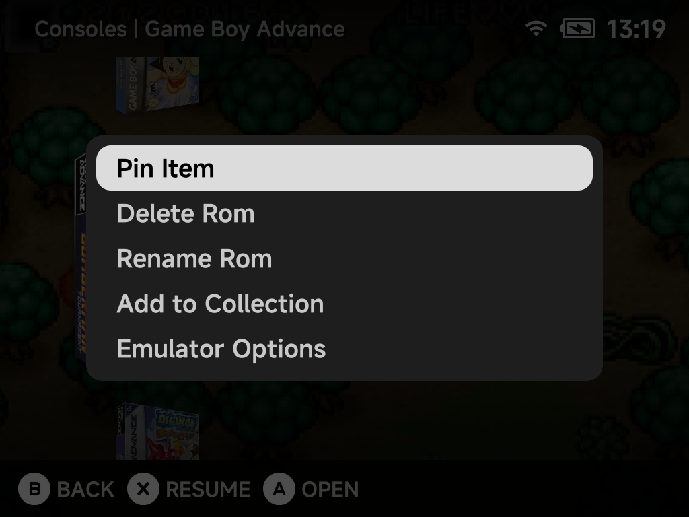

# Game Context Menu

Press `MENU` on a highlighted game in any game list, or on a game on
[Home](main-menu.md#home), to open its context menu.

Depending on the game, the menu offers:

| Option | What it does |
| --- | --- |
| **Pin Item / Unpin Item** | Pin the game to [Home](main-menu.md#pinning-games-and-tools) for one-press access |
| **Delete Rom** | Remove the game (with a confirmation dialog) |
| **Rename Rom** | Change a game's display name. The [keyboard](keyboard.md#editing-an-existing-name) opens with the current name to edit. The file itself is never touched. |
| **Add to Collection** | Add the game to an existing collection or create a new one on the spot |
| **Emulator Options** | Edit [per-game emulator options](emulator-options.md), overriding the system-wide defaults |
| **Fetch Artwork** | Download the screenshot and box art for this game in the background, plus the 2D box art, wheel and mix when they are turned on in [Artwork Manager → Settings](../apps/artwork-manager.md). Shown in game lists when the game has neither yet; needs Wi-Fi. |
| **Refresh Roms** | Rescan the ROMs list (on Home) |
| **Tools** | Open Tools (on Home, when the Tools tab is hidden) |

!!! tip "Bulk artwork"
    To fetch artwork for many games at once, use the
    [Artwork Manager](../apps/artwork-manager.md) instead of fetching one
    game at a time.

??? info "More detail"
    **Rename Rom** stores the new name as a
    [`map.txt` alias](main-menu.md#custom-display-names-maptxt). Box art,
    saves and save states stay matched, and arcade zips keep loading.
