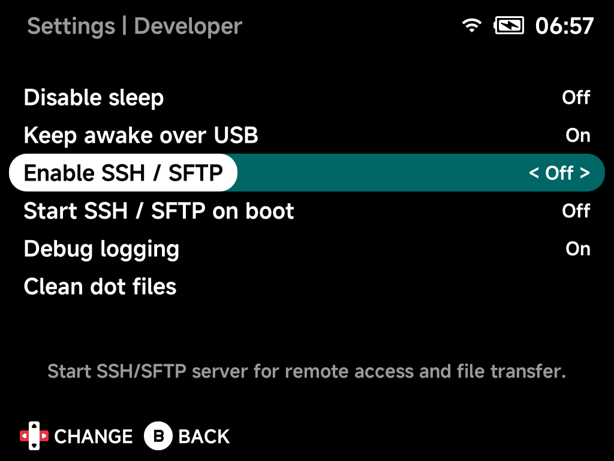

# Accessing Your Files

Everything NX Redux uses (ROMs, saves, BIOS files, artwork, music and videos)
lives on the SD card. You can reach it two ways:

| Way | How it works |
| --- | --- |
| [**Over Wi-Fi with SFTP**](#over-wi-fi-sftp) | Browse and copy files from your computer while the SD card stays in the device |
| [**With a card reader**](#with-a-card-reader) | Power the device off, take the SD card out and open it on your computer |

## Over Wi-Fi (SFTP)

1. Connect the device to Wi-Fi (**Settings → Network**).
2. Turn on **Settings → Developer → Enable SSH / SFTP**. The hint under the
   toggle shows the device's IP address and login, e.g.
   `root@192.168.1.8  Password: tina`.

    

3. Connect from your computer with an SFTP client using:

    | Field    | Value                                                  |
    |----------|--------------------------------------------------------|
    | Protocol | SFTP                                                   |
    | Host     | the IP address from the hint                           |
    | Port     | `22`                                                   |
    | Username | `root`                                                 |
    | Password | `tina` on Brick and Brick Pro; leave empty on Smart Pro S |

4. Go to `/mnt/SDCARD`. That is the root of the SD card.

To have SFTP available every time the device starts, also turn on
**Start SSH / SFTP on boot**.

??? info "More detail"
    SFTP is file transfer over SSH, so it comes with the SSH server: when SSH
    is on, SFTP is on.

### SFTP clients

Any SFTP client works. [FileZilla](https://filezilla-project.org/) is free and
runs on Windows, macOS and Linux:

1. Open **File → Site Manager → New site**.
2. Set **Protocol** to **SFTP - SSH File Transfer Protocol**.
3. Fill in the host, port, user and password above, and connect.
4. Accept the host key the first time.
5. Drag files between the left (your computer) and right (the device) panes.

??? info "More detail: other free SFTP clients"
    - **[WinSCP](https://winscp.net/)** (Windows): choose **SFTP** as the file
      protocol.
    - **[Cyberduck](https://cyberduck.io/)** (macOS, Windows): choose
      **SFTP (SSH File Transfer Protocol)**.
    - **Linux file managers**: type `sftp://root@192.168.1.8/mnt/SDCARD` into
      the address bar of Files (GNOME) or Dolphin (KDE).
    - **Command line**: `sftp root@192.168.1.8` or
      `scp game.zip root@192.168.1.8:/mnt/SDCARD/Roms/...`.

!!! tip "Keep the device awake during big transfers"
    Wi-Fi drops when the device sleeps, which stops a transfer. For long
    copies, keep the device awake or turn on
    [Developer → Disable sleep](../settings/developer.md#disable-sleep).

!!! warning "Turn SSH off on networks you don't trust"
    The login is `root` with a well-known password (or none on Smart Pro S),
    so anyone on the same network can reach the device while SSH is on. Turn
    **Enable SSH / SFTP** off when you're done.

## With a card reader

Power the device off, remove the SD card and put it in a card reader. It
opens like any other drive on your computer. Put the card back and power on.

!!! warning "SD cards are built per device model"
    Put a card back into the same kind of device it came from. To move saves
    between devices, use [Device Sync](../apps/device-sync.md) instead.

On macOS, run [Developer → Clean dot files](../settings/developer.md#clean-dot-files)
afterwards to remove the `.DS_Store` and `._*` files Finder leaves behind.

## What's where

| Folder              | Contents                                                     |
|---------------------|--------------------------------------------------------------|
| `Roms/`             | Your games, one folder per system                            |
| `Saves/`            | In-game saves                                                |
| `Bios/`             | BIOS files for systems that need them ([Cores & BIOS Files](../emulators/cores.md)) |
| `Cheats/`           | Cheat files ([Cheats](../apps/cheats.md))                    |
| `Collections/`      | Your game collections                                        |
| `Music/`            | Files for the [Music Player](../apps/music-player.md)        |
| `Videos/`           | Files for the [Media Player](../apps/media-player.md)        |
| `Overlays/`, `Shaders/` | Screen overlays and shaders                              |
| `Emus/`, `Tools/`   | Your own community paks (see [Getting Started](../getting-started.md#updating)) |
| `.userdata/`        | Settings, save states and logs (hidden folder)               |
| `.system/`          | NX Redux itself — don't change anything here                 |

Folders starting with a dot are hidden by default; turn on "show hidden
files" in your client or file manager to see them.
