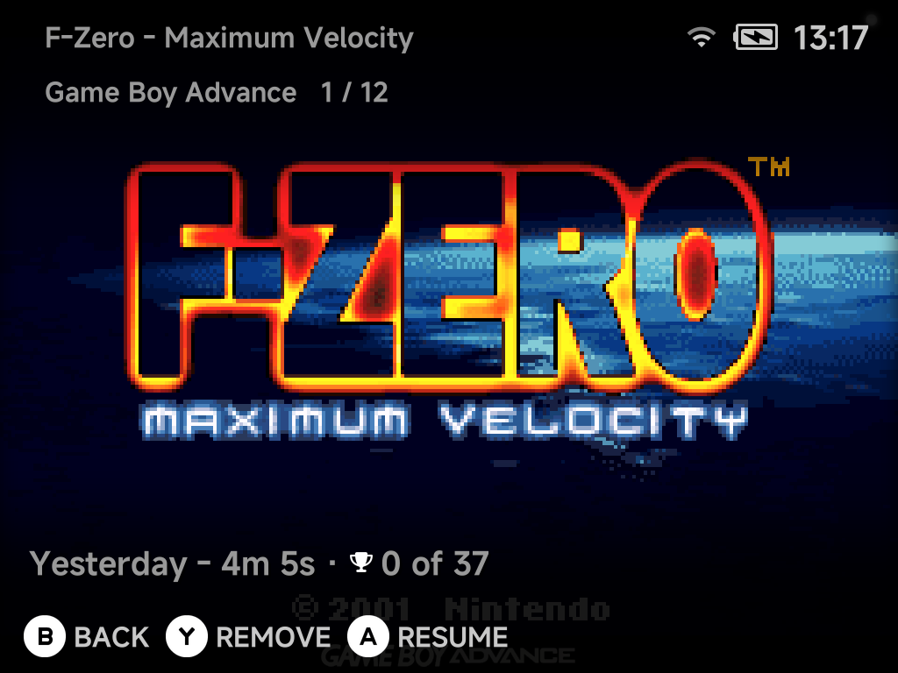

# Game Switcher

Tap `SELECT` anywhere in the menus to open the Game Switcher — a full-screen
carousel of your recent games that resumes any of them instantly.

| Button | What it does |
| --- | --- |
| `Left` / `Right` | Flip through games |
| `A` **Resume** | Continue exactly where you left off |
| `Y` **Remove** | Take the game out of the switcher |
| `B` **Back** | Return to the menu |

## Always resumable

Quitting a game auto-saves to a hidden save slot. The Game Switcher always
resumes exactly where you left off, with no manual save states needed. This
works on the built-in cores, Dreamcast included, and Nintendo 64.

Games without a save state show their box art instead, so the switcher stays
visual even for freshly added titles.

## Resumable-only by default

By default the switcher lists **only resumable games**. To see all recent
games, set [**Game Switcher games**](../settings/system.md#game-switcher-games)
in **Settings → System** to `All recent games`.
