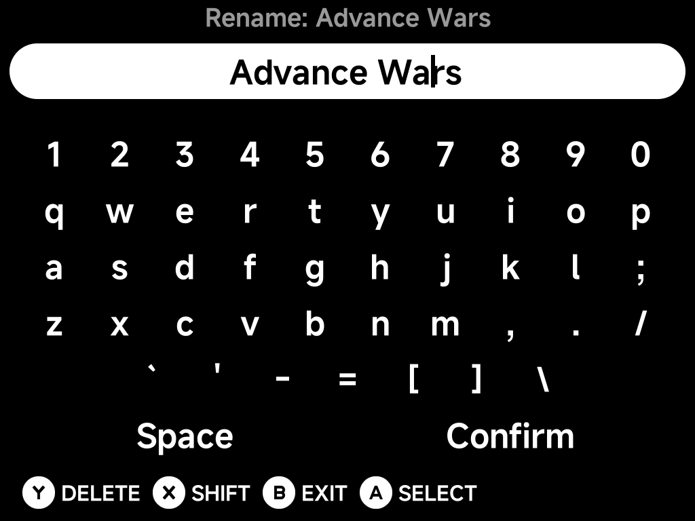

# On-Screen Keyboard

Anywhere you type text, NX Redux opens the same on-screen keyboard:
[Search](main-menu.md#search), **Rename Rom** in the
[context menu](context-menu.md), Wi-Fi passwords in
[Settings → Network](../settings/network.md) and the Netplay wizard, the
[RetroAchievements](../apps/retroachievements.md) and
[Artwork Manager](../apps/artwork-manager.md) logins, and names in the
[Music Player](../apps/music-player.md) and
[Image Viewer](../apps/image-viewer.md).

The prompt sits at the top, the text you're typing below it, then the keys.

## Typing

| Button | What it does |
| --- | --- |
| D-pad | Move between keys |
| `A` **Select** | Type the highlighted key |
| `X` **Shift** | Switch between lower and upper case |
| `Y` **Delete** | Delete the character before the cursor; hold to keep deleting |
| `B` **Exit** | Close the keyboard without changing anything |

Choose **Space** for a space and **Confirm** when you're done. Confirming
an empty line is the same as exiting.

## Moving the cursor

The thin bar in the text line is the cursor: new characters go in where it
is, and `Y` deletes the character before it. To move it:

1. Press `Up` from the top row of keys (or `Down` from **Space** /
   **Confirm**). The text line lights up.
2. Press `Left` / `Right` to move the cursor one character at a time.
3. Press `Down` (or `A`) to go back to the keys.

`L1` / `R1` also move the cursor from anywhere on the keyboard, without
leaving the keys.

Long text scrolls sideways so the cursor always stays in view.

## Editing an existing name

**Rename Rom** opens with the game's current name already typed in, so a
small fix doesn't mean retyping the whole title. Move the cursor to the
part you want to change, or hold `Y` to clear it and start fresh.
Confirming the name without changing it leaves the game as it was.
