# Menu Layouts

The Consoles, Collections and Tools tabs, and every game list, can each be
drawn in their own style. Pick them in
[Settings → Layouts](../settings/layouts.md). The menu picks up the change as
soon as you leave Settings, with no restart.

The pictures on this page are taken with
[Page title](../settings/layouts.md#page-title) and
[Button hints](../settings/layouts.md#button-hints) hidden.

| Style | Tabs | Game lists | In short |
| --- | :---: | :---: | --- |
| [**List**](#list) | ✓ | ✓ | Text rows over the art, the most entries per screen |
| [**Grid**](#grid) | ✓ | ✓ | Two rows of tiles |
| [**Carousel**](#carousel) | ✓ | ✓ | One large item at a time, across or down the screen |
| [**Backdrop**](#backdrop) | | ✓ | Box art over the game's screenshot |

Out of the box, Consoles, Collections and game lists use **Carousel**, and
Tools uses **Grid**.

Home has its own three layouts, **List**, **Grid** and **Carousel**: see
[Home](main-menu.md#home).

## List

A plain list. On the Consoles tab the selected console's controller sits
behind the list. In a game list the selected game's screenshot fills the
background.

*Consoles tab*

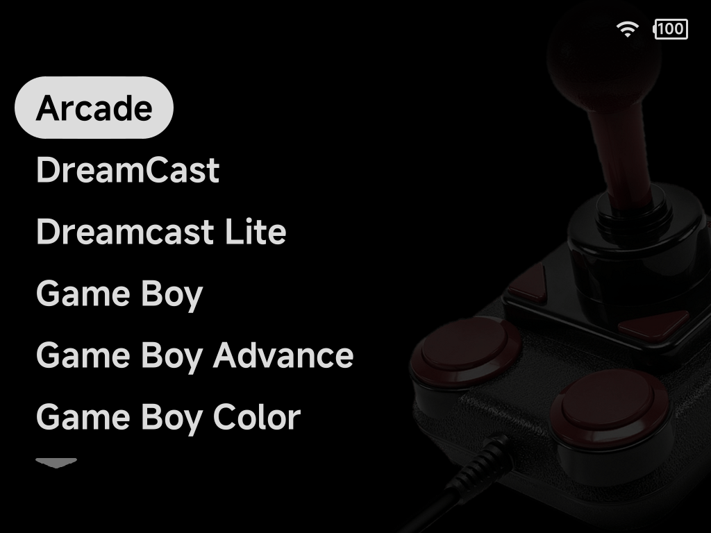

*Game list*

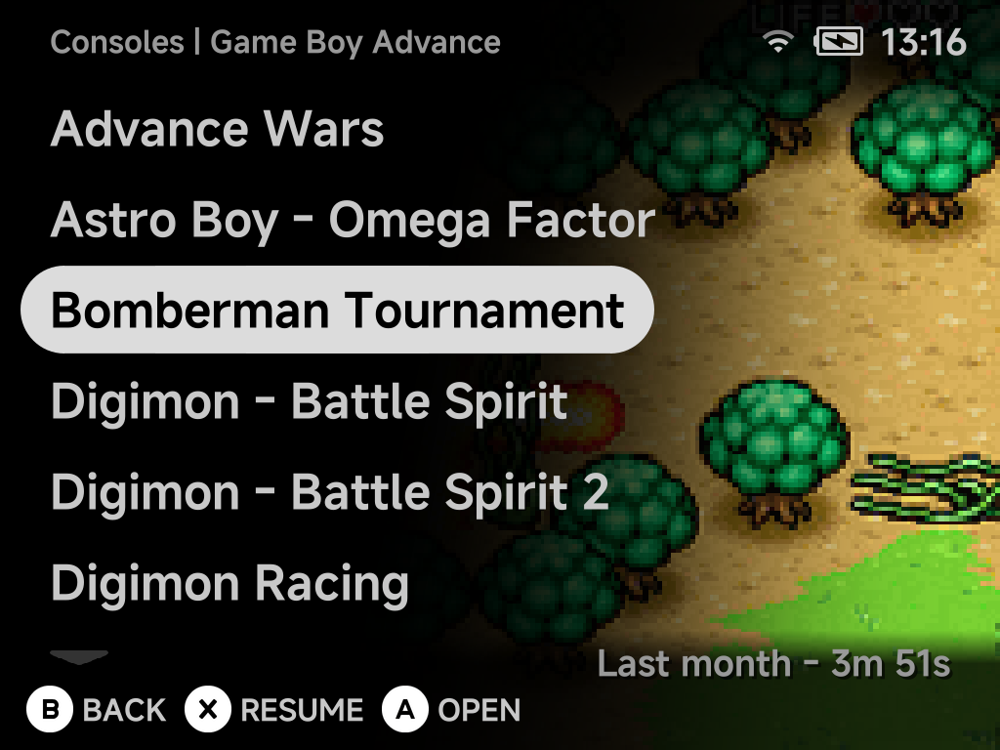

- The line at the bottom holds the scroll arrows.
- With [Button hints](../settings/layouts.md#button-hints) hidden, a game
  list shows the selected game's last-played time, achievements and next
  achievement in the bottom row, where the hints were.
- With [Page title](../settings/layouts.md#page-title) hidden, the up arrow
  moves above the first row, so the list has one arrow at each end. Home's
  List keeps both arrows in the bottom row.

- `Up` on the first row wraps to the last, and `Down` on the last wraps to the
  first (hold the button to stop at the end instead).
- On the main menu `Left` / `Right` switch tabs. In game lists they page up
  and down.

### Your own console backgrounds

The Consoles tab in List can show a picture of your choosing behind each
console instead of its controller, much like the list's look before 2.0.

1. Make the image and name it `bg.png`.
2. Put it in that console's `.media` folder:
   `Roms/<console> (<tag>)/.media/bg.png`, for example
   `Roms/Game Boy (GB)/.media/bg.png`.
3. In [Settings → Layouts](../settings/layouts.md), set **Consoles controller** to
   **Hide**.

The selected console's `bg.png` then fills the screen behind the list. A
console without one shows the plain list on black.

*Consoles tab in List with a custom background, Page title and Button hints
hidden*

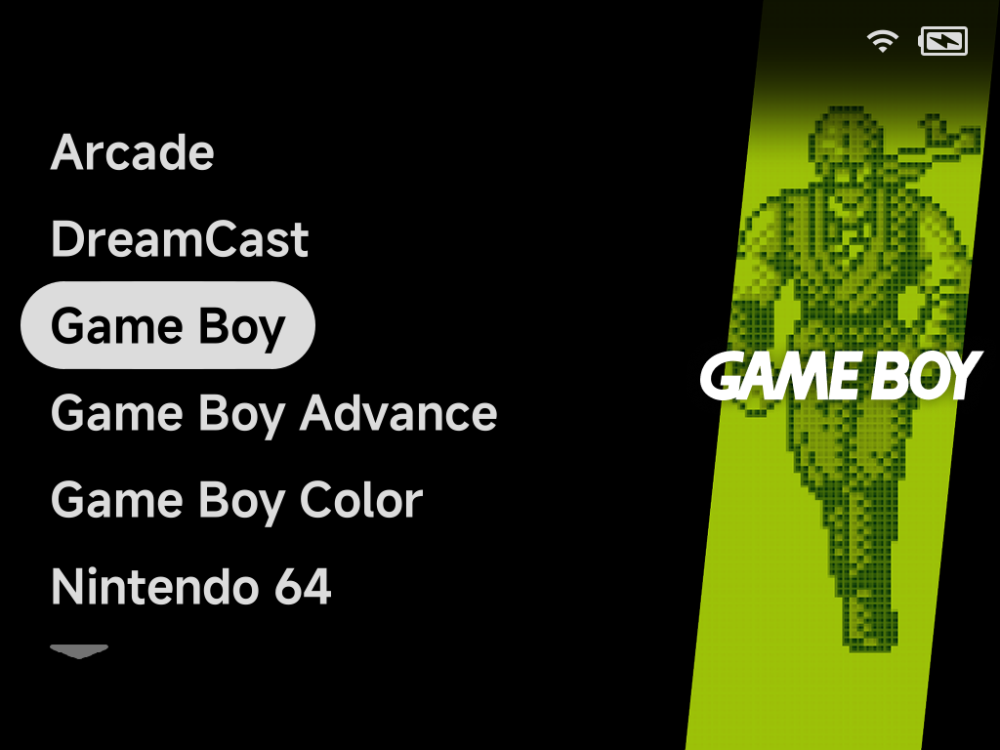

??? info "More detail"
    - Size the image to the screen: 1024×768 on the Brick, 1280×720 on the
      Brick Pro and Smart Pro S.
    - With **Consoles controller** on, the controller is shown and `bg.png` is
      ignored.
    - The Collections tab in List takes a background too, with no setting to
      change: `Collections/.media/<collection name>.png` for one collection,
      or `Collections/.media/bg.png` for all of them.
    - The [Artwork Manager](../apps/artwork-manager.md) never touches `bg.png`:
      neither **Reset artwork** nor **Optimize images** changes it.

## Grid

Two rows of tiles that slide sideways as you move. Consoles show their logo
and game count. Games show their screenshot, and the selected tile adds its
name, last-played time and achievement count.

*Consoles tab*

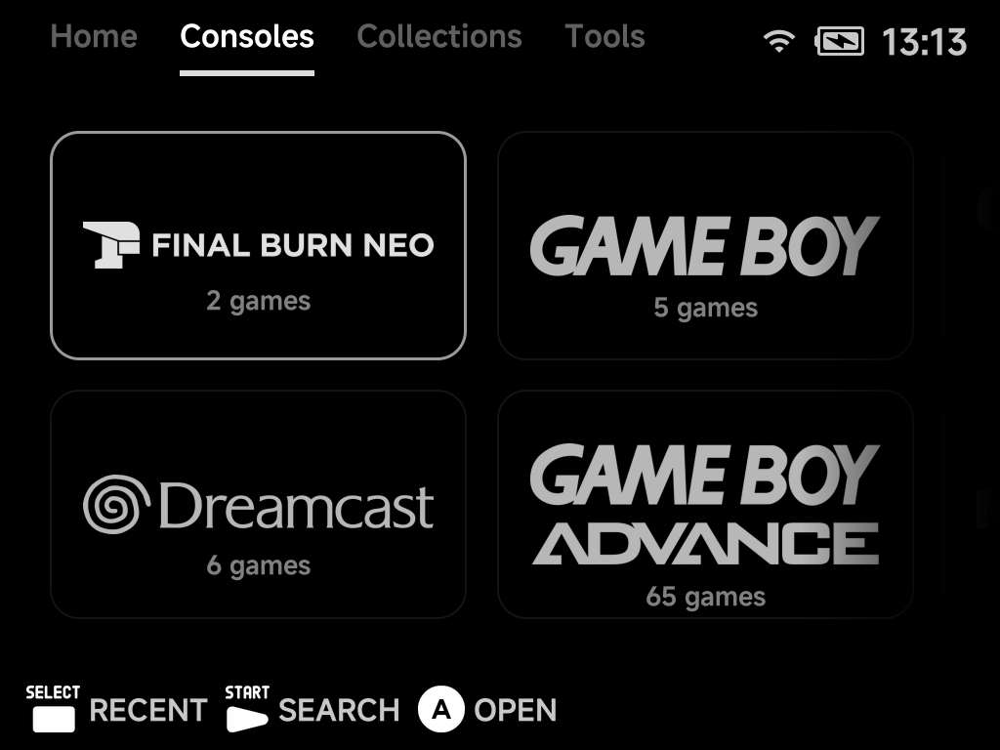

*Game list*

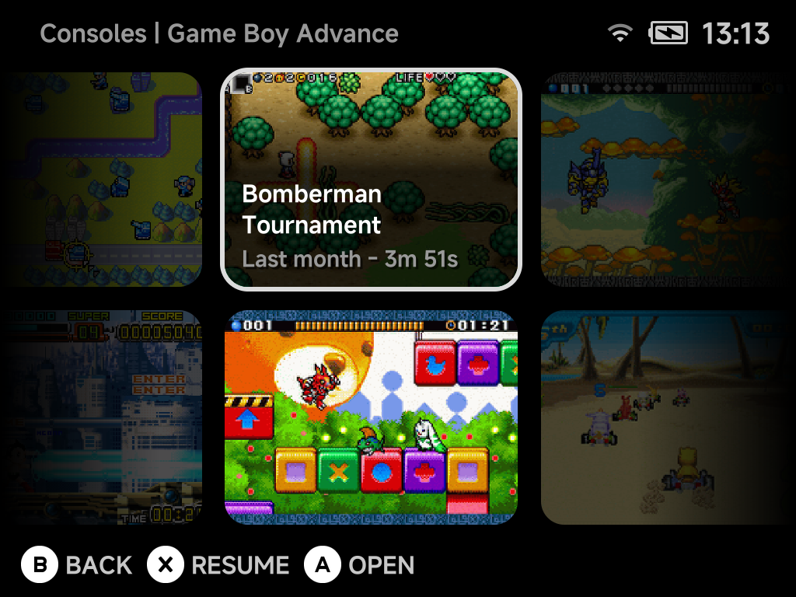

With no other tab to switch to (a single tab left, or a hidden tab opened from
the `MENU` options), `Left` / `Right` past the first or last tile wrap around
to the other end.

*Tools tab (the default for Tools)*

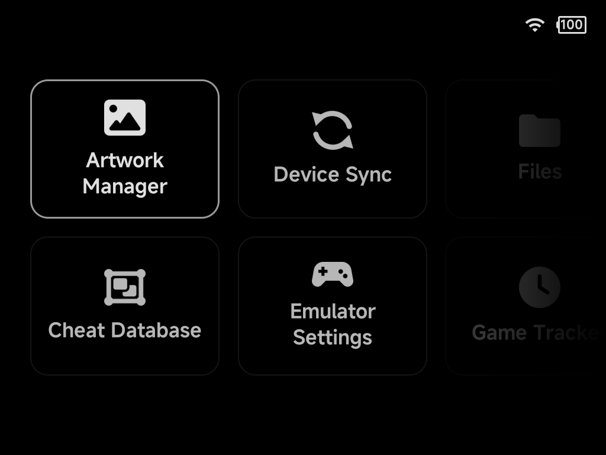

## Carousel

A single row with the selected item large in the middle and its neighbours
fading out to the sides. Consoles show their logo over their controller,
collections their name, tools their icon. In a game list the caption under
the selected game gives its name, play time and achievements; on the Brick and
Brick Pro the next achievement gets a line of its own. The selected game sits
centred with its caption, so a game without stats sits a little lower.

In the horizontal Carousel, collections and tools take the width their name
needs, with the same gap between each. A collection name starts a new line
before any long word.

*Consoles tab*

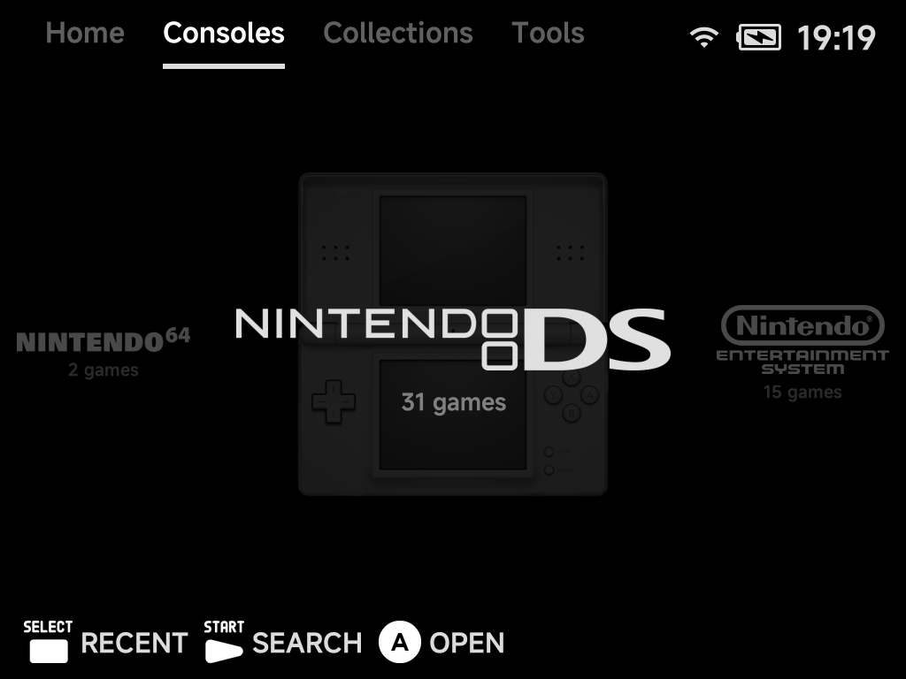

*Game list*

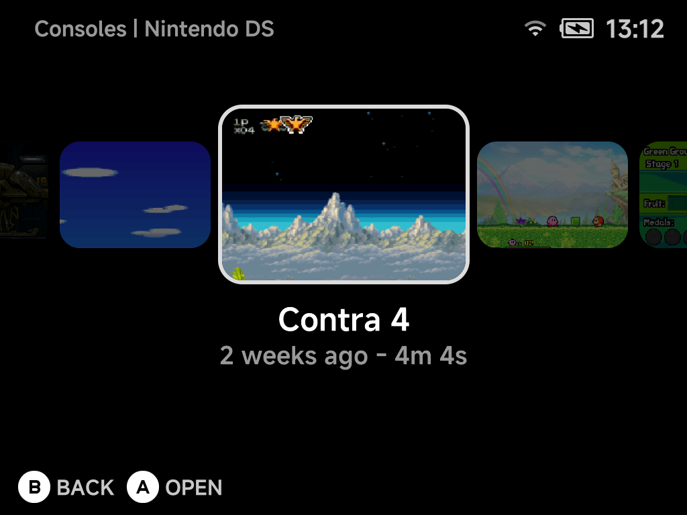

## Backdrop

Game lists only. The selected game's box art stands over its dimmed
screenshot, with its neighbours' boxes to the sides. A game with no box art
gets a placeholder box.

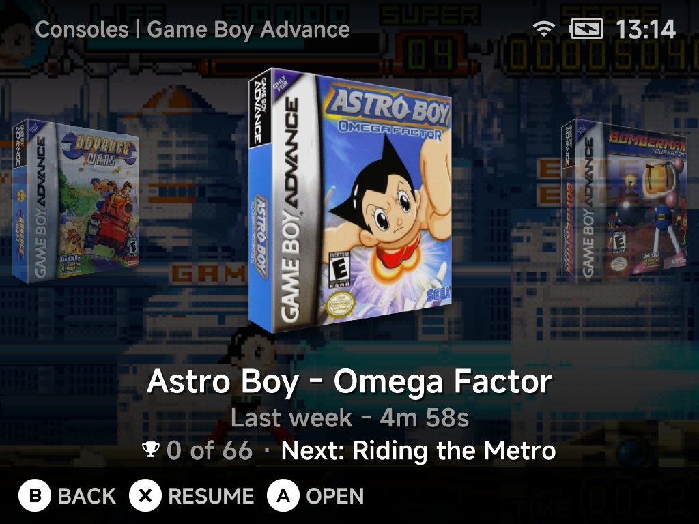

## Vertical orientation

Carousel and Backdrop can also run **down** the screen instead of across:
set the **orientation** row under the style to **Vertical**. `Up` / `Down`
then move through the items and wrap around at the ends (hold to stop
instead), and `Left` / `Right` switch tabs (on a tab) or do nothing (in a game
list).

*Consoles tab, vertical Carousel*

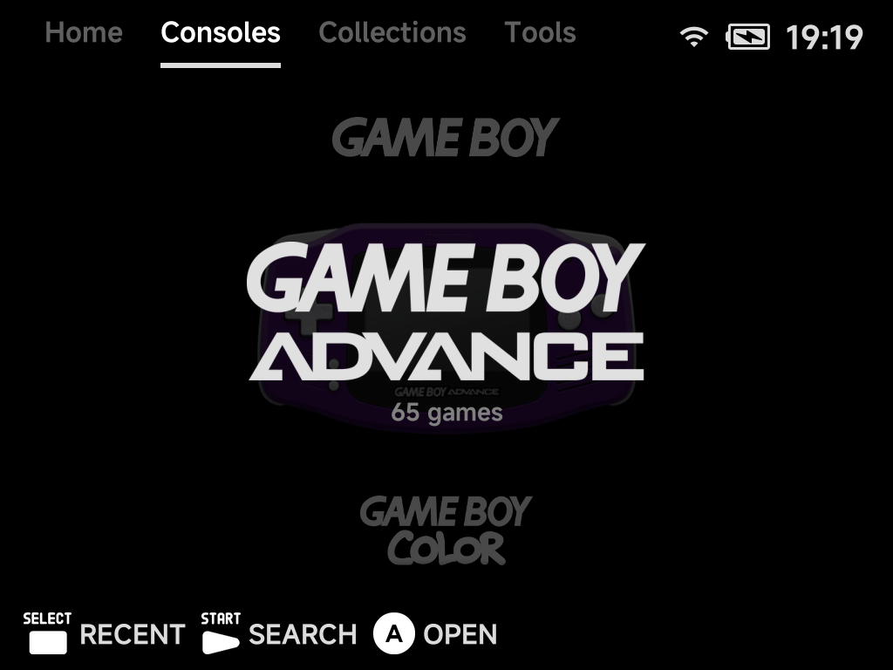

*Game list, vertical Carousel*

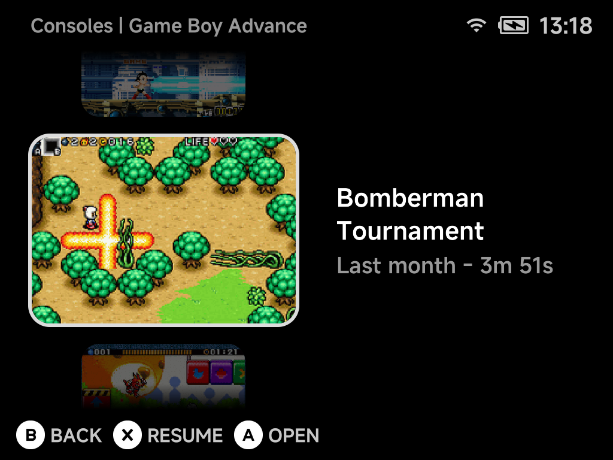

*Game list, vertical Backdrop*

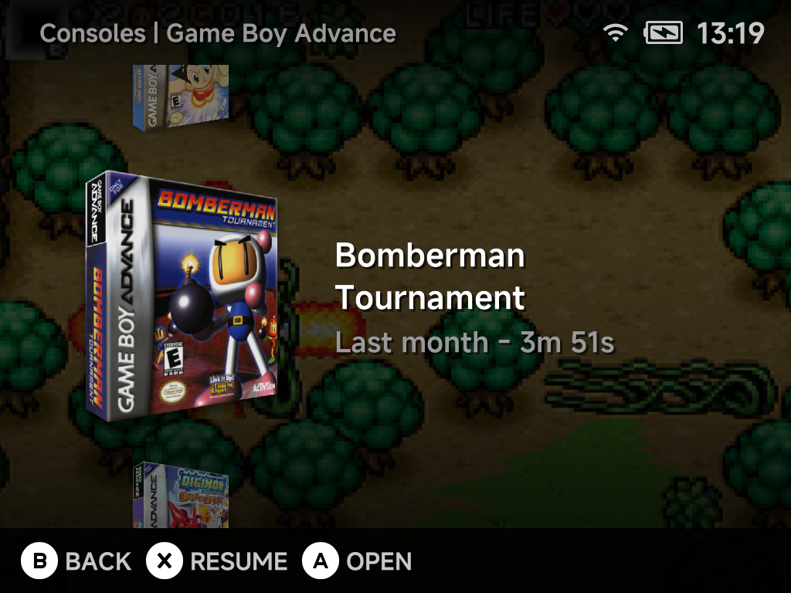

In a vertical game list the stack sits on the left and the details on the
right. Set **Game lists alignment** to **Right** to swap the sides.

With the page title or the button hints hidden, carousels and Backdrop are no
longer cut off at the top and bottom rows: the neighbouring items run on into
the freed space to the screen's edge.

??? info "More detail"
    - **Controller art.** The Consoles tab shows each console's controller
      behind it in the List and Carousel styles. Turn **Consoles controller** off in
      Layouts for plain logos.
    - **Logos.** Systems without a logo of their own show their name under a
      cartridge emblem. Tools without an icon get a generic one.
    - **Games without artwork.** A game with no screenshot or box art gets a
      generated abstract picture, the same one every time. These pictures are
      stored in `.userdata/shared/.minui/placeholders/`, never next to your
      ROMs, and are safe to delete. To fetch real art for one game, press
      `MENU` on it and choose **Fetch Artwork**; for many games, use the
      [Artwork Manager](../apps/artwork-manager.md).
