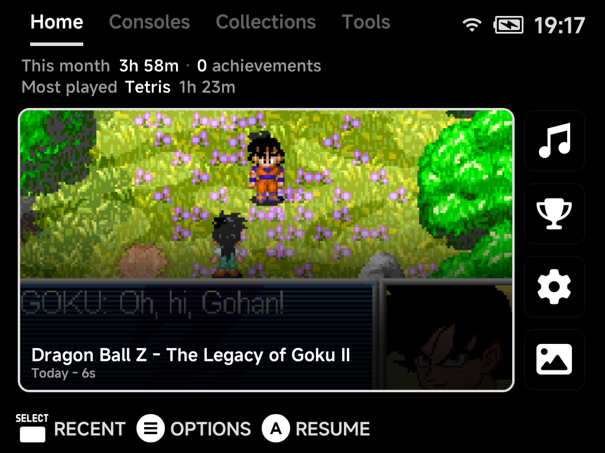
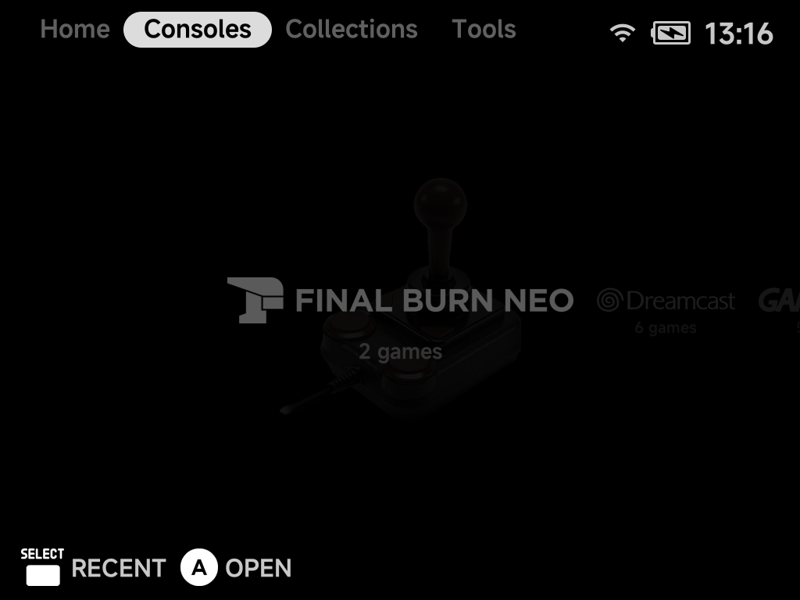
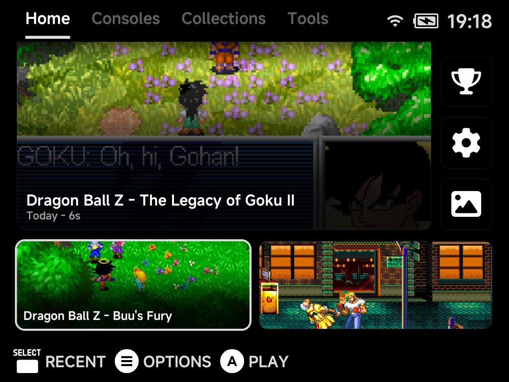
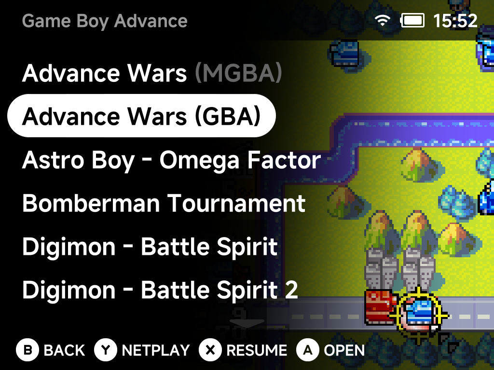
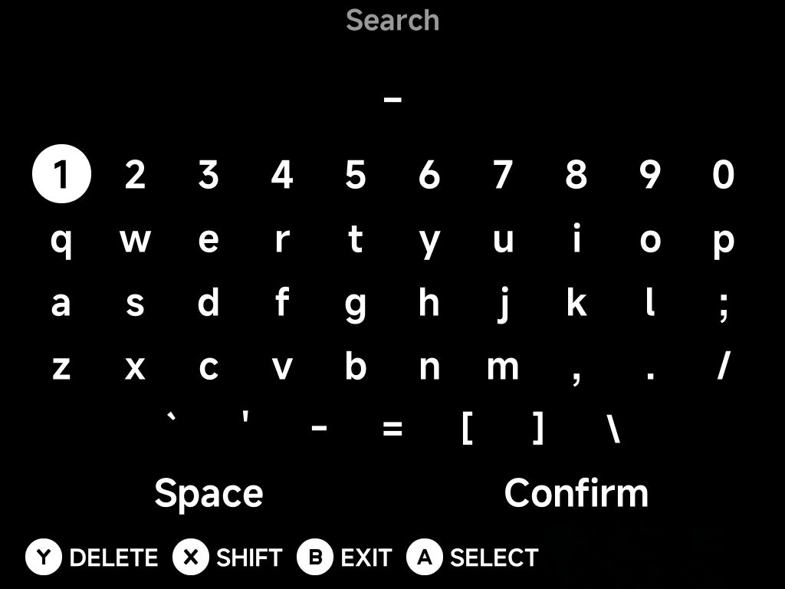
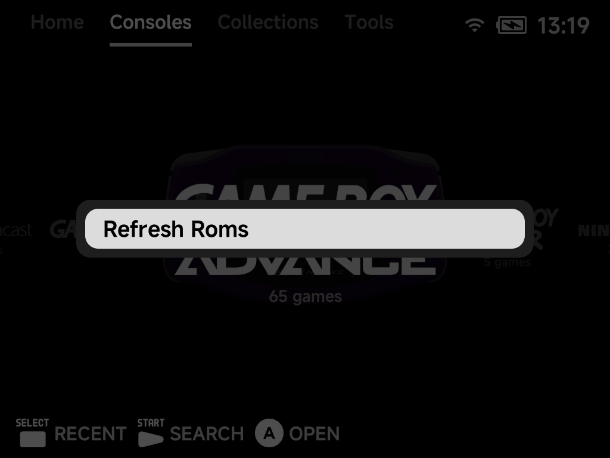
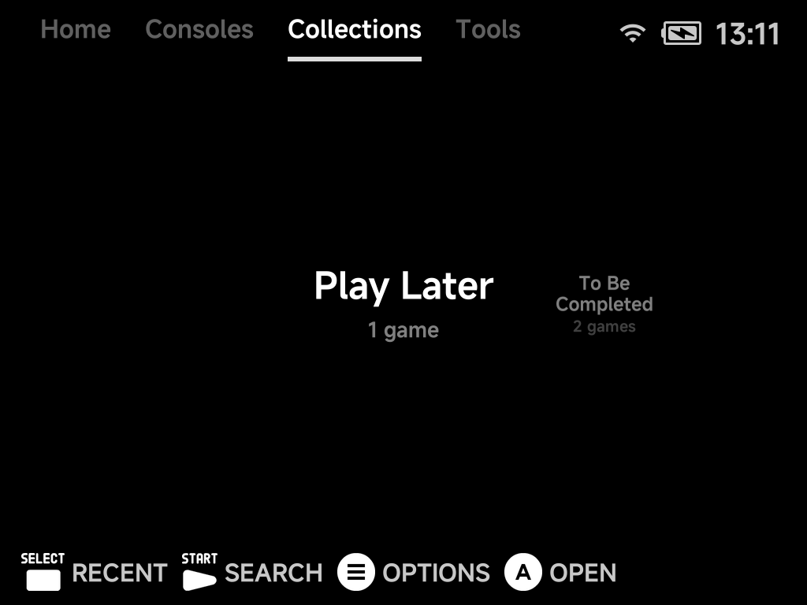
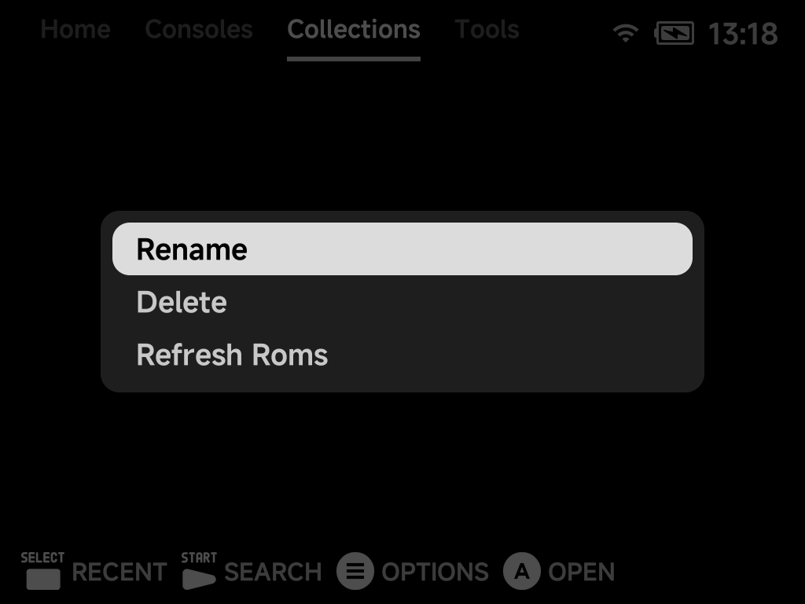

# Main Menu & Game Lists

The main menu is split into four tabs: **Home**, **Consoles**,
**Collections** and **Tools**. Home is hidden until you turn it on in
[Layouts](../settings/layouts.md#home-tab); the device powers on to the first
tab that shows.



Each tab except Home can be drawn as a list, a grid or a carousel, and game
lists have a fourth style, Backdrop. [Menu Layouts](layouts.md) shows them all.

## Tabs

| Tab | What it holds |
| --- | --- |
| **Home** | Your last game, play stats, and the games and tools you pinned |
| **Consoles** | One entry per system folder that has games in it |
| **Collections** | Your [collections](#collections) |
| **Tools** | The built-in apps, Settings included ([Tools Overview](../apps/tools.md)) |

- **Switch tabs** with `L1` / `R1`. The tab order wraps around.
- `Left` / `Right` also switch tabs:
    - in List style, always;
    - in Grid and Carousel, when you push past the first or last item.
- **Show or hide tabs** in [Settings → Layouts](../settings/layouts.md). A tab
  with nothing in it, such as Collections before you make one, is left out
  automatically. With a single tab left, the tab row shows an **NX Redux**
  title instead.

### The tab row

In the Grid and horizontal Carousel styles, press `Up` from the top of a tab to
move the highlight onto the tab row (List and vertical carousels wrap to their
last item instead). The content dims while the row is focused. With
[Page title](../settings/layouts.md#page-title) hidden there is no tab row to
focus.



| Button | What it does |
| --- | --- |
| `Left` / `Right`, `L1` / `R1` | Switch tabs |
| `Down`, `A` or `B` | Go back into the content |
| `Up` | Jump to the bottom of the content |

??? info "More detail"
    - Each tab keeps its own selection while you move between tabs.
    - After a game, you come back to the tab you launched it from: Home's
      Continue card for a game started from Home, or the same row in its
      list. A game launched from Search or the Game Switcher returns you
      to the tab that lists it.
    - The last tab is remembered until the device powers off. A cold boot
      opens the first tab that shows (Home when it is on).

## Home

Home is the starting point: your most recent game, this month's play time,
and everything you pinned.



- **Stats line.** The top lines show **This month**'s total play time, your
  RetroAchievements unlocked this month (left out when you are signed out),
  and the month's **Most played** game. A month without play shows
  **No play yet**.
- **Continue card.** Your most recent game, showing where you left off (the
  save-state picture, else the game's artwork), its name and when you last
  played it. Press `A` to jump back in. On a fresh install it is replaced by
  a **Pick a game** card that opens the Consoles tab.
- **Pinned tools** sit beside the Continue card as square icon tiles. Every
  pinned tool is shown.
- **Pinned games** fill the rows below, two per row on the Brick and Brick Pro
  and four on the Smart Pro S. The selected pin shows its name and play time.
- **On the Brick and Brick Pro** the Continue card and the tool tiles (in
  columns of four) always fill the screen, and the pinned games sit below it:
  press `Down` to scroll to them.
- **On the Smart Pro S** the tools stand in columns of three and a row of
  pinned games shares the screen; Home scrolls when there are more. With no
  pinned games the top section fills the screen and the tool tiles grow, in
  columns of four, and one or two pinned games stand in a column beside the
  Continue card instead of a row.
- Home keeps the same size whatever the
  [UI scale](../settings/appearance.md#ui-scale) is set to.

| Button | What it does |
| --- | --- |
| D-pad | Move between the cards |
| `A` **Play** / **Resume** / **Open** | Start the game (resuming its auto-save when it has one), or open the tool |
| `MENU` **Options** | The [context menu](context-menu.md) for the selected game or tool, plus **Refresh Roms** |
| `SELECT` **Recent** | Open the [Game Switcher](game-switcher.md) |
| `START` | Open [Search](#search) |

## Pinning games and tools

- **Pin a game:** press `MENU` on it in a game list (or on Home's Continue
  card) and choose **Pin Item**. **Unpin Item** removes it again.
- **Pin a tool:** press `MENU` on it in the Tools tab and choose
  **Pin Tool**.
- Pins appear on Home in the order you pinned them.
- You can pin up to **12** items in total, games and tools together. Up to
  **9** of them can be tools (**8** while no game is pinned), so Home always
  has room for every pin. At the limit, **Pin Item** / **Pin Tool** is not
  offered: unpin something first.
- Multi-disc game folders can be pinned like single games.
- **F1**/**F2** keys (Brick and Brick Pro) can each launch a tool of your
  choice from anywhere in the menu. Assign them in
  [Settings → F1 / F2 Keys](../settings/fn-keys.md).
- Want a minimal menu with only hand-picked games? See the
  [Five-Game Menu](five-game-menu.md) guide.

## Consoles, Collections and Tools

These three tabs list their entries in the style chosen in
[Layouts](../settings/layouts.md). By default Consoles and Collections are a
carousel, and Tools is a grid.


- Consoles show their logo and how many games they hold. Behind the
  selected console you see its controller, unless you turn **Controller** off
  in Layouts. A system without a logo shows its name under a cartridge
  emblem.
- Collections show their name and game count.
- Tools show an icon for each app.

| Button | What it does |
| --- | --- |
| `A` **Open** | Open the console, collection or tool |
| `MENU` | **Refresh Roms**, plus **Rename** / **Delete** on a collection and **Pin Tool** on a tool |
| `START` **Search** | Search your whole library |
| `SELECT` **Recent** | Open the [Game Switcher](game-switcher.md) |

## Game lists

Opening a console or a collection shows its games. The page title says where
you are, e.g. **Consoles | Game Boy Advance**.


Under the selected game you see when you last played it and your total play
time ("Last week - 4m 58s"). For games with achievements, the line adds your
progress ("🏆 3 of 40") and the next achievement to go for. Games without any
fetched artwork get a generated abstract picture so every tile looks
different.

The hint bar shows what is available for the selected game:

| Button | What it does |
| --- | --- |
| `A` **Open** | Launch the game |
| `X` **Resume** | Jump straight back into your auto-saved session (shown when the game has one) |
| `Y` **Netplay** | Host or join a local wireless session for [supported systems](../netplay.md) |
| `B` **Back** | Return to the tab |
| `L1` / `R1` | Jump to the previous / next letter |
| `MENU` | Open the [game context menu](context-menu.md) |

In the **List** style, `Left` / `Right` page up and down, and `Up` / `Down`
wrap around at the ends.

### Duplicate names

When two games in the same list share a name, each row shows what sets it
apart. The extra text appears in a dimmer colour after the name.



Names that are unique in their list are unaffected.

??? info "More detail"
    | Case | Example | What the list shows |
    | --- | --- | --- |
    | **Same file in two emulator folders** (the list shows them together) | `Advance Wars.gba` in both `Game Boy Advance (GBA)` and `Game Boy Advance (MGBA)` | The emulator tag: `Advance Wars (GBA)` and `Advance Wars (MGBA)` |
    | **Different files in two emulator folders** | | The full filename without its extension, plus the tag, so you can tell both the version and the core apart: `Astro Boy - Omega Factor (USA) (MGBA)` |
    | **Different files in one folder** | `Tetris.gb` next to `Tetris (1).gb` | The filenames without extensions: `Tetris` and `Tetris (1)` |

    The extension is kept only when it is the sole difference, such as
    `Tetris.gb` next to `Tetris.gbc`.


## Search

Press `START` on any tab to search your entire library.



1. Type your search with the [on-screen keyboard](keyboard.md).
2. Confirm to see matching games from every system.
3. Tap `START` again, from the keyboard or the results list, to close the
   search and return to the menu.

## Reordering systems

The Consoles tab lists systems alphabetically by folder name. To put your
favorites first, add a number prefix to the folder names under `Roms/`:

```
Roms/
├── 1) Game Boy Advance (GBA)
├── 2) Super Nintendo ES (SFC)
├── 3) Sony PlayStation (PS)
└── Sega Genesis (MD)          ← unnumbered folders follow, alphabetically
```

The number is **only used for sorting. It never shows in the menu**, which
still displays "Game Boy Advance", "Super Nintendo ES" and so on. Rename the
folders from a computer, or on the device with the [Files](../apps/files.md)
tool.

!!! warning "Keep the tag in parentheses"
    Leave the tag (e.g. `(GBA)`) untouched. It's what links the folder to its
    emulator. Only add the prefix at the front.

The same trick works on files and folders *inside* a system. Prefix game names
with `1) `, `2) ` to control their order in the game list.

??? info "More detail"
    - Sorting is alphabetical, so with **ten or more** numbered folders use
      zero-padding (`01)`, `02)`, … `10)`). Otherwise `10)` sorts before `2)`.
    - **Only the tag matters.** The folder name itself is free-form. The
      **uppercase tag in parentheses at the end** is the only part that links
      the folder to its emulator. `Roms/GBA Games (GBA)` or
      `Roms/1) My Handheld Picks (GBA)` work exactly like
      `Roms/Game Boy Advance (GBA)`. Rename the front part to whatever you want
      the menu to show. The tag values are listed on
      [Cores & BIOS Files](../emulators/cores.md).

## Multi-disc games

Put a multi-disc game in its own folder inside the system folder. The folder
then behaves as a **single game**:

- It shows as one entry in the game list and launches disc 1 when opened.
- It can be pinned to Home.
- It shares one save/resume identity across discs.

While playing, swap discs from the in-game
[pause menu](playing-games.md#the-in-game-menu), which shows the current
**Disc N**. Save states remember which disc they belong to.

??? info "More detail"
    The folder holds the disc images plus an `.m3u` file named **exactly after
    the folder**, listing one disc file per line:

    ```
    Roms/Sony PlayStation (PS)/Final Fantasy VII/
    ├── Final Fantasy VII.m3u      ← contains the three .cue names, one per line
    ├── Final Fantasy VII (Disc 1).cue / .bin
    ├── Final Fantasy VII (Disc 2).cue / .bin
    └── Final Fantasy VII (Disc 3).cue / .bin
    ```

    The same folder trick works for single-disc `.cue`/`.bin` games too. A
    folder containing a matching folder-named `.cue` shows and launches as one
    game instead of exposing the file pair.

## Custom display names (map.txt)

--8<-- "map-txt.md"

A `map.txt` at the top level (`Roms/map.txt`) does the same for the
**system folders**. It's an alternative to renaming the folders themselves.

The context menu's [**Rename Rom**](context-menu.md) writes these aliases for
you. Renaming on the device edits the `map.txt` rather than the file.

??? info "More detail"
    - The number-prefix trick above works inside aliases too.
    - Arcade folders don't need a `map.txt` for readable names. Games in an
      [Arcade (FBN)](../emulators/arcade.md#never-rename-the-zips) folder, and
      [Naomi/Atomiswave zips](../emulators/dreamcast.md#arcade-games-naomi-atomiswave)
      in the Dreamcast folder, show their full titles automatically and their
      BIOS zips are hidden. A `map.txt` alias still overrides those titles.

## Refreshing the ROMs list

Added, renamed or reorganized ROMs **while the device is running** (over USB,
ADB or a network share)? The menus won't see the changes yet. Rebuild the list:

1. Press `MENU` on any tab.
2. Choose **Refresh Roms**.



The same action is in a game's [context menu](context-menu.md)
(**Refresh Roms**) and in
[Settings → System](../settings/system.md#refresh-emulatorroms-list)
(**Refresh emulator/roms list**).

??? info "More detail"
    The system and ROM lists are **cached** for fast boots. The cache refreshes
    itself on startup whenever files changed while the device was off.

## Collections

Build your own game collections from the game list:

1. Press `MENU` on a game.
2. Choose **Add to Collection**.
3. Add it to an existing collection, or create a new one on the spot.

Your collections live on the **Collections** tab, each with its game count.
The tab appears once you have a collection. Hide it in
[Settings → Layouts](../settings/layouts.md) if unused.



Press `MENU` on a collection to **Rename** or **Delete** it. Deleting a
collection removes only the list, never the games in it.



??? info "More detail"
    --8<-- "collections.md"

    A `Collections/map.txt` can alias the displayed names, in the same format
    as a system folder's `map.txt`.
