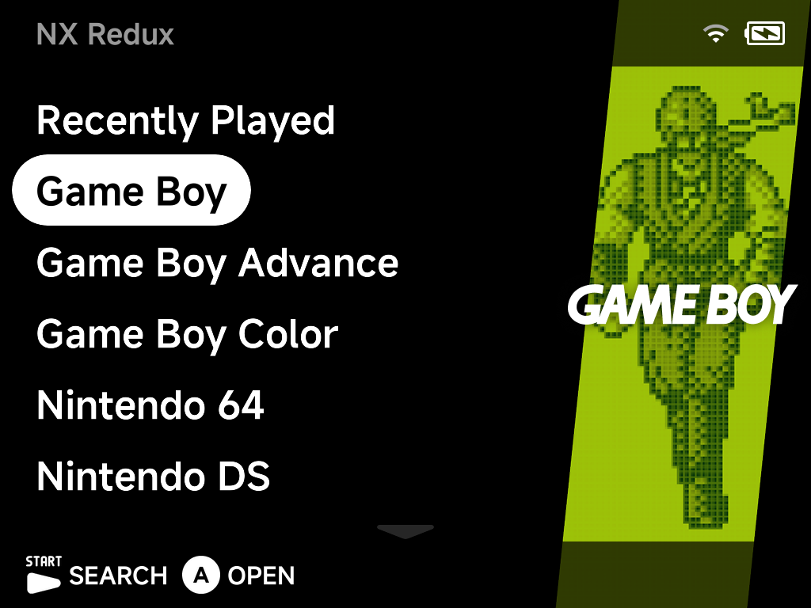
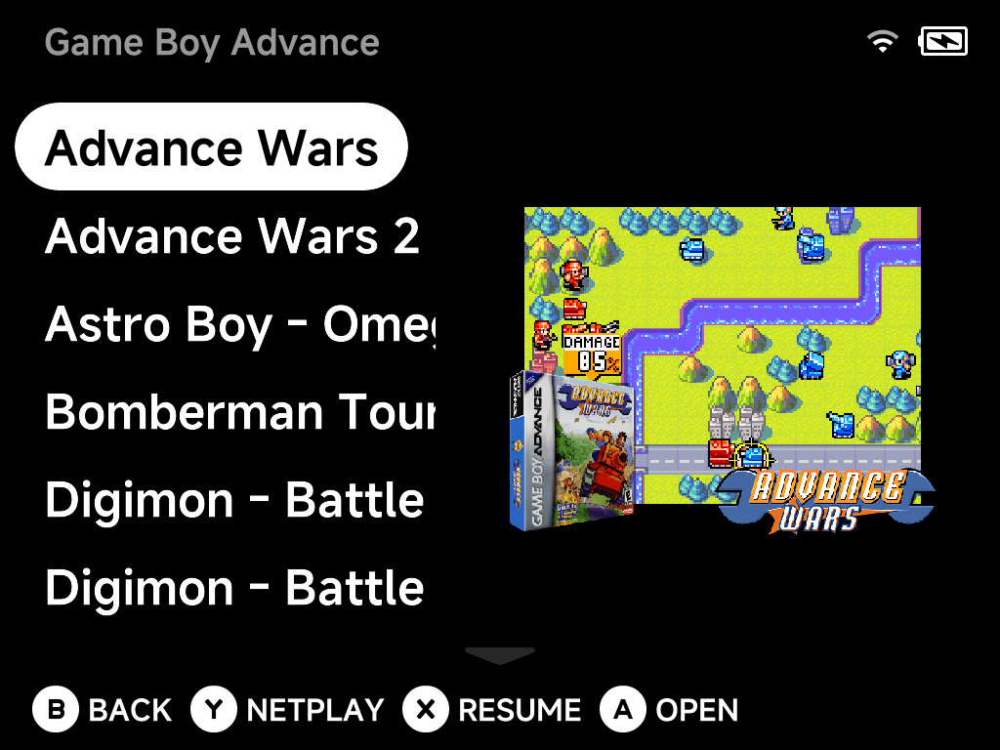
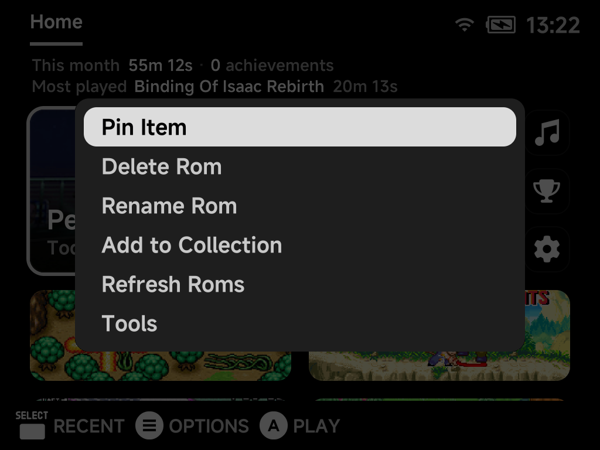

# Main Menu & Game Lists

The main menu lists your systems, with **Recently Played** at the top and
**Tools** at the bottom. The artwork panel on the right previews the selected
system or game.



## Navigating

| Button | What it does |
| --- | --- |
| `Up` / `Down` | Move through the list. The list wraps around at both ends, so `Up` from the top jumps straight to Tools at the bottom. |
| `A` | Open the selected system, folder or game |
| `B` | Go back |

Scroll indicators at the top and bottom edges show when there is more to see.

## Game lists

Opening a system shows its games, with box art and a screenshot preview for the
selected title.



The hint bar shows what is available for the selected game:

| Button | What it does |
| --- | --- |
| `A` **Open** | Launch the game |
| `X` **Resume** | Jump straight back into your auto-saved session (shown when the game has one) |
| `Y` **Netplay** | Host or join a local wireless session for [supported systems](../netplay.md) |
| `B` **Back** | Return to the main menu |
| `MENU` | Open the [game context menu](context-menu.md) |

### Duplicate names

When two games in the same list share a name, each row shows what sets it
apart. The extra text appears in a dimmer colour after the name.


Names that are unique in their list are unaffected.

??? info "More detail"
    | Case | Example | What the list shows |
    | --- | --- | --- |
    | **Same file in two emulator folders** (the list shows them together) | `Advance Wars.gba` in both `Game Boy Advance (GBA)` and `Game Boy Advance (MGBA)` | The emulator tag: `Advance Wars (GBA)` and `Advance Wars (MGBA)` |
    | **Different files in two emulator folders** | | The full filename without its extension, plus the tag, so you can tell both the version and the core apart: `Astro Boy - Omega Factor (USA) (MGBA)` |
    | **Different files in one folder** | `Tetris.gb` next to `Tetris (1).gb` | The filenames without extensions: `Tetris` and `Tetris (1)` |

    The extension is kept only when it is the sole difference, such as
    `Tetris.gb` next to `Tetris.gbc`.

## Search

Press `START` on the main menu to search your entire library.


1. Type with the on-screen keyboard: `A` select, `X` shift, `Y` delete.
2. Confirm to see matching games from every system.
3. Tap `START` again, from the keyboard or the results list, to close the
   search and return to the menu.

## Shortcuts and pinned games

- **Pin a game** to the main menu from its [context menu](context-menu.md)
  for one-press access.
- **Pin a tool** the same way: press `MENU` on a tool in the Tools list and
  choose **Pin Tool**.
- **F1**/**F2** keys (Brick and Brick Pro) can each launch a tool of your
  choice from anywhere in the menu. Assign them in
  [Settings → F1 / F2 Keys](../settings/fn-keys.md).
- Want a minimal menu with only hand-picked games? See the
  [Five-Game Menu](five-game-menu.md) guide.

## Reordering systems

The main menu lists systems alphabetically by folder name. To put your
favorites first, add a number prefix to the folder names under `Roms/`:

```
Roms/
├── 1) Game Boy Advance (GBA)
├── 2) Super Nintendo ES (SFC)
├── 3) Sony PlayStation (PS)
└── Sega Genesis (MD)          ← unnumbered folders follow, alphabetically
```

The number is **only used for sorting. It never shows in the menu**, which
still displays "Game Boy Advance", "Super Nintendo ES" and so on. Rename the
folders from a computer, or on the device with the [Files](../apps/files.md)
tool.

!!! warning "Keep the tag in parentheses"
    Leave the tag (e.g. `(GBA)`) untouched. It's what links the folder to its
    emulator. Only add the prefix at the front.

The same trick works on files and folders *inside* a system. Prefix game names
with `1) `, `2) ` to control their order in the game list.

??? info "More detail"
    - Sorting is alphabetical, so with **ten or more** numbered folders use
      zero-padding (`01)`, `02)`, … `10)`). Otherwise `10)` sorts before `2)`.
    - **Only the tag matters.** The folder name itself is free-form. The
      **uppercase tag in parentheses at the end** is the only part that links
      the folder to its emulator. `Roms/GBA Games (GBA)` or
      `Roms/1) My Handheld Picks (GBA)` work exactly like
      `Roms/Game Boy Advance (GBA)`. Rename the front part to whatever you want
      the menu to show. The tag values are listed on
      [Cores & BIOS Files](../emulators/cores.md).

## Multi-disc games

Put a multi-disc game in its own folder inside the system folder. The folder
then behaves as a **single game**:

- It shows as one entry in the game list and launches disc 1 when opened.
- It can be pinned to the main menu.
- It shares one save/resume identity across discs.

While playing, swap discs from the in-game
[pause menu](playing-games.md#the-in-game-menu), which shows the current
**Disc N**. Save states remember which disc they belong to.

??? info "More detail"
    The folder holds the disc images plus an `.m3u` file named **exactly after
    the folder**, listing one disc file per line:

    ```
    Roms/Sony PlayStation (PS)/Final Fantasy VII/
    ├── Final Fantasy VII.m3u      ← contains the three .cue names, one per line
    ├── Final Fantasy VII (Disc 1).cue / .bin
    ├── Final Fantasy VII (Disc 2).cue / .bin
    └── Final Fantasy VII (Disc 3).cue / .bin
    ```

    The same folder trick works for single-disc `.cue`/`.bin` games too. A
    folder containing a matching folder-named `.cue` shows and launches as one
    game instead of exposing the file pair.

## Custom display names (map.txt)

--8<-- "map-txt.md"

A `map.txt` at the top level (`Roms/map.txt`) does the same for the
**system folders**. It's an alternative to renaming the folders themselves.

The context menu's [**Rename Rom**](context-menu.md) writes these aliases for
you. Renaming on the device edits the `map.txt` rather than the file.

??? info "More detail"
    - The number-prefix trick above works inside aliases too.
    - Arcade folders don't need a `map.txt` for readable names. Games in an
      [Arcade (FBN)](../emulators/arcade.md#never-rename-the-zips) folder, and
      [Naomi/Atomiswave zips](../emulators/dreamcast.md#arcade-games-naomi-atomiswave)
      in the Dreamcast folder, show their full titles automatically and their
      BIOS zips are hidden. A `map.txt` alias still overrides those titles.

## Refreshing the ROMs list

Added, renamed or reorganized ROMs **while the device is running** (over USB,
ADB or a network share)? The menus won't see the changes yet. Rebuild the list:

1. Press `MENU` on the main menu.
2. Choose **Refresh Roms**.



The same action is in a game's [context menu](context-menu.md)
(**Refresh Roms**) and in
[Settings → System](../settings/system.md#refresh-emulatorroms-list)
(**Refresh emulator/roms list**).

??? info "More detail"
    The system and ROM lists are **cached** for fast boots. The cache refreshes
    itself on startup whenever files changed while the device was off.

## Collections

Build your own game collections from the game list:

1. Press `MENU` on a game.
2. Choose **Add to Collection**.
3. Add it to an existing collection, or create a new one on the spot.

Collections appear as a **Collections** entry on the main menu. Hide it via
[Appearance](../settings/appearance.md) if unused.

??? info "More detail"
    --8<-- "collections.md"

    A `Collections/map.txt` can alias the displayed names, in the same format
    as a system folder's `map.txt`.
