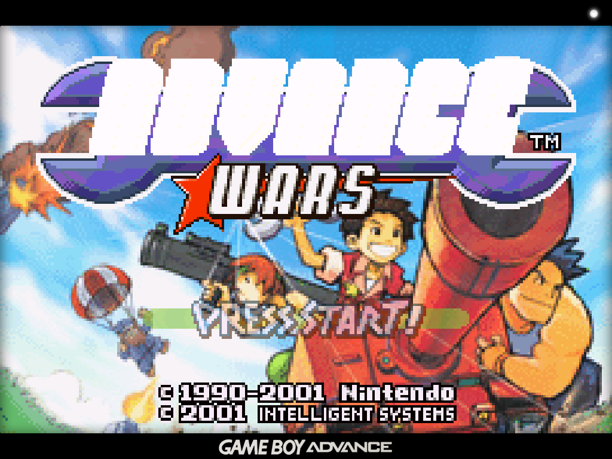
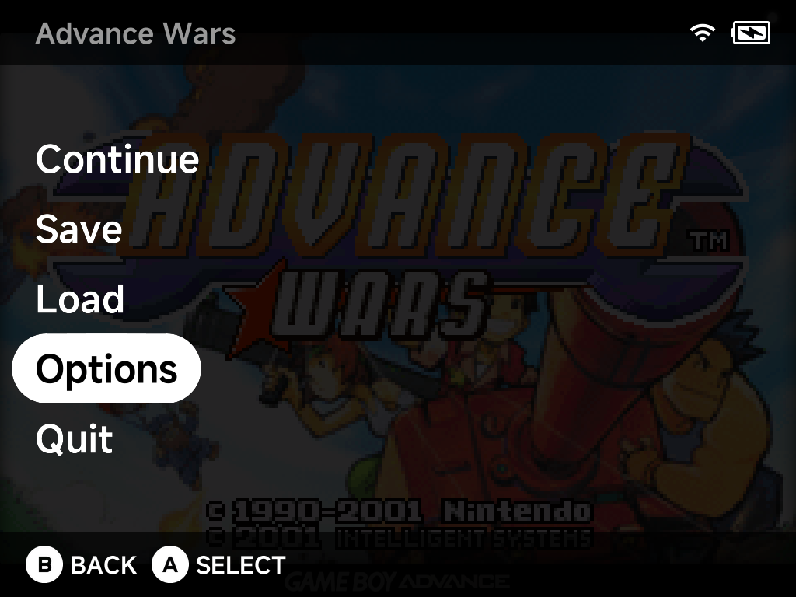

# Playing Games

Launch a game with `A` from any game list. Resume your last session with `X`,
or through the [Game Switcher](game-switcher.md).



## The in-game menu

Press `MENU` while playing to pause the game and open the in-game menu.



| Entry | What it does |
| --- | --- |
| **Continue** | Return to the game |
| **Save** / **Load** | Save states, complete with screenshots so you can see what you're loading |
| **Options** | [In-game options](in-game-options.md) for the running game (Frontend, Core Options, Shaders, Cheats, Controls, Shortcuts, Achievements and Save Changes), applied live |
| **Quit** | Exit back to the menu. Quitting auto-saves to a hidden slot, so the [Game Switcher](game-switcher.md) can always resume exactly where you left off. |

??? info "More detail"
    All emulators share the same menu, with UI styling consistent with the
    rest of the system. That covers the built-in cores (Dreamcast included)
    and the standalone Nintendo 64 and Nintendo DS emulators.

## Saves and save states

| Kind | What it is | Where it lives |
| --- | --- | --- |
| **Battery saves** | The game's own save files | `Saves/<TAG>/` on the SD card (e.g. `Saves/GBA/`) |
| **Save states** | **8 slots per game**, each with a screenshot, via the pause menu's Save/Load | Per core under `.userdata/shared/` |

Quitting a game also writes a **hidden auto-resume state**. That's what the
[Game Switcher](game-switcher.md) resumes from. It never touches your manual
slots.

!!! warning "Save states belong to one emulator"
    Save states are tied to the emulator core that made them. Unlike battery
    saves, they generally don't survive moving to a different emulator.

[Device Sync](../apps/device-sync.md) carries both: `Saves/` and the shared
state folder.

??? info "More detail"
    - By default battery saves are written as **uncompressed
      RetroArch-compatible `.srm`** files. You can move them between NX Redux
      and RetroArch on another device as-is.
    - The battery-save format is changeable in
      [Settings → System](../settings/system.md#save-format): `MinUI` `.sav`,
      RetroArch compressed/uncompressed `.srm`, or Generic.
    - Save states default to RetroArch-style naming (also
      [configurable](../settings/system.md#save-state-format)).
    - The hidden auto-resume state is a ninth, invisible slot on top of the 8.

## Cheats

Get the cheat files first with the **Cheat Database** tool. Install it from the
Xtras Store, then open it from Tools to download the cheats. See
[Cheats](../apps/cheats.md).

While playing, open the pause menu → **Options → Cheats** to toggle individual
cheats on and off.

??? info "More detail"
    Cheat files use the standard **RetroArch `.cht` format**. The
    [libretro cheat database](https://github.com/libretro/libretro-database/tree/master/cht)
    is a ready source. Name the file after the game and put it in the
    system's folder under `Cheats/`:

    ```
    Roms/Game Boy (GB)/Super Example World (USA).zip
    Cheats/GB/Super Example World (USA).cht        ← with or without the .zip
    ```

## Shaders

The pause menu's **Options → Shaders** page controls the video shader
pipeline:

| Mode | What it does |
| --- | --- |
| **Presets** | Ready-made looks shipped in the `Shaders/` folder: `crt-perfect`, `lcd-perfect`, `dmg-perfect` (original Game Boy), `real-gameboy`, `real-gba`, `scanlines`, `old-tv`, pixel-perfect variants and more |
| **Manual setup** | Up to **3 shader passes**, each picking a `.glsl` shader from `Shaders/glsl/`, with per-pass filter and scaling options |

!!! tip "Trying a preset"
    Loading a preset replaces your current shader settings. To just try one
    out, exit the game without saving settings.

Shader choices save with the emulator's config, so they can be set
system-wide or [per game](emulator-options.md).

## Overlays

Overlays are border/bezel images drawn around the game screen. Pick one
in-game under pause menu → **Options → Frontend → Overlay**.

To add your own, drop a PNG at your device's screen resolution into the
system's folder under `Overlays/` (e.g. `Overlays/GBA/My Bezel.png`). It
appears in the Overlay list by filename.

??? info "More detail"
    Releases ship a set of overlays for many systems (Native/Aspect variants,
    with optional LCD grid).

## Sleep

Press the power button to put the device to sleep. This works in all
standalone emulators and PortMaster games, not just the built-in cores.

## Audio output

All emulators support USB-C and Bluetooth audio. Plug in a USB-C DAC or
connect Bluetooth mid-game and audio reroutes automatically. A headphone icon
appears in the status bar while an external output is active. See
[Settings → Audio](../settings/audio.md) for details.

## In-game notifications

RetroAchievements unlock and progress notifications appear in-game as you
play. See [RetroAchievements](../apps/retroachievements.md). Tune their
behavior in **Settings → In-game Notifications**.
