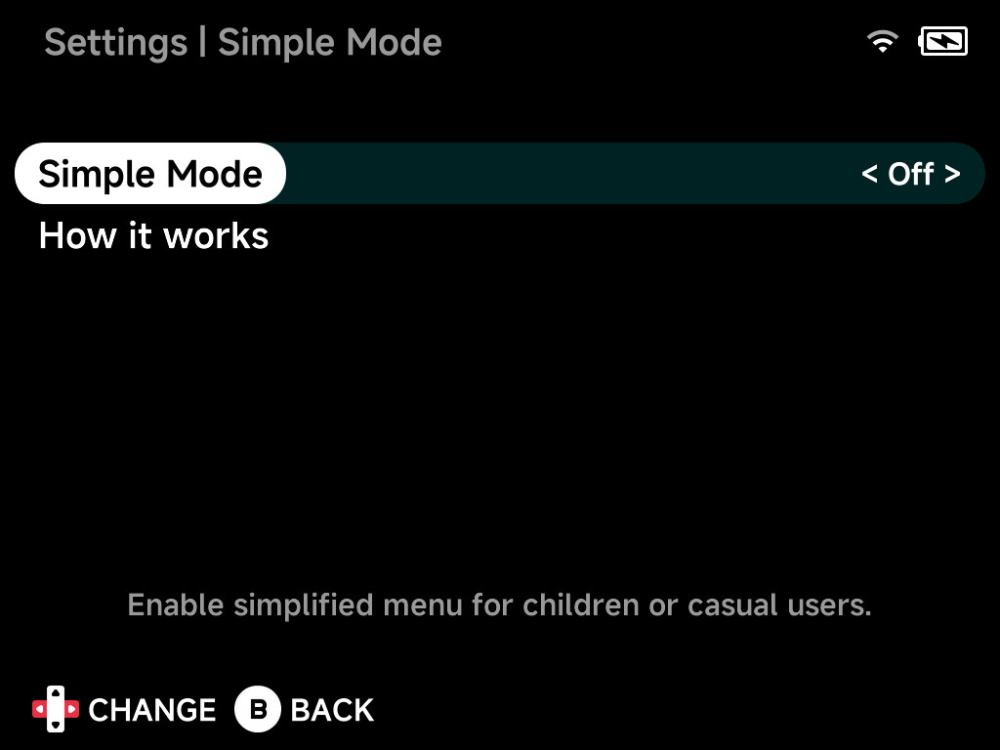

# Simple Mode

Simple Mode is a simplified menu for children or casual users, enabled in
**Settings**.

When Simple Mode is on:

- The **Tools** tab lists only **Settings**, whatever the
  [Tools tab](../settings/layouts.md#consoles-tab-collections-tab-tools-tab)
  setting says.
- **Settings** is protected by a 4-digit PIN that you set when enabling
  Simple Mode. Only you can turn it back off.
- Games and tools can't be pinned or unpinned, and collections can't be
  renamed or deleted, so a curated [Home](main-menu.md#home) stays as you set
  it up.
- In-game, **Options** is replaced with **Reset**, so there are no settings to
  wander into mid-game.

!!! question "Forgot the PIN?"
    Delete `.userdata/shared/enable-simple-mode` from the SD card (from a
    computer) to turn Simple Mode off.
