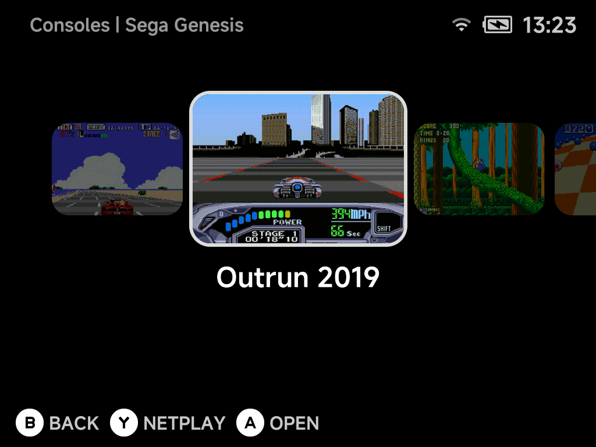
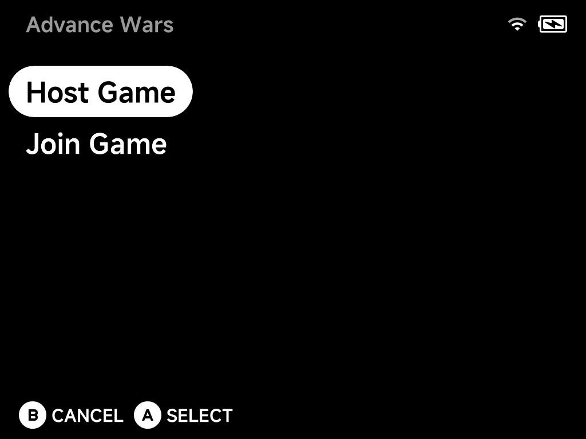
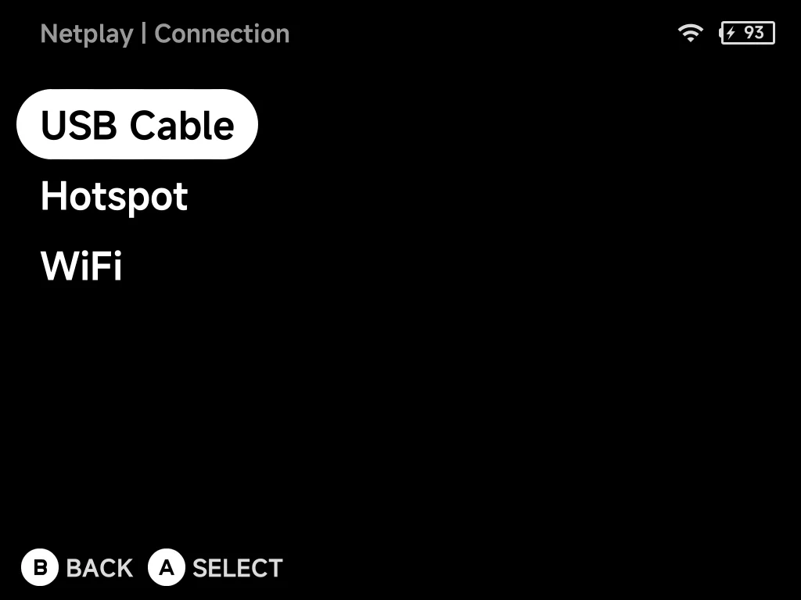
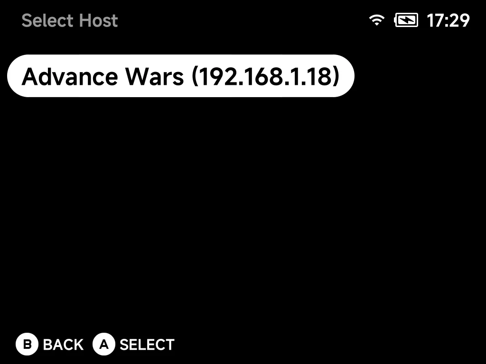
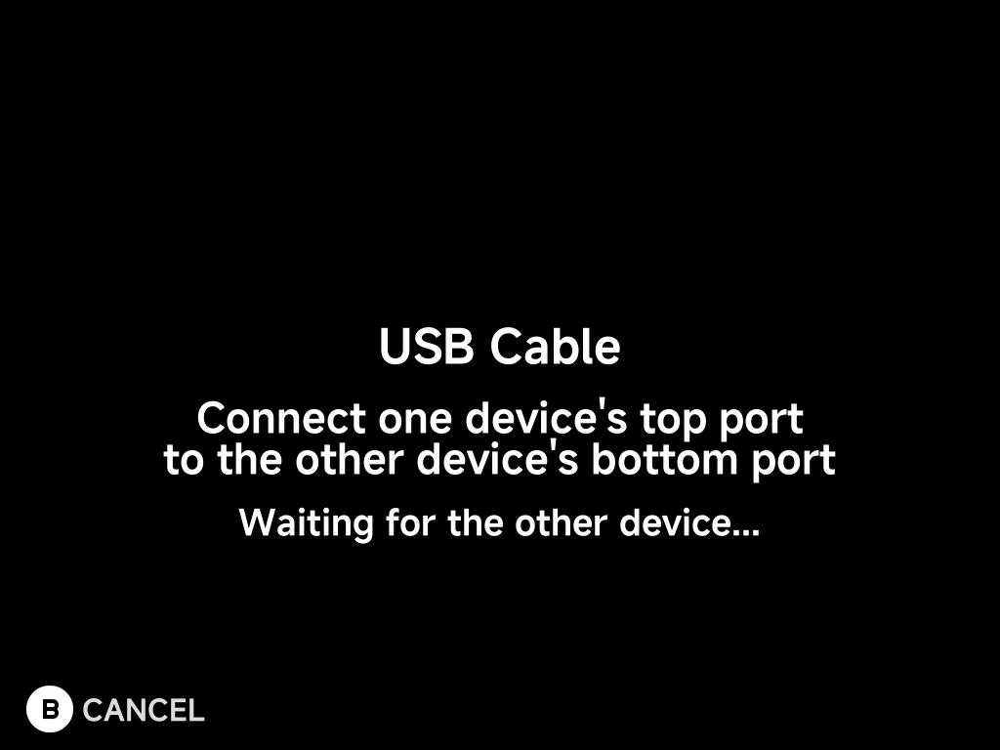

# Netplay

NX Redux includes [Netplay](https://github.com/mohammadsyuhada/nextui-netplay)
for **local multiplayer**. When a game supports it, the hint bar in
the game list shows `Y NETPLAY`:

Press `Y` to host or join over Wi-Fi, a hotspot hosted by one device, or a
[USB cable](#usb-cable) between the two devices. There
is no IP to type and no persistent toggle to remember to turn off. Save data
syncs automatically before the match starts.

## Starting a session

1. Both players pick the same game in their game list and press `Y`.
2. One player chooses **Host Game**, the other **Join Game**.

    

3. Both players choose how to connect: [**USB Cable**](#usb-cable) (a cable
   between the two devices), **Hotspot** (hosted by one device) or **WiFi**
   (the local network).

    

4. Connect, depending on what you chose:
    - **USB Cable:** nothing to pick. Both screens wait for the cable link,
      then connect on their own. See [USB Cable](#usb-cable).
    - **Hotspot:** the host shows a code; the joiner picks that code.
    - **WiFi:** the joiner picks the host from the **Select Host** list.
      Devices on the same network find each other automatically.

        

5. Save data syncs, then the match starts.

## USB Cable

No Wi-Fi nearby, or a laggy one? Connect the two devices with a USB-C to
USB-C data cable instead. A cable is much steadier than Wi-Fi.

1. Plug the cable into the **top** USB-C port of one device and the
   **bottom** USB-C port (the charging port) of the other. Either device can
   take either end.
2. Both players pick the same game, press `Y` and choose **Host Game** or
   **Join Game** as usual.
3. Both players choose **USB Cable**. The screen shows *Waiting for the other
   device…* until the cable link is up. You can plug the cable in now if you
   haven't yet. Press `B` to cancel.
4. There is no host list: the joiner connects straight to the other device.
   Save data syncs over the cable, then the match starts.

- **2 players only.** One cable connects two devices.
- **Start both devices charged.** The device with the cable in its top port
  powers the other one's USB connection. The bottom-port device does not
  charge from it during the session (charging over the cable can drop the
  link) and runs on its own battery; it charges normally again afterwards.
- **Same NX Redux version on both.** Otherwise the wizard shows *Both devices
  need the same NXRedux version.*

!!! tip "Host and Join don't depend on the cable"
    **Host Game** and **Join Game** have nothing to do with which device has
    the cable in its top port. Pick them as you like.

??? info "More detail"
    - Tested between the Brick and the Smart Pro S in both cable directions.
      The Brick Pro runs the same software as the Brick.
    - With both ends in top ports, or both in bottom ports, the devices won't
      connect — the wizard just keeps waiting. Move one end.
    - Pulling the cable out mid-game ends the session, the same as a lost
      Wi-Fi connection.
    - Over the cable the devices answer each other in about 1 ms, with no
      dropped packets. Wi-Fi through a router has occasional spikes of
      70–190 ms and some loss.

### Game Boy Advance link cable over USB

Over a USB cable, Game Boy Advance games (gpSP, `Game Boy Advance (GBA)`
folder) get a real link cable between the two devices, not just the
built-in emulation of a few games. Cable link play works as on real
hardware, for example:

- Pokémon Ruby, Sapphire and Emerald trades and battles in the Cable Club
- **Cross-game trades** such as FireRed or LeafGreen with Ruby or Sapphire
- Mario Kart: Super Circuit races and The Legend of Zelda: Four Swords

With the link mode left on **Automatic**, games that support the wireless
adapter (FireRed, LeafGreen, Emerald) keep using it, so the Union Room works
as before. For a cable trade between FireRed/LeafGreen and Ruby/Sapphire the
host sets the game's link option to **Link Cable - Real (USB only)** before
starting the session. The joiner follows the host's choice.

??? info "More detail"
    - Wi-Fi and Hotspot sessions keep the previous Game Boy Advance link
      emulation. The real cable needs the USB connection's speed.
    - The two games run in step, transfer by transfer, as two GBAs on a cable
      do. During link play the CPU runs at full speed to keep that smooth.
    - Cross-game trades between FireRed/LeafGreen and Ruby/Sapphire also need
      the game's own requirements, such as the National Pokédex in FireRed.

## Supported systems

Netplay works only on the cores below. The `Y NETPLAY` hint appears only for
games in these `Roms` folders. Systems not in the table (Nintendo DS, Virtual
Boy, Neo Geo Pocket, the Atari and Commodore machines, and so on) have no
netplay.

| System | `Roms` folder | Core | Netplay type |
| --- | --- | --- | --- |
| Game Boy | `Game Boy (GB)` | gambatte | **GB Link** — link cable games (Pokémon trades and battles, etc.) |
| Game Boy Color | `Game Boy Color (GBC)` | gambatte | **GB Link** — link cable games |
| Game Boy Advance | `Game Boy Advance (GBA)` | gpSP | **GBA Link** — wireless adapter and link cable games |
| Nintendo ES | `Nintendo ES (FC)` | FCEUmm | Lockstep |
| Famicom Disk System | `Famicom Disk System (FDS)` | FCEUmm | Lockstep |
| Super Nintendo ES | `Super Nintendo ES (SFC)` | Snes9x | Lockstep |
| Super Nintendo ES | `Super Nintendo ES (SUPA)` | Mednafen Supafaust | Lockstep |
| Sega SG-1000 | `Sega SG-1000 (SG1000)` | PicoDrive | Lockstep |
| Sega Master System | `Sega Master System (SMS)` | PicoDrive | Lockstep |
| Sega Game Gear | `Sega Game Gear (GG)` | PicoDrive | Lockstep |
| Sega Genesis | `Sega Genesis (MD)` | PicoDrive | Lockstep |
| Sega CD | `Sega CD (SEGACD)` | PicoDrive | Lockstep |
| Sega 32X | `Sega 32X (32X)` | PicoDrive | Lockstep |
| Sega (Genesis Plus GX) | `Sega … (GPGX)` folders | Genesis Plus GX | Lockstep |
| Sony PlayStation | `Sony PlayStation (PS)` | PCSX-ReARMed | Lockstep |
| Sony PlayStation | `Sony PlayStation (PSX)` | SwanStation | Lockstep |
| Arcade | `Arcade (FBN)` | FBNeo | Lockstep |
| Nintendo 64 | `Nintendo 64 (N64)` | Mupen64Plus (standalone) | Up to 4 players, device-dependent ([details](emulators/nintendo-64.md#netplay)) |
| Sega Dreamcast | `DreamCast (DC)` | Flycast | GGPO rollback, 2 players ([details](emulators/dreamcast.md#netplay)) |

Both players must use the same system folder (and so the same core) for the
same game.

| Netplay type | What it means |
| --- | --- |
| **Lockstep** | Both devices run the same game and swap controller input every frame. Suits games with a built-in multiplayer mode. |
| **GGPO** (Dreamcast) | Rollback netplay. Stays responsive over Wi-Fi. |
| **GB Link** / **GBA Link** | Emulates the link cable (and, for GBA, the wireless adapter). Trading and versus battles in single-player cartridges work between two devices. |

!!! warning "Game Boy Advance: use the `GBA` folder, not `MGBA`"
    Only **gpSP** in `Game Boy Advance (GBA)` supports netplay. A GBA game in
    `Game Boy Advance (MGBA)` (the **mGBA** core) shows no `Y NETPLAY` hint and
    cannot host or join. Move it to `Game Boy Advance (GBA)` to play over link.

    The same applies to `Super Game Boy (SGB)`, which also runs on mGBA. Put
    Game Boy games in `Game Boy (GB)` / `Game Boy Color (GBC)` for link play.

??? info "More detail"
    - **Lockstep** is classic frame-synchronised netplay.
    - **GGPO** keeps things responsive because each device runs ahead on its
      own input and quietly corrects when the other player's input arrives.
    - NX Redux ships two Game Boy Advance cores in two `Roms` folders: **gpSP**
      in `Game Boy Advance (GBA)` and **mGBA** in `Game Boy Advance (MGBA)`.

## Different versions of one game

You can join a host running a sister version of your game, such as Pokémon
FireRed and LeafGreen. The joiner is asked first:

> The host is running *Pokemon - LeafGreen* 
> You are running *Pokemon - FireRed* 
> Join anyway?

<!-- SCREENSHOT: handheld-netplay-join-anyway — the "Join anyway?" prompt when the host runs a sister version (Brick) -->

Press `A` to join or `B` to go back to the host list. On a **Hotspot** join
the same question appears while connecting.

!!! warning "Only confirm when you know the two games link"
    The wizard cannot tell a sister version from a genuinely different game. A
    real mismatch fails inside the game, not in the wizard.

??? info "More detail"
    - The join step checks that both devices run the same game by comparing
      the ROM **file names**. It ignores case, punctuation and anything in
      brackets, so `Pokemon - FireRed (USA).gba` pairs with
      `pokemon_firered.gba` without any renaming.
    - Two *versions* of a game have different names: Pokémon FireRed and
      LeafGreen, Ruby and Sapphire, Gold and Silver. Those link fine on real
      hardware, so picking such a host is allowed.
    - Both devices must run an NX Redux build that includes this prompt. An
      older host still answers *"The host is running a different game."* and
      the join is refused.

## Saves

A netplay session never overwrites your own save file.

| Netplay type | Whose save is used |
| --- | --- |
| **Lockstep** cores and **Sega Dreamcast** | The host brings the save. Both devices start from the host's progress. |
| **GB Link** and **GBA Link** | Nothing is copied. Each device keeps and plays on its own save. |

!!! tip "Give each device its own save"
    Two Pokémon games with identical saves share a Trainer ID and refuse to
    trade.

??? info "More detail"
    - **Lockstep and Dreamcast:** at the start the host's save is copied to the
      joiner. The host plays on its real save as usual. The joiner plays on
      that copy in a scratch area, and its own save in `Saves/` is left exactly
      as it was.
    - The copy matters because some of these cores (the Sega and PlayStation
      ones) keep battery saves outside the shared game state. Without it the
      two devices could drift out of sync.
    - On Dreamcast the host's save includes the memory card and console
      settings, and both devices agree on a BIOS. See
      [Dreamcast → Netplay](emulators/dreamcast.md#netplay).
    - **GB Link and GBA Link:** link-cable play needs each device to keep its
      own save.

## During a session

Save states, fast-forward, rewind and reset are turned off during a session to
protect the connection.

Pressing `MENU` doesn't open the full in-game menu. It asks **Leave netplay?**:

<!-- SCREENSHOT: handheld-netplay-leave — the "Leave netplay?" prompt with Continue and Leave (Brick) -->

| Button | What it does |
| --- | --- |
| `B` or `MENU` **Continue** | Goes back to the game |
| `A` **Leave** | Ends the session and returns you to the game list |

- On most systems both players pause while the question is open, with no time
  limit.
- After one player leaves a Lockstep game, the other can keep playing on their
  own.
- On **Game Boy Advance link** (GBA Link, wireless adapter or cable) the other
  player's game freezes on its last frame while the question is open, so the
  link survives the pause. The question counts down and you leave
  automatically after 20 seconds.
- On **Dreamcast** the other player's game waits for you. The question counts
  down and you leave automatically after 20 seconds. The other player sees
  **Netplay ended** right away.
