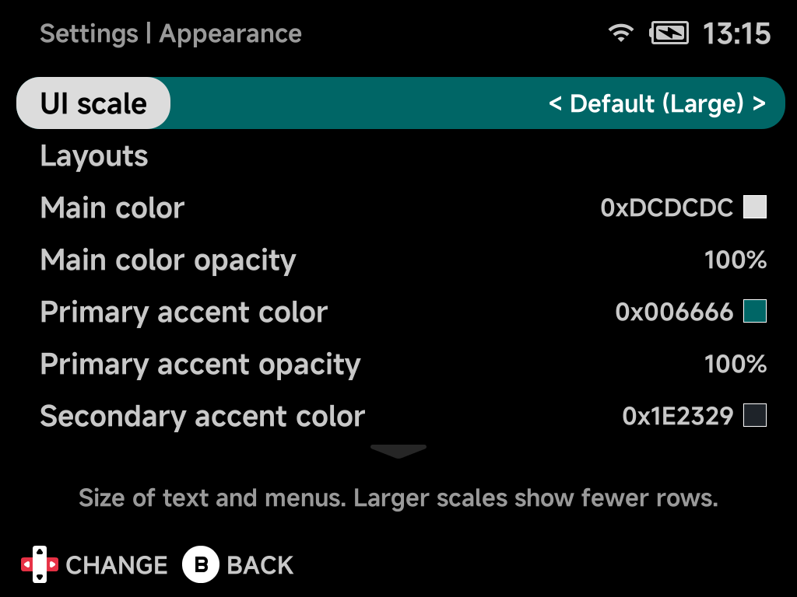
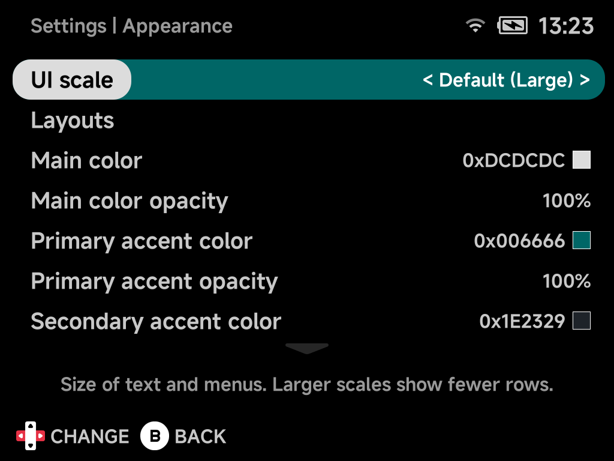
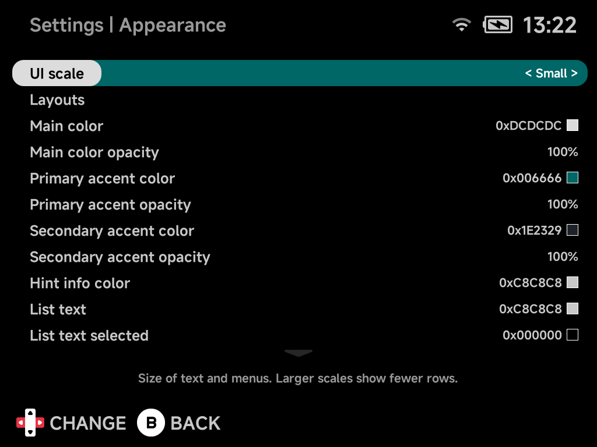

# Appearance

Change how the interface looks: UI scale, menu layouts, colors (with live
swatches) and animations.

## UI scale

Size of text and menus across the whole UI.

| Choice | What it does |
| --- | --- |
| **Default** | Follows the device and shows which scale that is: **Default (Large)** on the Brick, **Default (Small)** on the Brick Pro and Smart Pro S. |
| **Small** | Smaller, shows more rows. |
| **Large** | Larger, shows fewer rows. |

- Settings redraws at the new scale straight away.
- The main menu, the other tools and the in-game menus pick it up the next
  time they start. For the main menu, that is as soon as you leave Settings.
- The main menu's tab row, page titles and hint bar keep their size at every
  scale.
- The Nintendo 64 in-game menu uses the same scale.

*Default (Large) on the Brick*

*Small on the Brick*

## Layouts

Opens the [Layouts](layouts.md) page: the style of each main menu tab and of
the game lists, and which tabs show.

## Main color

The color used to render main UI elements.

## Main color opacity

Opacity of the main color, `10%`–`100%` in 10% steps. Below `100%`, the pills
and selection capsules turn translucent and show the wallpaper through them.
The wallpaper is `bg.png` at the SD card root.

## Primary accent color

The color used to highlight important things in the UI.

## Primary accent opacity

Opacity of the primary accent color, `10%`–`100%`. Below `100%` accented
elements become translucent and show the wallpaper through them.

## Secondary accent color

A secondary highlight color.

## Secondary accent opacity

Opacity of the secondary accent color, `10%`–`100%`. Below `100%` accented
elements become translucent and show the wallpaper through them.

## Hint info color

Color for button hints and info text.

## List text

List text color.

## List text selected

Color of the selected list entry's text.

## Show battery percentage

Show the battery level as a percentage in the status pill.

## Show search hint

Show or hide the `START` search button hint on the main menu tabs. Hiding it
only removes the hint: pressing `START` on a tab still opens search.

## Show menu animations

Enable or disable menu animations.

## Show menu transitions

Enable or disable the animated slide transitions between screens.

## Bootlogo

Change the device boot logo.

1. Scroll through the images with left/right.
2. Press `A` to apply one. The device reboots to show it.

The NX Redux mark is the default logo. The previous NextUI logo is still in
the list.

## Reset to defaults

Resets all options on this page, and on the Layouts page, to their default
values.

??? info "Options that moved or were removed"
    The main menu redesign replaced several older options:

    | Old option | Now |
    | --- | --- |
    | **Show Emulators**, **Show Collections**, **Show Tools** | **Consoles tab**, **Collections tab**, **Tools tab** in [Layouts](layouts.md) |
    | **Show Recents** | Removed. Your last game is Home's Continue card, and the [Game Switcher](../guide/game-switcher.md) lists the rest. |
    | **Game art visible / style / type / width / corner radius**, **Use folder background for ROMs** | Removed. Each [layout](../guide/layouts.md) places the art itself. |
    | **Show folder names at root** | Removed. Names always show. |
