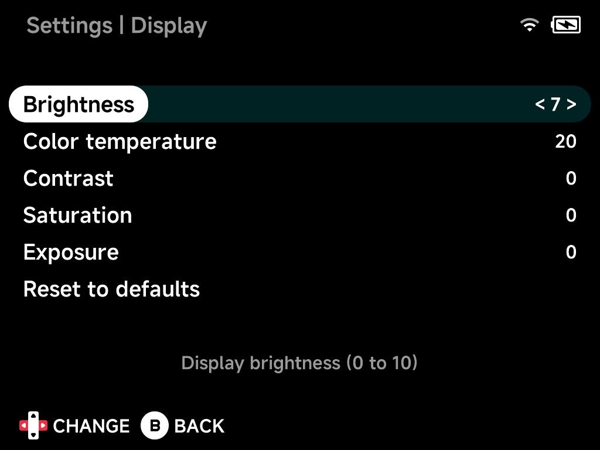

# Display

Panel tuning. Options marked *hardware-dependent* only appear on devices
whose panel supports them.

| Setting | What it does | Range |
| --- | --- | --- |
| **Brightness** | Display brightness. | `0` to `10` |
| **Color temperature** | Color temperature; lower is warmer. *(Hardware-dependent.)* | `0` to `40` |
| **Contrast** | Contrast enhancement. *(Hardware-dependent.)* | `-4` to `5` |
| **Saturation** | Saturation enhancement. *(Hardware-dependent.)* | `-5` to `5` |
| **Exposure** | Exposure enhancement. *(Hardware-dependent.)* | `-4` to `5` |
| **Reset to defaults** | Resets all options on this page to their default values. | |
