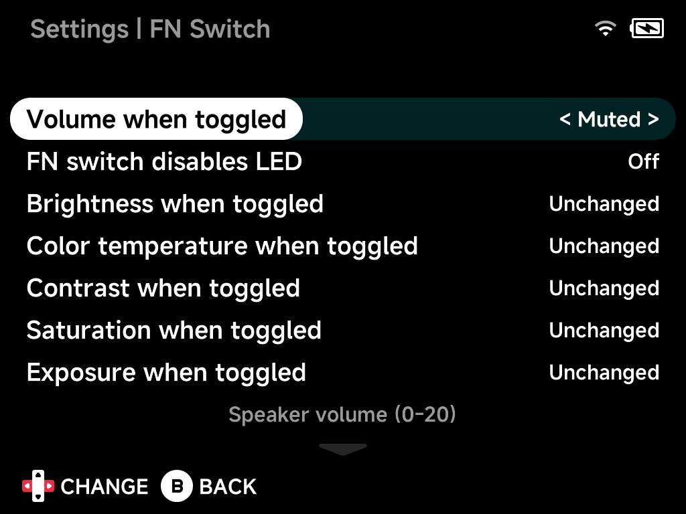

# FN Switch

Choose what flipping the **FN switch** does. The switch applies the changes you
pick here all at once, and reverts them when you flip it back. Display options
can be left `Unchanged`.

Treat it as a quick-toggle profile for whatever you switch between most: a
quiet, dim setup for late-night play, turbo fire and a joystick-style D-pad for
one particular game, or just LEDs off.

## FN mode and the OSD Mute toggle

The FN switch and the OSD **Mute** toggle are separate things.

- **OSD Mute** is a speaker mute only. It silences the audio output, changes
  nothing else, and doesn't depend on the FN switch. Press either volume key to unmute; that press also
  steps the volume.
- **Volume when FN is on** (below) is part of the FN profile, not the OSD mute.

!!! tip "D-pad stopped moving the menu cursor?"
    Check **Dpad mode when FN is on**. `Joystick` makes the D-pad act only as
    an analog stick while the switch is on, so it no longer moves the menu
    cursor. Flip the switch back, or set that
    option to `Dpad` or `Both`.

## Volume when FN is on

Speaker volume while toggled, `0`–`20` (`Muted` for silence).

## FN switch disables LED

Also turn the LEDs off while toggled.

## Brightness when FN is on

Display brightness while toggled, `0`–`10`, or `Unchanged`.

## Color temperature when FN is on

Color temperature while toggled, `0`–`40`, or `Unchanged`.
*(Hardware-dependent.)*

## Contrast when FN is on

Contrast enhancement while toggled, `-4`–`5`, or `Unchanged`.
*(Hardware-dependent.)*

## Saturation when FN is on

Saturation enhancement while toggled, `-5`–`5`, or `Unchanged`.
*(Hardware-dependent.)*

## Exposure when FN is on

Exposure enhancement while toggled, `-4`–`5`, or `Unchanged`.
*(Hardware-dependent.)*

## Turbo fire A / B / X / Y / L1 / L2 / R1 / R2

Eight separate toggles. While the FN switch is on, the enabled buttons
auto-repeat (turbo fire) in games.

## Dpad mode when FN is on

On devices without analog sticks: `Dpad` (default), `Joystick` (the D-pad
acts exclusively as an analog stick), or `Both` (D-pad sends both inputs at
once). Useful for games that expect a stick.

## Reset to defaults

Resets all options on this page to their default values.
