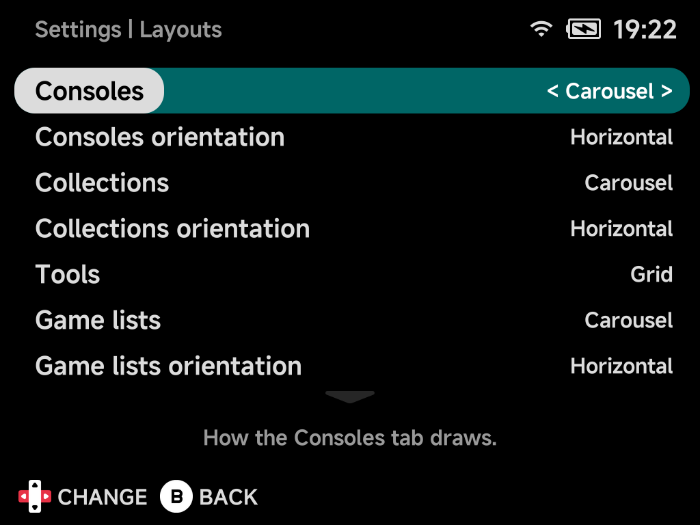
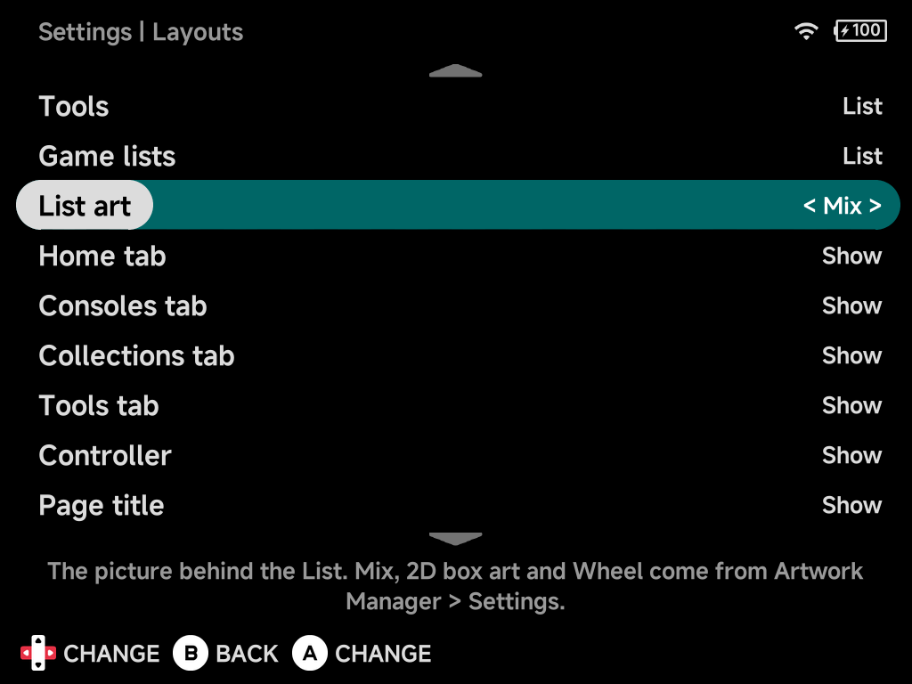
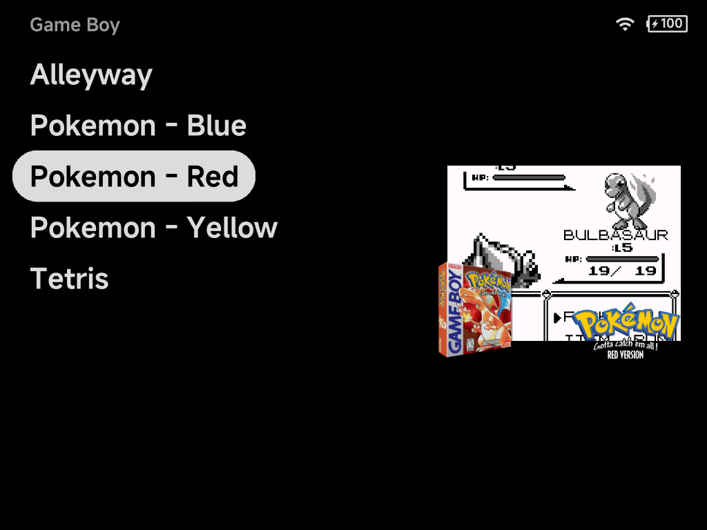
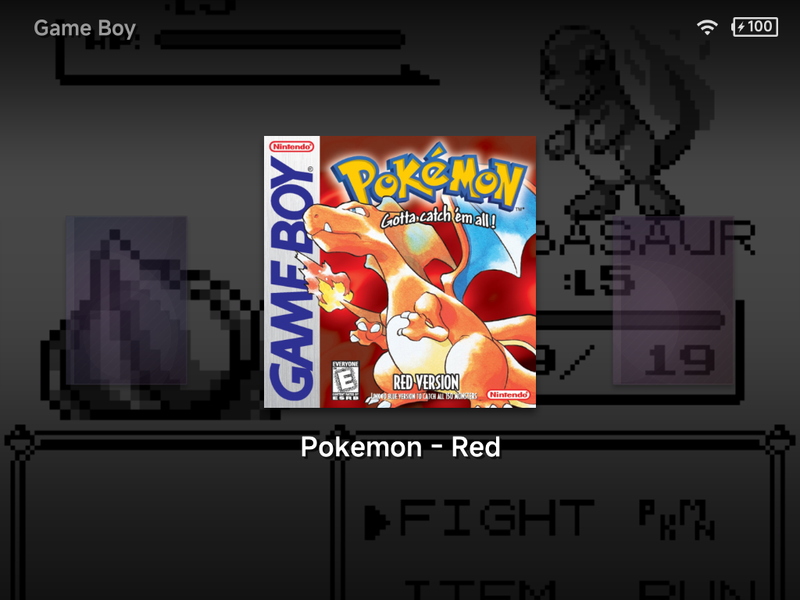
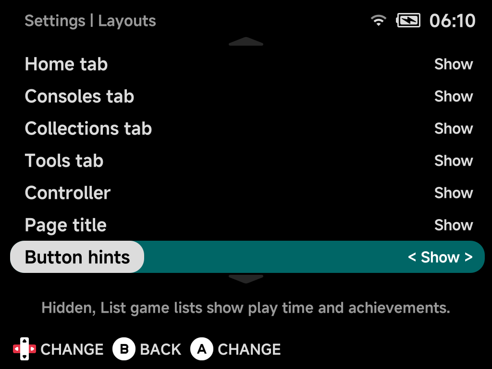

# Layouts

**Settings → Layouts** picks how each main menu tab and the game lists are
drawn, which tabs show, and how much chrome sits around them. Changes apply as
soon as you leave Settings, with no restart. See
[Menu Layouts](../guide/layouts.md) for pictures of every style.

The rows are grouped by what they change: Home first, then each tab, then the
game lists, then the options that apply to the whole menu. A tab's layout rows
show only while that tab is shown.

## Home tab

`Show` (default) or `Hide` the [Home](../guide/main-menu.md#home) tab. Home
still shows when every other tab is hidden.

## Home layout

How Home draws:

- `List`: one list with the Continue game first, then your pinned games, then
  your pinned tools.
- `Grid` (default): the Continue card beside your pinned tools, your pinned
  games in rows below.
- `Carousel`: one row that starts on the Continue card, your pinned games
  after it, and your pinned tools in a row of small squares underneath.

See [Home](../guide/main-menu.md#home) for both.

## Consoles, Collections and Tools

Each tab has the same rows, in this order.

### Tab

`Show` (default) or `Hide` the tab. Hide all of them for a Home-only menu, as
in the [Five-Game Menu](../guide/five-game-menu.md). With a single tab left,
the tab row is replaced by an **NX Redux** title.

!!! note "Hidden tabs stay reachable"
    Pressing `MENU` on a tab offers each hidden tab (**Consoles**,
    **Collections**, **Tools**), so Settings is never locked away. The list
    opens over the current tab in the hidden tab's own layout, and `B` returns.

### Layout

How the tab draws: `List`, `Grid` or `Carousel`.

| Tab | Default |
| --- | --- |
| Consoles | `Carousel` |
| Collections | `Carousel` |
| Tools | `Grid` |

### Orientation

Whether the tab's carousel runs across (`Horizontal`, the default) or down
(`Vertical`) the screen. Shows only while the tab's layout is `Carousel`.

### Consoles controller

Consoles only. `Show` (default) or `Hide` each console's controller behind it
on the Consoles tab.

Hide it to show your own picture behind each console in the List style
instead: see [Your own console backgrounds](../guide/layouts.md#your-own-console-backgrounds).

## Game lists

### Game lists layout

How a console's or collection's games draw: `List`, `Grid`, `Carousel` or
`Backdrop`. Default `Carousel`.

### Game lists orientation

Whether the carousel or backdrop runs across (`Horizontal`, the default) or
down (`Vertical`) the screen. Shows only while game lists are `Carousel` or
`Backdrop`.

### Game lists alignment

Which side a vertical game list's stack sits on: `Left` (default) or `Right`.
The game's details take the other side. Shows only while game lists are drawn
vertically.

### List art

The picture beside a game list in the List style. Shows only while game lists
are `List`.

- `Screenshot` (default): the game's screenshot fills the background.
- `Mix`, `3D box art`, `2D box art` or `Wheel`: the whole picture in a box on
  the right, and the game names stop short of it.

A game without that picture falls back to the screenshot. `Mix` also takes an
old Mix from an older release. Mix, 2D box art and Wheel are only on the card
once you turn them on in
[Artwork Manager → Settings](../apps/artwork-manager.md#settings-extra-art).

*List art set to Mix*

### Backdrop art

The pictures in a game list's Backdrop row: `3D box art` (default),
`2D box art` or `Wheel`. The background stays the screenshot. Shows only while
game lists are `Backdrop`.

A game without that picture shows its 3D box art, else a placeholder box. 2D
box art and Wheel come from
[Artwork Manager → Settings](../apps/artwork-manager.md#settings-extra-art).

*Backdrop art set to 2D box art*

## Extra info

`Show` (default) or `Hide` the extra game details in the menus:

- Home's monthly stats (**This month**, **Most played**);
- the play time, last played, achievement progress and next achievement
  under a game's name, on Home and in every game list layout.

Names always show. The [Game Switcher](../guide/game-switcher.md) keeps its
own details either way.

## Page title

`Show` (default) or `Hide` the tab row on the main menu and the title above a
game list. Hidden, `L1` / `R1` still switch tabs, and in the List style the
up arrow moves to the top of the list. Carousels run up into the freed row.

## Button hints

`Show` (default) or `Hide` the button hint bar along the bottom of the menu,
volume and brightness changes included. Hidden:

- the rows keep their place, so nothing jumps;
- a game list in the List style shows the selected game's play time,
  achievements and next achievement in the bar's row instead (unless
  [Extra info](#extra-info) is hidden);
- carousels run down into the freed row.

## Reset to defaults

Resets every option on this page to its default.
