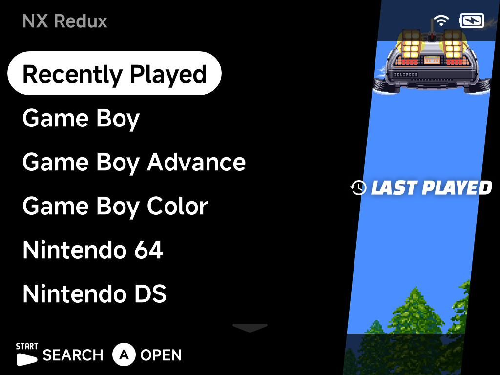

# NX Redux

Custom firmware for TrimUI retro handheld gaming devices. It keeps the minimal,
distraction-free interface — pick up, pick a game, play — while deliberately
extending what sits underneath: standalone emulators, netplay, achievements,
media tools and more. Those extras stay out of the way until you ask for them,
tucked into the Tools and pause menus.

NX Redux is a fork of [NextUI](https://github.com/LoveRetro/NextUI) by
LoveRetro, which itself descends from
[MinUI](https://github.com/shauninman/MinUI).

[:material-youtube: Watch the feature demonstration on YouTube](https://www.youtube.com/watch?v=l4iJBRgUe4U){ .md-button }
[:material-download: Get NX Redux](https://github.com/mohammadsyuhada/nx-redux/releases){ .md-button .md-button--primary }

## Highlights

- **Redesigned UI** with consistent styling across the whole system, slide
  transition animations, and a game-list context menu.
- **Game Switcher** that always resumes exactly where you left off — quitting a
  game auto-saves to a hidden save slot.
- **On-Screen Display (OSD)** for volume, brightness, Wi-Fi, Bluetooth,
  screenshots and screen recording — available anywhere, even in-game.
- **Netplay** for local wireless multiplayer, including Game Boy / GBA link
  cable games, Nintendo 64 (up to 4 players) and Dreamcast (GGPO).
- **RetroAchievements** with full offline support — earn achievements offline
  and sync them later.
- **Built-in Music Player and Media Player** with high-quality audio routing to
  speaker, Bluetooth or USB-C DACs.
- **Bundled standalone emulators**: Nintendo 64 (Mupen64Plus), Nintendo DS
  (Drastic) and Sega Dreamcast (Flycast), plus PortMaster via the Xtras store.

## Supported devices

| Device | Required stock firmware |
| --- | --- |
| TrimUI Brick | `1.1.1` |
| TrimUI Brick Hammer | `1.1.1` |
| TrimUI Brick Pro | `1.1.1` |
| TrimUI Smart Pro S | `1.0.1` |
| TrimUI Smart Pro | `1.1.1` (should work in theory, but unconfirmed — no test device) |

!!! warning "SD cards are built per device model"
    Each release is packaged for a specific device — resolution, OSD assets and
    other layout differ between models — so a card set up for one device (e.g.
    the Brick) must **not** be moved into another (e.g. the Smart Pro S). To
    carry saves, save states, settings and (optionally) ROMs across devices, use
    the built-in **Device Sync** tool instead of swapping cards.

Ready to install? Head to [Getting Started](getting-started.md).
