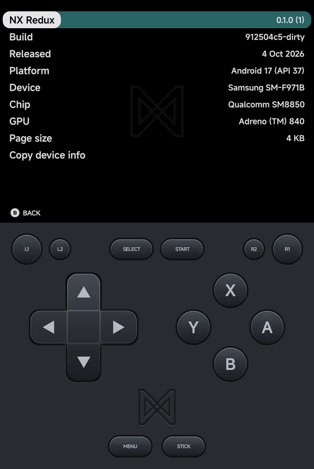

# About

**Tools → Settings → About** shows the app's version and your device's
details. The rows are read-only.

| Row | What it shows |
| --- | --- |
| **NX Redux** | The app's version, with its build number in brackets |
| **Build** | The commit the app was built from |
| **Released** | The date of that commit |
| **Platform** | The Android version and its API level |
| **Device** | The phone's maker and model |
| **Chip** | The phone's processor |
| **GPU** | The graphics chip. It reads **…** for a moment while the app asks for it |
| **Page size** | The memory page size, e.g. 4 KB |

A row the app can't read shows **Unknown**.

## Copy device info

Select **Copy device info** and press `A` **Copy** to put all the rows on the
clipboard as text. The app shows "Device info copied". Paste it into a bug
report so the details are exact.
