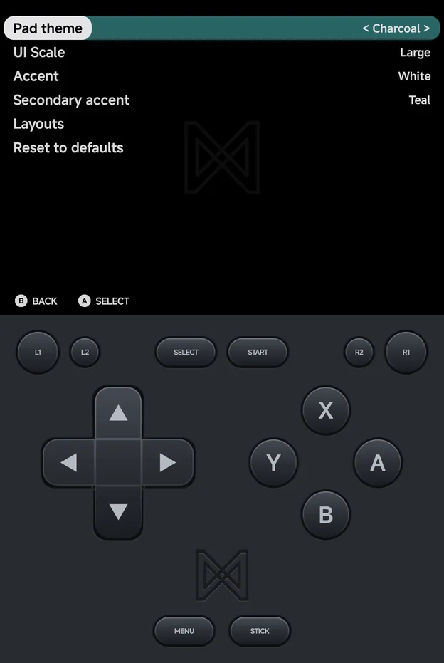
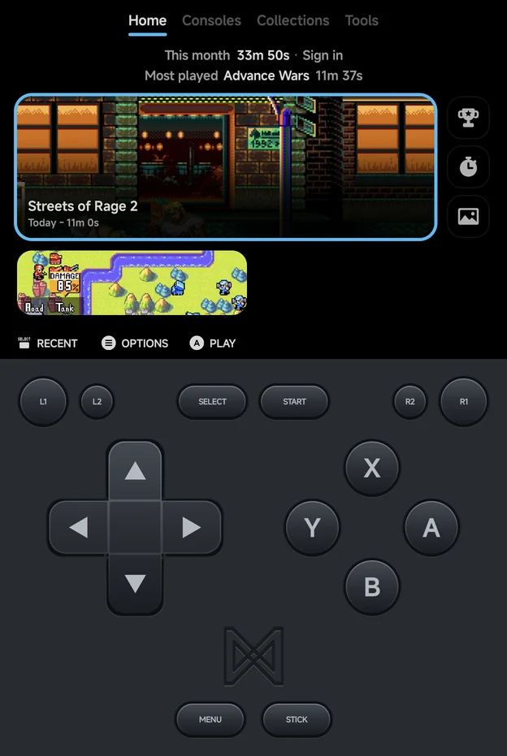

# Appearance

**Tools → Settings → Appearance** sets the look of the app: the on-screen
pad, the text size, the colours and the menu layouts. `Left`, `Right` and
`A` step the highlighted row to its next value.

| Setting | Values | Default |
| --- | --- | --- |
| [**Pad theme**](#pad-theme) | Charcoal, Retro | Charcoal |
| [**UI Scale**](#ui-scale) | Large, Small | Large |
| [**Accent**](#accent) | White, Red, Orange, Amber, Lime, Teal, Sky, Violet, Pink | White |
| [**Secondary accent**](#secondary-accent) | Auto, then the same nine colours | Teal |
| [**Layouts**](#layouts) | Opens the Layouts page | |
| [**Reset to defaults**](#reset-to-defaults) | | |

## Pad theme

The colours of the on-screen pad in portrait, in the menus and in games.

- **Charcoal** (default): the dark pad.
- **Retro**: a light grey body with magenta face buttons.

The landscape button clusters always stay Charcoal. Their opacity is set per
game or console with **Pad Opacity (landscape)** in the in-game
[Frontend](in-game-menu.md#frontend) options, not here. See
[Controls](controls.md) for the pad itself.

## UI Scale

The size of the text across the app.

- **Large** (default): bigger text, fewer rows per screen.
- **Small**: smaller text, more rows per screen.

The page titles and the hint bar keep their size at both scales. On Home,
the text also follows Android's own font size setting.

## Accent

The selection colour. The highlight on the selected row, tile or card, and
the line under the current tab, draw in it. It also colours Home's
**Pick a game** picture and the in-game menu.

There are nine colours: **White**, **Red**, **Orange**, **Amber**, **Lime**,
**Teal**, **Sky**, **Violet** and **Pink**. White is the default.

*Home with the Sky accent*

## Secondary accent

The colour of the bar behind a selected setting's value, as in
**< Charcoal >** above. It shows on the Settings pages, a game's
[Game Settings](emulator-settings.md) and the
[in-game menu](in-game-menu.md).

- **Teal** is the default.
- **Auto** uses a darker shade of the Accent. With the White accent, Auto
  gives Teal.
- The nine Accent colours can be picked here too.

## Layouts

Opens the [Layouts](layouts.md) page: the style of each main menu tab and of
the game lists.

## Reset to defaults

Puts every option on this page back to its default, and resets the
[Layouts](layouts.md) page too. It does not ask first.
