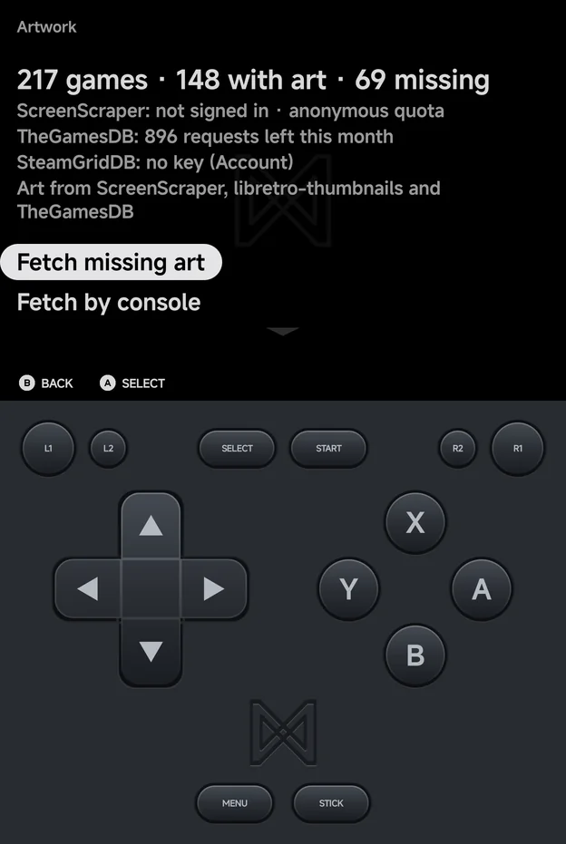
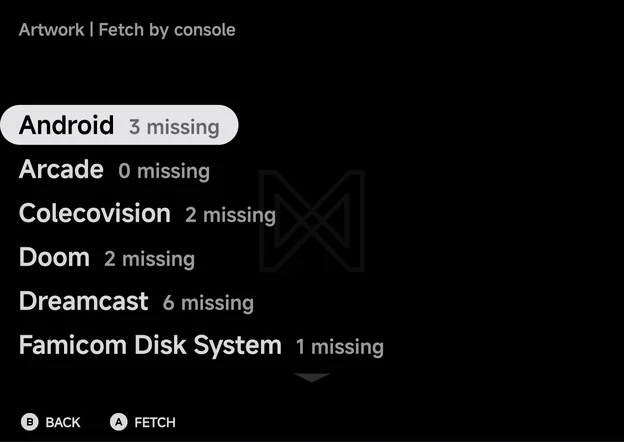
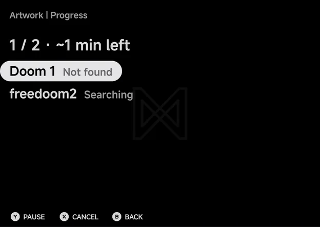
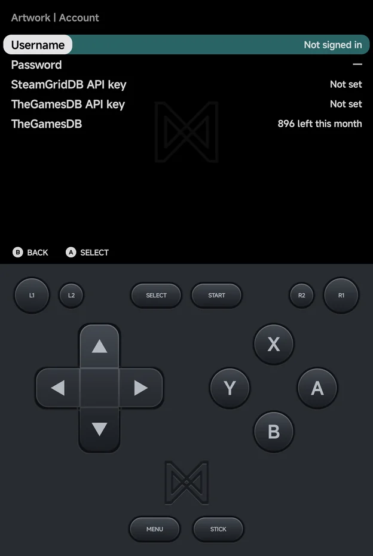
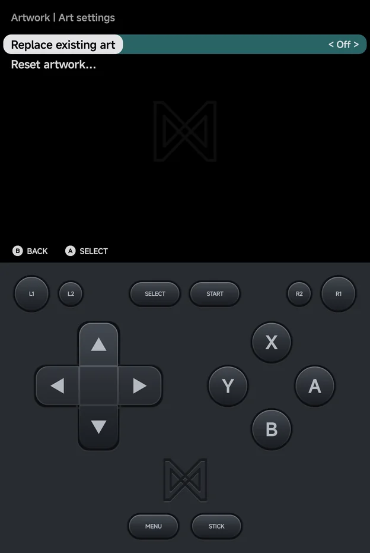

# Artwork

**Tools → Artwork** fetches box art and screenshots for your games. It works
through your whole library in the background, and you can keep playing while
it runs.



The page opens with your counts, such as **217 games · 148 with art · 69
missing**, then one line per art source and a credit line naming the sources
in use. Below them are its rows:

| Row | What it does |
| --- | --- |
| **Resume art fetch (d/t)** | Carries on a paused fetch. Only shown while one is paused. |
| **Fetch missing art** | Fetches art for every game that has none. Reads **Fetch all art** when **Replace existing art** is on. |
| **Fetch by console** | Fetches art for one console. |
| **Progress** | Shows the current or last fetch. Only shown once a fetch has run. |
| **Account** | Your ScreenScraper sign-in and the SteamGridDB and TheGamesDB keys. |
| **Art settings** | **Replace existing art** and **Reset artwork…**. |

Unassigned games, and folders whose tag no art source knows, are left out of
the counts and are never fetched.

## Where the art comes from

The app asks up to four sources, in this order, and stops as soon as a game
has what it needs:

| Art | Sources, in order |
| --- | --- |
| **Box art** | ScreenScraper 3D box, ScreenScraper 2D cover, libretro-thumbnails, TheGamesDB, then a SteamGridDB grid |
| **Screenshot** | ScreenScraper, libretro-thumbnails, then TheGamesDB |

- A game is only asked for what it lacks. A game with box art and a
  screenshot is skipped, unless **Replace existing art** is on.
- When no source has a screenshot, SteamGridDB stands in: a wide **hero**
  image for landscape backgrounds, and a tall **grid** image for portrait
  ones.
- libretro-thumbnails needs nothing from you. SteamGridDB needs your own
  API key, and ScreenScraper and TheGamesDB go further with your own account
  or key. See [Account](#account).
- When a source runs out of requests or stops answering, the fetch carries
  on with the others. The Artwork page shows a note for the source that
  stopped.

## Fetching art

### The whole library or one console

Choose **Fetch missing art** for everything, or **Fetch by console** to pick
one. Fetch by console lists each console with how many of its games lack
art, such as **Dreamcast 6 missing**. Press `A` **Fetch** on one.



If there is nothing to fetch, the app says **Every game has art**, or
**Every *console* game has art** for one console.

### Progress

Starting a fetch opens **Progress**. Its first line shows how far it is and
the time left, such as **1 / 2 · ~1 min left**. Each game shows its status:

| Status | Meaning |
| --- | --- |
| **Waiting** | Queued |
| **Searching** / **Downloading** | Being fetched now |
| **Done** | Box art and a screenshot were found, followed by the sources used. It adds **no screenshot** when a SteamGridDB hero stands in for the screenshot |
| **Partial** | Only one was found, followed by **no box** or **no screenshot** |
| **Not found** | No source had art for it |
| **Skipped** | It already has art, or no source covers its console |
| **Error** | Something went wrong, followed by the reason |



| Button | What it does |
| --- | --- |
| `Y` **Pause** / **Resume** | Pauses the fetch, or carries it on |
| `X` **Cancel** | Asks **Cancel art fetch?** Games already fetched keep their art. **Stop** ends the fetch. |
| `B` **Back** | Leaves the page. The fetch keeps running. |

### In the background

A fetch keeps running when you leave the page, start a game or switch to
another app. A **Fetching artwork** notification shows its progress, with
**Pause** and **Cancel** buttons.

- Android asks once whether the app may show notifications. If you say no,
  the fetch still runs, just without the notification.
- A fetch pauses by itself when the connection drops, or when it cannot
  write to your home folder.
- A paused fetch is kept, even after the app closes. **Resume art fetch
  (d/t)** on the Artwork page carries on from where it stopped.

Art shows up in the menus as each game finishes. There is no need to
rescan.

### One game

Open a game's context menu with `MENU` in a game list, and choose **Fetch
art**. The app fetches that game straight away while **Fetching art…**
shows. `B` cancels. It then says **Art fetched**, **No art found**, or
**Already has art (Replace existing art is off)**.

**Fetch art** is only offered for games in a console an art source knows.
See [Context menus](main-menu.md#context-menus) for the rest of the menu.

## Account

**Artwork → Account** holds what lets the app ask for more.



| Row | What it does |
| --- | --- |
| **Username** / **Password** | Opens **Sign in to ScreenScraper**. Signing in is optional. |
| **Requests today** | Your ScreenScraper requests used today, out of your daily limit. Shown when signed in. |
| **Sign out** | Forgets your ScreenScraper sign-in. Shown when signed in. |
| **SteamGridDB API key** | Reads **Set** or **Not set**. `A` asks for the key. |
| **Remove SteamGridDB key** | Shown when a key is set. |
| **TheGamesDB API key** | Reads **Set** or **Not set**. `A` asks for the key. |
| **Remove TheGamesDB key** | Shown when a key is set. |
| **TheGamesDB** | How many TheGamesDB requests are left this month, such as **896 left this month**. |

- **ScreenScraper** works without an account, on a shared anonymous
  allowance. A free [ScreenScraper](https://www.screenscraper.fr/) account
  gives you your own daily allowance, which goes much further. The Artwork
  page reads **ScreenScraper: not signed in · anonymous quota** until you
  sign in, then your username and the requests used today.
- **TheGamesDB** can work without your own key, when the app has one built
  in. The Artwork page then shows its monthly allowance, such as
  **TheGamesDB: 896 requests left this month**. A free key from
  [TheGamesDB](https://thegamesdb.net/) gives you your own allowance.
- **SteamGridDB** is only used with your own free key from
  [SteamGridDB](https://www.steamgriddb.com/). Until then, the Artwork page
  reads **SteamGridDB: no key (Account)**.
- A key is checked before it is saved. If the source turns it down, the app
  says so and does not save it.

## Art settings

**Artwork → Art settings** has two rows.



| Row | Values | Default | What it does |
| --- | --- | --- | --- |
| **Replace existing art** | On, Off | Off | Fetch art again for games that already have it. **Fetch missing art** then reads **Fetch all art**. |
| **Reset artwork…** | — | — | Delete art the app fetched |

**Reset artwork…** opens a list: **All**, then each console. Pick one, and
the app asks **Delete fetched art for *console*? Art you added yourself is
kept.** **Delete** removes it and says how many files went.

- Only art the app fetched itself is deleted. Images you put in the folders
  yourself stay.
- A fetch running for the same games is paused first.

## Where art is kept

Fetched art goes in the `.media` folder next to the games, one folder per
kind of image:

| Folder | Image |
| --- | --- |
| `.media/boxart/` | 3D box art |
| `.media/box2d/` | Flat 2D cover |
| `.media/screenshot/` | In-game screenshot |
| `.media/grid/` | SteamGridDB grid (tall cover) |
| `.media/hero/` | SteamGridDB hero (wide banner) |

Each image is named after the game's file without its extension, as a
`.png` or `.jpg`:

```
Roms/Game Boy Advance (GBA)/Golden Sun.gba
Roms/Game Boy Advance (GBA)/.media/boxart/Golden Sun.png
Roms/Game Boy Advance (GBA)/.media/screenshot/Golden Sun.png
```

- **Your own art:** put images in the same folders by hand. The app uses
  them like fetched art. After adding them, use **Rescan library** in
  **Tools → Settings → Library** so the app picks them up.
- **Art from the handheld:** the `.media/boxart/` and `.media/screenshot/`
  folders made by the handheld's
  [Artwork Manager](../handheld/apps/artwork-manager.md) work here too. Its
  old **Mix** image (`.media/<game>.png`) is ignored.
- **Multi-disc games** kept in their own folder: the art goes in the
  `.media` of the folder above it, named after the game's folder.
- **Extra ROM folders:** the app writes only inside your home folder. Art it
  fetches for a game in an extra folder goes in
  `Roms/.sources/<id>/<folder>/.media/` in your home folder. A `.media`
  folder you keep next to the games in the extra folder is still read, and
  its images win.

## Where each image shows

| Place | What it shows |
| --- | --- |
| **Grid and Carousel tiles**, Home's pinned games | The screenshot. Without one, the SteamGridDB hero on a wide tile or the grid on a tall one. |
| **Game list backgrounds** (List and Backdrop) | The screenshot. Without one, the hero in landscape or the grid in portrait. |
| **The box** in Backdrop | The 3D box art. Without it, the 2D cover, then the grid, drawn in a case. Without any, an empty case. |
| **The [Game Switcher](game-switcher.md)**, when a game has no resume screenshot | The 3D box art, then the 2D cover or the grid in a case. Without any, **No Preview**. |
| **Home's Continue card** | The game's last frame, then the screenshot, the hero, then the grid |
| **[RetroAchievements](retroachievements.md)** game list | The screenshot, then the 3D box art, then the 2D cover |
| **[Game Tracker](game-tracker.md)** | The 3D box art, then the 2D cover, then the screenshot |

### Abstract art

A game with nothing to show gets generated abstract art: a soft gradient
with a few large shapes. It is the same for the same game every time, and
fills any place above that has no real image. It does not count as art, so
the game still shows as missing and is still fetched.

### Android games

Games in the Android console get their art here too, through **Fetch
missing art** or **Fetch by console → Android**.

- Only a screenshot is fetched, from ScreenScraper only.
- It is kept inside the app's own storage, not in your home folder.
- Until it has one, an Android game shows abstract art in its icon's
  colours, with the icon in the middle.

See [Android games](launcher.md#android-games) for adding them.

## Credits

Art comes from these sources. The Artwork page's last line names the ones in
use, such as **Art from ScreenScraper, libretro-thumbnails and TheGamesDB**.

- [ScreenScraper](https://www.screenscraper.fr/): box art and screenshots
- [libretro-thumbnails](https://github.com/libretro-thumbnails/libretro-thumbnails):
  box art and screenshots, from the libretro project
- [TheGamesDB](https://thegamesdb.net/): box art and screenshots
- [SteamGridDB](https://www.steamgriddb.com/): grid and hero images
