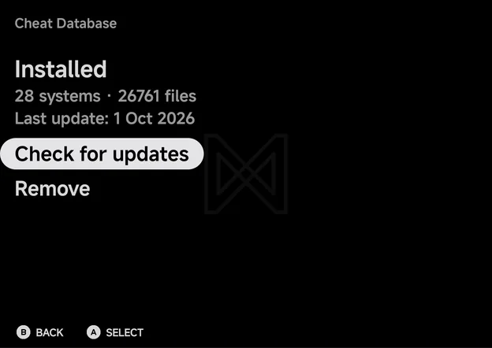
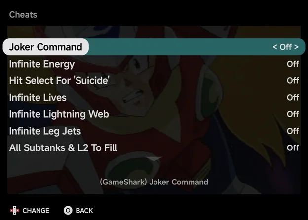

# Cheats

NX Redux Mobile uses [libretro](https://www.libretro.com/)'s cheat
collection. Download it once from **Tools → Cheat Database**, then turn
cheats on and off from a game's [in-game menu](in-game-menu.md#cheats).

Unlike the handheld, there is no separate tool to install first: Cheat
Database is part of the app.

## Downloading the cheats

Open **Tools → Cheat Database**. Before the first download the page shows
**Not installed**, the download size and how many systems it covers, with one
row: **Download (about 37 MB)**.

- The download needs about 400 MB of free space. With less, it stops with
  **Not enough space (needs about 400 MB free)**.
- A progress bar follows the download, then the install, system by system
  (**Installing** followed by the system's tag and count). `B` cancels.
- When it is done, the page shows **Installed**, the number of systems and
  files, and the date of the last update.

One download covers every supported system.

## Keeping it up to date

With the cheats installed, the page offers **Check for updates** and
**Remove**.

- **Check for updates** compares your copy with libretro's latest one and
  downloads it again only when it has changed. Otherwise it reports **Cheat
  database is up to date**. With no connection it reports **Could not check
  for updates (Wi-Fi?)**.
- **Remove** asks to confirm, then deletes the downloaded files.

## Where the files go

The cheats live inside the app's own storage. Unlike the handheld, they are
not on your card or in your home folder. Arcade (`FBN`), ColecoVision and
Dreamcast (with NAOMI and Atomiswave) have no cheats.

??? info "More detail"
    - The cheats are libretro `.cht` files, kept in one `Cheats/<TAG>/` folder
      per system inside the app's own storage. The app reads cheats only from
      there.
    - The download installs folders only for systems whose core takes cheats,
      so Arcade (`FBN`), ColecoVision and Dreamcast have none.

## Using cheats in a game

1. Open the [in-game menu](in-game-menu.md) and choose **Options**.
2. Choose **Cheats**.
3. Turn a cheat **On** or **Off** with `LEFT` or `RIGHT`. It applies straight
   away. `A` shows its full description.
4. To keep your cheats for next time, use **Save Changes → Save for game**.

The app finds the game's cheat file by the ROM's file name first, then by the
game's name. If nothing matches, the page says **No cheats for this game.** and
names the file it looked for, such as `Looked for Cheats/GBA/...`.

!!! tip "Variants are merged"
    Some games have several cheat files from different sources, such as
    GameShark or Action Replay. The app loads every file for the game's name
    and region into one list. When a merged cheat is highlighted, the
    description under the list starts with its source, such as
    `(GameShark)`, so you can tell them apart.

## Cheats and RetroAchievements

[RetroAchievements](retroachievements.md) on mobile is **softcore only**,
so there is no hardcore mode to block cheats. You can turn cheats on
with achievements enabled.
